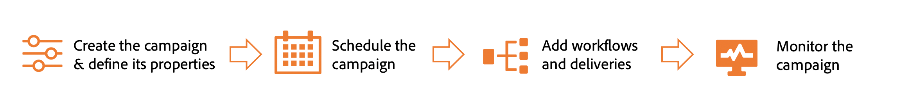

# Kom igång för marknadsförare {#acs-gs-marketers}

Den här guiden ger en översikt över de viktigaste funktionerna i Campaign v8 för marknadsförare som går över från Campaign Standard till Campaign v8.

Du kommer åt Adobe Campaign v8 via klientkonsolen eller webbgränssnittet. Med webbgränssnittet kan ni skapa, hantera och utföra viktiga marknadsföringsåtgärder. Adobe Campaign nya webbgränssnitt är ett modernt och intuitivt gränssnitt som förenklar utformningen och leveransen av marknadsföringskampanjer. [Läs mer](../../v8/get-started/user-interface.md).

Med migreringen importeras alla data från Campaign Standard i Campaign v8, vilket ger en smidig övergång utan avbrott i den pågående verksamheten.

Du kan fortsätta att använda dina befintliga autentiseringsuppgifter för att logga in och ansluta till din nya Adobe Campaign v8-instans. När du är inloggad kan du hitta alla profiler och arbetsflöden som migreras, så att du kan fortsätta arbeta med dina kampanjer.

Den största skillnaden finns i användargränssnittet. Nedan visas en jämförelse av samma arbetsflöde i de två gränssnitten:

{zoomable="yes"}

>[!NOTE]
> Adobe Campaign Web-gränssnittsreleaser fungerar enligt en kontinuerlig leveransmodell som ger en mer skalbar, stegvis metod för driftsättning av funktioner. Kontrollera [versionsinformationen](../../v8/rn/release-notes.md) regelbundet för att se om det finns de senaste uppdateringarna.

## Upptäck webbgränssnittet för Campaign {#acs-gs-marketers-ui}

I videon nedan får du lära dig hur du får åtkomst till och navigerar i användargränssnittet för Campaign-webben och hur du anpassar lagerlistorna.

>[!VIDEO](https://video.tv.adobe.com/v/3453426?quality=12&learn=on&captions=swe){transcript=true}

Mer information finns i dokumentationen nedan:

1. [Upptäck gränssnittet för Campaign Web](../../v8/get-started/user-interface.md)

1. [Bläddra och filtrera listor](../../v8/get-started/list-filters.md)

## Skapa och hantera profiler och målgrupper {#acs-gs-marketers-profiles-and-audiences}

De allmänna begreppen för att skapa och hantera profiler och målgrupper i Campaign v8 är desamma som i Adobe Campaign Standard. Lär dig hur du börjar med profiler och målgrupper i [det här avsnittet](../../v8/audience/gs-audiences-recipients.md).

Nedan finns några användbara länkar att börja med.

### Hantera profiler {#acs-gs-marketers-profiles}

I Adobe Campaign är en profil en post som lagras i databasen och fungerar som en nyckelkomponent för att skapa målgrupper för leveranser och lägga till personaliseringsdata i innehållet.

1. Lär dig hur du får tillgång till, hanterar och utforskar profiler med Campaign-webbgränssnittet i den här videon:

   >[!VIDEO](https://video.tv.adobe.com/v/3448368?quality=12&learn=on&captions=swe){transcript=true}

   Läs mer i dokumentationen för [Kom igång med profiler](../../v8/audience/about-recipients.md).

1. Lär dig hur du [skapar och hanterar testprofiler](../../v8/audience/test-profiles.md) i Campaign v8.

### Hantera målgrupper {#acs-gs-marketers-audiences}

Målgrupper är profiler som har liknande beteenden och/eller egenskaper. Samlingen med personer kan antingen genereras, markeras eller läsas in. När ni väl har skapat dem kan ni utnyttja dem som målgrupp för era leveranser.

Lär dig hur du bygger och hanterar målgrupper, väljer målgrupper för en leverans och definierar kontrollgrupper i den här videon:

>[!VIDEO](https://video.tv.adobe.com/v/3453206?quality=12&learn=on&captions=swe){transcript=true}

Mer information finns i [Kom igång med publiker](../../v8/audience/manage-audience.md){target="_blank"}.

Precis som i Campaign Standard kan du lägga till en kontrollgrupp i leveransen. Du kan definiera en kontrollgrupp för att undvika att skicka meddelanden till en del av publiken och jämföra beteendet efter leverans med huvudmålet. Det här alternativet hjälper er att mäta effekten av er kampanj.
Lär dig hur du [anger en kontrollgrupp](../../v8/audience/control-group.md){target="_blank"}.

>[!AVAILABILITY]
>
>* Alla målgrupper som skapas via Campaign Standard Query-aktivitet omvandlas till fördefinierade filter i Campaign v8 under övergången. Campaign v8 har också stöd för Query-aktiviteten.
>
>* Läsmålgruppen omvandlas till Query-aktivitet med [fördefinierat filter](../../v8/query/build-query.md)
>
>* Fördefinierat filter tar bara det senaste värdet efter målgruppsmigrering till Campaign v8.
>
>* Filtypsmålgrupper i Campaign Standard migreras som listtyper utan dimensioner.

### Hantera prenumerationer {#acs-gs-marketers-sub}

Du kan hantera och skapa tjänster som nyhetsbrev och kontrollera prenumerationer och avbeställningar av dessa tjänster. De viktigaste stegen är i stort sett samma som i Campaign Standard. Läs mer på sidorna nedan:

<table style="table-layout:fixed"><tr style="border: 0;">
<td>

<a href="https://experienceleague.adobe.com/sv/docs/campaign-web/v8/audiences/work-with-services/manage-services"><strong>Skapa prenumerationstjänster</strong></a>

</td>
<td>

<a href="https://experienceleague.adobe.com/sv/docs/campaign-web/v8/audiences/work-with-services/manage-subscribers"><strong>Hantera prenumeranter<strong></strong></a>

</td>
<td>

<a href="https://experienceleague.adobe.com/sv/docs/campaign-web/v8/msg/send-to-subscribers"><strong>Skicka meddelanden till prenumeranterna på en tjänst</strong></a>

</td>
</tr>
</table>

## Använd planer, program och kampanjer {#acs-gs-marketers-plans}

Med Adobe Campaign v8 kan du konfigurera mapphierarkin för marknadsföringsplaner och program. Planer, program och kampanjfunktioner liknar dem i Camera Standard och Campaign v8.

Läs mer i [Planer och programdokumentation](../../v8/administration/plans-programs.md).

Nedan finns användbara länkar att börja med. Ändringar som kan påverka användarupplevelsen markeras i Tillgänglighetsinformationen.

### Skapa en kampanj {#acs-gs-marketers-campaign}

Med Adobe Campaign kan ni enkelt samordna era riktade marknadsföringssatsningar med den inbyggda kampanjhanteringsfunktionen. Med möjligheten att definiera ett schema kan ni planera kampanjernas varaktighet och tidsplanering för att anpassa dem till strategiska mål och maximera målgruppernas engagemang.

Följ dokumentationen nedan om du vill veta mer om kampanjer:

1. [Kom igång med kampanjer](../../v8/campaigns/gs-campaigns.md)
1. [Få tillgång till och hantera era kampanjer](../../v8/campaigns/manage-campaigns.md)
1. [Skapa din första kampanj](../../v8/campaigns/create-campaigns.md)

### Skapa ett arbetsflöde {#acs-gs-marketers-wf}

Arbetsflödets användargränssnitt har omarbetats helt och hållet i gränssnittet för Campaign-webben för att underlätta användning, konfiguration, körning och felsökning. Som ni redan har erfarit i Campaign Standard kan ni med arbetsflöden samordna alla processer och uppgifter, förbättra hastighet och skala för alla delar av marknadsföringskampanjer, från att skapa segment och förbereda meddelanden till leverans. Dessutom kan ni synkronisera era kanaler med ett enda lättanvänt gränssnitt för kampanjsamordning.

Lär dig hur arbetsflöden fungerar och hur du skapar ett arbetsflöde för målinriktning i den här videon:

>[!VIDEO](https://video.tv.adobe.com/v/3453976?quality=12&learn=on&captions=swe){transcript=true}

Mer information finns i [Worklow-dokumentationen](../../v8/workflows/gs-workflows.md).

Adobe Campaign webbgränssnitt har en frågemodellerare i arbetsflöden som förenklar filtreringen av databasen baserat på olika kriterier. [Läs mer om frågemodelleraren](../../v8/query/query-modeler-overview.md)

Om du vill förstå syftet och funktionaliteten med varje aktivitet i arbetsflödet kan du utforska den detaljerade information som finns tillgänglig om [arbetsflödesaktiviteter](../../v8/workflows/activities/about-activities.md)

Maximera arbetsflödets effektivitet genom att granska [säkerhetsutkast och begränsningar för arbetsflöden](../../v8/get-started/guardrails.md).

>[!AVAILABILITY]
>
>* Arbetsflödeskörningen [historik och loggar](../../v8/workflows/start-monitor-workflows.md#logs-tasks) är tillgängliga i Adobe Campaign v8.
>
>* Historiska loggar för arbetsflöden som körs på din Campaign Standard-instans migreras inte till Campaign v8.
>
>* Organisationsenheter mappas till begreppet mapp för mappning och säkerställer liknande åtkomstkontroll.
>

## Skapa och hantera leveranser {#acs-gs-marketers-deliveries}

Med Campaign Web User Interface kan du som marknadsförare skapa fristående leveranser från den vänstra menyn **Leveranser** eller skapa leveranser i ett arbetsflöde, som ingår eller inte ingår i en kampanj. De viktigaste stegen är anpassade efter din tidigare erfarenhet i Campaign Standard. Lär dig hur du skapar en leverans i följande avsnitt: [Dokumentation för att skapa och hantera leverans](../../v8/msg/gs-deliveries.md).

Länkar:

* **Leveransmallar** - För en snabbare och förbättrad designprocess kan du skapa leveransmallar som enkelt kan återanvända anpassat innehåll och anpassade inställningar för alla era kampanjer. Den här funktionen gör att du kan standardisera det kreativa utseendet och känslan, så att det går snabbare att köra och starta kampanjer/ Läs mer på sidan [Leveransmall](../../v8/msg/delivery-template.md).

* **Leveransinställningar** - Leveransinställningar är tekniska leveransparametrar som definieras i leveransmallen. De kan laddas över för varje leverans. De här inställningarna är tillgängliga från knappen Inställningar som är tillgängliga när du redigerar en leverans- eller leveransmall. Läs mer i avsnittet [Leveransinställningar](../../v8/advanced-settings/delivery-settings.md).

* **Dynamiskt innehåll** - Med Adobe Campaign funktioner för dynamiskt webbinnehåll kan du anpassa ditt innehåll baserat på den information du har samlat in om mottagarna. Genom att använda dynamiskt innehåll ser du till att era marknadsföringssatsningar är mer relevanta och undviker att marknadsföra oönskade eller onödiga produkter eller tjänster. Läs mer i avsnittet [Dynamiskt innehåll](../../v8/personalization/gs-personalization.md).

* **Testa och korrektur** - När leveransinnehållet har definierats kan du använda profiler och testprofiler för att förhandsgranska och testa det innan du skickar meddelandet. Det här steget är viktigt för att säkerställa att det är korrekt, men också felfritt, både när det gäller innehåll och personalisering. Se [Förhandsgranska och testa](../../v8/preview-test/preview-test.md).

* **Schemaläggning** - Du kan ange datum och exakt tid för att skicka meddelanden. Genom att välja den lämpligaste tidpunkten för ert marknadsföringsmeddelande kan ni maximera öppningsfrekvensen.

   * Lär dig [schemalägga en fristående leverans](../../v8/msg/gs-deliveries.md#gs-schedule)
   * Lär dig [schemalägga en leverans i ett arbetsflöde](../../v8/monitor/schedule-sending.md#schedule-a-delivery-in-a-campaign-workflow)

* **Lägg till erbjudanden** - Du kan lägga till erbjudanden i dina leveranser i Adobe Campaign webbgränssnitt. Erbjudandena finns på den vänstra menyn Erbjudanden, där du får tillgång till listan över erbjudanden.  Lär dig hur du [lägger till erbjudanden i dina meddelanden](../../v8/msg/offers.md)

>[!AVAILABILITY]
>
>* Leveranser i utkastläge eller avslutat tillstånd har migrerats.
>
>* Leveranser som har någon av följande status har migrerats till Adobe Campaign v8, men måste förberedas igen: Pågår/Pågår/Avbrutet/Pågående nytt försök/Förberedelsefel.
>
>* Leveranser som har någon av följande status har migrerats som annullerade leveranser: För annullerade/pågående försök igen.
>
>* Spårning av länkar, URL-länkar för spegelsidor, prenumerations-/avprenumerationslänkar fungerar som i Campaign Standard.
>
>Se även följande avsnitt: [Spårning och övervakning](https://experienceleague.adobe.com/sv/docs/campaign/campaign-v8/analytics/tracking){target="_blank"}, [Varumärkning](https://experienceleague.adobe.com/sv/docs/experience-cloud/campaign/branding/branding-gs){target="_blank"} i Adobe Campaign.

### E-postleverans {#acs-gs-marketers-email}

Lär dig hur du skapar en e-postleverans från grunden, definierar målgruppen, utformar innehållet, simulerar förhandsgranskning och skickar ett korrektur i den här videon:

>[!VIDEO](https://video.tv.adobe.com/v/3454009?quality=12&learn=on&captions=swe){transcript=true}

Lär dig hur du skapar ditt första riktade e-postmeddelande i [Skapa din första e-postdokumentation](../../v8/email/create-email.md)

I Campaign v8 liknar de detaljerade stegen för att skapa, testa och skicka e-postmeddelanden Campaign Standard.

1. **Designa och definiera innehåll**

   E-postdesignern för Campaign v8 liknar den som finns i Campaign Standard. Som en påminnelse togs e-postredigeraren i Campaign Standard[bort](https://experienceleague.adobe.com/sv/docs/campaign-standard/using/release-notes/deprecated-features#deprecated-features){target="_blank"} för några år sedan. Du bör redan ha gått över till Campaign Email Designer för att skapa och personalisera ditt e-postinnehåll.

   Lär dig navigera i e-post-Designer. Lär dig strukturera och utforma ett e-postmeddelande från grunden, hur du anpassar och testar e-postmeddelandet i följande video:

   >[!VIDEO](https://video.tv.adobe.com/v/3453569?quality=12&learn=on&captions=swe){transcript=true}

   Med e-post-Designer kan du skapa engagerande, individuellt anpassade e-postmeddelanden via ett intuitivt dra-och-släpp-gränssnitt. Läs mer i [e-postdokumentationen för Designer](../../v8/email/get-started-email-designer.md)

   Lär dig hur du skapar ett e-postmeddelande genom att överföra HTML, hur du gör det kompatibelt med e-post-Designer och hur du konverterar det till en mall i den här videon:

   >[!VIDEO](https://video.tv.adobe.com/v/3447036?quality=12&learn=on&captions=swe){transcript=true}

   Ett innehållsfragment är en återanvändbar komponent som kan refereras i ett eller flera meddelanden. Läs mer om [Innehållsfragment](../../v8/content/fragments.md) för att förenkla skapandet av din e-postleverans.

   För en snabbare och förbättrad designprocess kan du skapa fristående mallar för att enkelt återanvända anpassat innehåll i Adobe Campaign. Se [Skapa e-postmallar](../../v8/content/create-email-templates.md)

1. **Förhandsgranska och testa**

   Lär dig hur du förhandsgranskar innehåll och personalisering i e-postmeddelanden, skickar testleveranser (korrektur) och kontrollerar e-poståtergivningen i populära dator-, mobil- och webbaserade klienter i den här videon:

   >[!VIDEO](https://video.tv.adobe.com/v/3450341?quality=12&learn=on&captions=swe){transcript=true}

1. **Skicka loggar för e-post och kontroll**

   När ni har definierat ert innehåll, er målgrupp och ert schema är ni redo att förbereda er för att leverera e-post. Läs mer i följande avsnitt:

   * [Förbered och skicka ett e-postmeddelande](../../v8/monitor/prepare-send.md)
   * [Övervaka leveransloggar](../../v8/monitor/delivery-logs.md)

### SMS-leverans {#acs-gs-marketers-sms}

SMS-leveranser är ett praktiskt och effektivt sätt att skicka textmeddelanden till kundernas mobila enheter. Med den här funktionen kan du skapa, anpassa och förhandsgranska textbaserade meddelanden för effektiv kommunikation.

I Campaign v8 liknar de detaljerade stegen för att skapa, testa och skicka SMS-meddelanden Campaign Standard.

<table style="table-layout:fixed"><tr style="border: 0;">
<td>

<a href="https://experienceleague.adobe.com/sv/docs/campaign-web/v8/msg/sms/create-sms"><strong>Skapa en SMS-leverans</strong>

</td>
<td>

<a href="https://experienceleague.adobe.com/sv/docs/campaign-web/v8/msg/sms/content-sms"><strong>Designa en SMS-leverans<strong></strong></a>

</td>
<td>

<a href="https://experienceleague.adobe.com/sv/docs/campaign-web/v8/msg/sms/send-sms"><strong>Förhandsgranska och skicka en SMS-leverans</strong></a>

</td>
</tr></table>

### Push-meddelanden {#acs-gs-marketers-push}

Push-meddelanden är nödvändiga för att nå ut till mobilappsanvändare, även när de inte aktivt använder din app. De har olika syften, till exempel att tillhandahålla uppdateringar, driva specifika åtgärder och meddela om avtal.

I Campaign v8 liknar de detaljerade stegen för att skapa, testa och skicka en push-meddelandeleverans Campaign Standard.

<table style="table-layout:fixed"><tr style="border: 0;">
<td>

<a href="https://experienceleague.adobe.com/sv/docs/campaign-web/v8/msg/push/create-push"><strong>Skapa en push-leverans</strong>

</td>
<td>

<a href="https://experienceleague.adobe.com/sv/docs/campaign-web/v8/msg/push/content-push"><strong>Designa en push-leverans<strong></strong></a>

</td>
<td>

<a href="https://experienceleague.adobe.com/sv/docs/campaign-web/v8/msg/push/send-push"><strong>Förhandsgranska och skicka en push-leverans</strong></a>

</tr></table>

>[!AVAILABILITY]
>
>* Adobe Campaign v8 har stöd för både Android och iOS Push Channel. Om du vill ha en övergång av befintliga arbetsflöden och leveranser med Push Channel måste du ansluta till din Adobe Campaign Transition Manager. Läs mer om [Kanalkonfiguration](https://experienceleague.adobe.com/sv/docs/campaign/campaign-v8/send/push/push-data-collection){target="_blank"}.
>
>* Observera att SDK V4 för mobilprogram [togs bort i Campaign Standard](https://experienceleague.adobe.com/sv/docs/campaign-standard/using/release-notes/deprecated-features#deprecated-features){target="_blank"} för några år sedan. Du borde redan ha gått över till Adobe Experience Platform SDK, som är samma sak som används i Campaign v8.
> 

### Direktmeddelande {#acs-gs-marketers-direct-mail}

Direktreklam är en offlinekanal som gör att du kan producera filer för att skicka personaliserade brev till kunder som vykort, flygblad eller kataloger. När du skapar en direktutskick genererar Adobe Campaign automatiskt en extraheringsfil som innehåller alla målprofiler och valda data, till exempel postadresser och profilattribut.

I Campaign v8 liknar de detaljerade stegen för att skapa, testa och skicka direktreklam Campaign Standard.

1. [Skapa direktleverans](../../v8/direct-mail/create-direct-mail.md)
1. [Definiera extraheringsfilen](../../v8/direct-mail/content-direct-mail.md)
1. [Förhandsgranska och skicka](../../v8/direct-mail/send-direct-mail.md)

### Kanal i appen {#acs-gs-marketers-in-app}

Observera att kanalen i appen inte är tillgänglig i Campaign v8. Om du behöver skicka meddelanden i appen kontaktar du Adobe-representanten.

## Skapa och hantera landningssidor {#acs-gs-marketers-lp}

Adobe Campaign v8-webbgränssnitt har en förbättrad användarupplevelse för landningssidor. Med Campaign kan ni skapa, designa och dela landningssidor. Med landningssidor kan du dirigera dina användare till onlineformulär där de kan uppdatera sina data, välja att inte ta emot meddelanden eller prenumerera på en viss tjänst, till exempel ett nyhetsbrev.

Som Campaign Standard-användare som går över till Campaign v8 har era befintliga landningssidor migrerats till användargränssnittet för Campaign Web. Du har tillgång till samma utbud av funktioner.

Läs mer om landningssidor i följande avsnitt:

<table style="table-layout:fixed"><tr style="border: 0;">
<td>

<a href="https://experienceleague.adobe.com/sv/docs/campaign-web/v8/landing-pages/create-lp"><strong>Skapa landningssidor</strong>

</td>
<td>

<a href="https://experienceleague.adobe.com/sv/docs/campaign-web/v8/landing-pages/lp-content"><strong>Utforma landningssidor</strong></a>

</td>
<td>

<a href="https://experienceleague.adobe.com/sv/docs/campaign-web/v8/landing-pages/lp-templates"><strong>Arbeta med mallar för landningssidor</strong></a>

</td>
</tr></table>

## Rapportering {#acs-gs-marketers-reporting}

Adobe Campaign innehåller en uppsättning [rapporteringsverktyg](https://experienceleague.adobe.com/sv/docs/campaign/campaign-v8/analytics/reports/gs-reporting){target="_blank"}. Som administratör kan du skapa och konfigurera rapporter som ska delas med andra Campaign-användare.

Adobe Campaign rapporteringsverktyg ger värdefulla insikter om hur effektiv er marknadsföring är, så att ni kan optimera era kampanjer för maximal effekt. Läs mer i [rapporteringsdokumentationen](../../v8/reporting/gs-reports.md).

Dynamisk rapportering är dessutom, i linje med Adobe Campaign Standard upplevelse, tillgänglig i Campaign v8 för e-postleveranser. Den ger fullt anpassningsbara realtidsrapporter för att mäta effekten av era marknadsföringsaktiviteter. Det ger åtkomst till profildata, vilket möjliggör demografiska analyser efter profildimensioner som kön, ort och ålder, utöver funktionella e-postkampanjdata som öppningar och klick. Läs mer i [dokumentationen för dynamisk rapportering](https://experienceleague.adobe.com/sv/docs/experience-cloud/campaign/reporting/get-started-reporting){target="_blank"}

>[!AVAILABILITY]
>
>* [Dynamisk rapportering](https://experienceleague.adobe.com/sv/docs/experience-cloud/campaign/reporting/get-started-reporting){target="_blank"} kan användas för rapportering av e-postleveranser, kampanjer med e-postleveranser och transaktionsmeddelanden. Det finns också en demografisk analys per profildimension.
>
> * [Adobe Campaign webbgränssnittsrapportering](../../v8/reporting/campaign-reports.md) är också tillgänglig för alla användare som går över från Adobe Campaign Standard till Adobe Campaign v8.

Adobe Campaign erbjuder tre olika rapporter:

<table style="table-layout:fixed"><tr style="border: 0;">
<td>

<a href="https://experienceleague.adobe.com/en/docs/campaign-web/v8/reports/campaign-report/campaign-reports"><strong>Kampanjrapporter</strong></a>

Ge detaljerad information om prestanda, effektivitet och resultat för era individuella leveranser, med en omfattande översikt.

</td>
<td>

<a href="https://experienceleague.adobe.com/en/docs/campaign-web/v8/reports/delivery-report/delivery-reports"><strong>Leveransrapporter</strong>

Erbjud en grundlig analys av varje produkts prestanda, per kanal: antal lyckade inköp, målgruppsengagemang och andra viktiga mätvärden. De gör att ni kan utvärdera kampanjens övergripande effektivitet och effekt.

</td>
<td>

<a href="https://experienceleague.adobe.com/en/docs/campaign-web/v8/reports/global-report/global-reports"><strong> globala rapporter </strong></a>

Erbjud en samlad sammanfattning av trafik- och interaktionsstatistik för varje kanal i Campaign-instansen. Rapporterna består av olika widgetar, som var och en har ett distinkt perspektiv på kampanjen eller leveransresultatet.

</td>
</tr>
</table>
