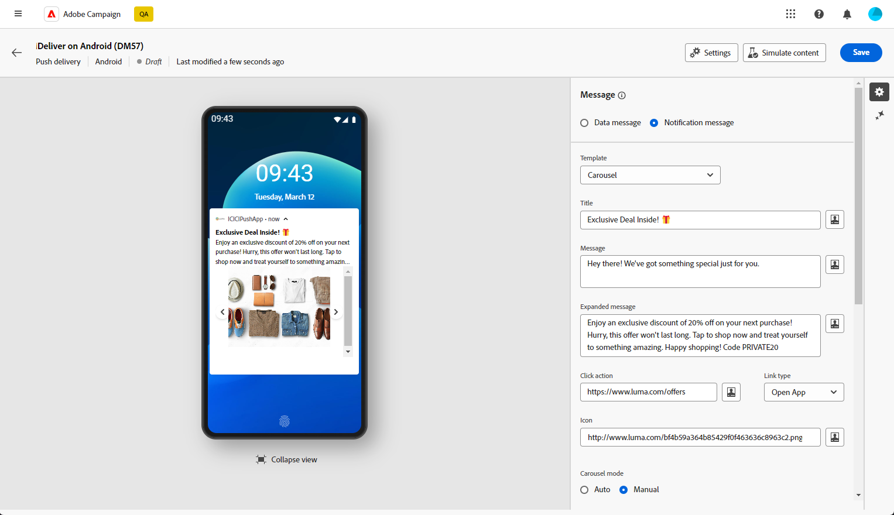
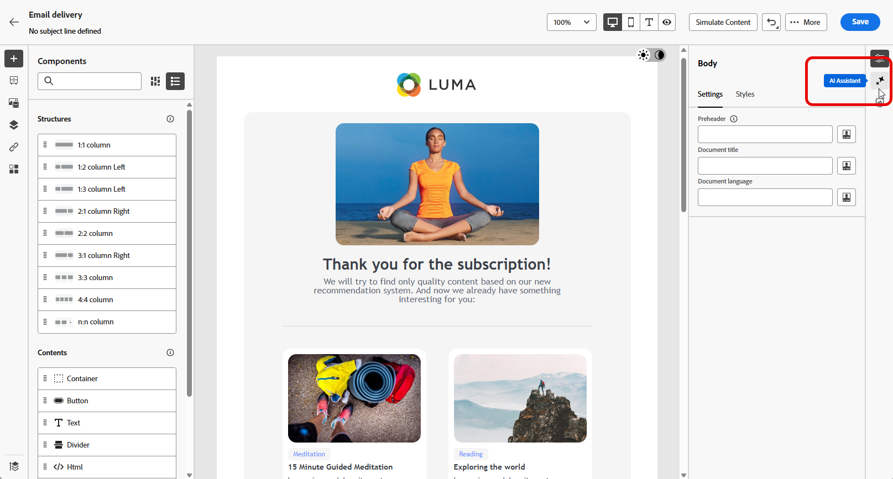

# Från Campaign Standard till v8 {#ac-acs}

Välkommen till Adobe Campaign v8!

Referenshandboken är utformad för dig som vill gå över från Campaign Standard till Campaign v8. Det hjälper er att bekanta er med er nya Campaign-miljö och vägleda er genom de steg som krävs för att komma igång med er roll.

1. Börja med att lära dig [vad som är nytt i Adobe Campaign v8](#new).

1. Lär dig sedan [skillnaderna i upplevelse mellan Adobe Campaign Standard och Adobe Campaign v8 enligt din roll](#experiences).

## Nyheter? {#new}

Få en glimt av de senaste förbättringarna i Adobe Campaign webbgränssnitt på den här sidan. En omfattande lista över viktiga funktioner och funktioner för att släppa uppdateringar finns i [det här avsnittet](../../v8/rn/whats-new.md).

### Förbättringar med Campaign v8 {#ac-enhancements}

Viktiga förbättringar som ingår i Adobe Campaign v8 listas nedan.

* **Webbanvändargränssnitt**

  Adobe Campaign v8 erbjuder både en klientkonsol och ett webbanvändargränssnitt som tar hänsyn till olika användarinställningar och behov. Klientkonsolen är en kraftfull programmiljö, medan webbgränssnittet är intuitivt och lättillgängligt, vilket gör det till ett idealiskt val för marknadsförare som är bekanta med Adobe Campaign Standard.

  Webbgränssnittet har många likheter med Adobe Campaign Standard, men vissa terminologier kan skilja sig åt.

  Du kan [läsa mer om Adobe Campaign webbanvändargränssnitt här](../../v8/campaign-web-home.md).

  {zoomable="yes"}

  Alla nya funktioner och förbättringar visas i [versionsinformationen](../../v8/rn/release-notes.md). Adobe Campaign Web Interface används i en kontinuerlig leveransmodell som ger en mer skalbar, stegvis metod för driftsättning av funktioner. Därför uppdateras versionsinformationen flera gånger i månaden. Kontrollera dem regelbundet.

* **Prestanda**

  Adobe Campaign v8 drar nytta av avancerad molnbaserad databasteknik, vilket ger betydligt bättre prestanda och effektivitet. Denna omarbetade arkitektur har flera viktiga fördelar:

   * *Skala*: Systemet har nu stöd för en avsevärd ökning av bearbetningskapaciteten, med batchbearbetning som omfattar upp till **20 miljoner åtgärder per timme**. Med den nya arkitekturen kan ännu högre profiler hanteras med förutsägbara prestanda.
   * *Hastighet*: Systemet har förbättrats för alla marknadsföringsaktiviteter: segmentering, leveransförberedelser eller genomströmning för transaktionsmeddelanden som nu är **1 miljon per timme**.

  De fullständigt hanterade molntjänsterna ger användaren:

   * Datautforskning i realtid: Få direkt tillgång till och analysera data för att få snabba insikter och mer välgrundade beslut.

   * Snabb målgruppsuppbyggnad: Skapa enkelt målgrupper inom några minuter för effektivare kampanjsegmentering.

  Generellt sett utgör Adobe Campaign v8:s robusta arkitektur en kraftfull grund för att hantera omfattande och komplexa marknadsföringskampanjer snabbare och effektivare.

### Nya funktioner i Adobe Campaign v8 {#ac-new-features}

Som Campaign Standard-användare som går över till Adobe Campaign v8 finns nu följande funktioner:

* **Omfattande push**

  Med Adobe Campaign v8 kan du skicka omfattande push-meddelanden som fångar användarnas uppmärksamhet och uppmuntrar dem att vidta åtgärder. Dessa meddelanden kan innehålla en mängd olika element, t.ex. text, bilder, knappar, nedräkningstimer, ljud.

  {zoomable="yes"}

  För att förenkla skapandet av dessa avancerade meddelanden innehåller Adobe Campaign v8 olika mallar som du kan använda för att utforma och anpassa innehållet i komplexa meddelanden, till exempel karuseller eller timers.

  Du kan anpassa dina meddelanden baserat på kundens system:

   * För [Android](../../v8/push/rich-push.md)-mallar

   * För [iOS](../../v8/push/rich-push.md)-mallar

  Push-meddelanden är ett viktigt verktyg för att engagera mobilappsanvändare, så att ni kan nå dem även när de inte aktivt använder er app.

* **Adobe Experience Manager as a Cloud Service**

  Adobe Campaign v8 är helintegrerat med Adobe Experience Manager as a Cloud Service och förbättrar er förmåga att leverera personaliserade och innehållsrika upplevelser till era kunder. Den inbyggda integreringen effektiviserar innehållshanteringen och utnyttjar Adobe Experience Manager robusta funktioner för att optimera er marknadsföring.

  Här är de viktigaste funktionerna som den här integreringen har aktiverat:

   * *Resurshantering*: I Adobe Campaign v8 kan e-postdesignern välja att få åtkomst till och hantera resurser. Den här funktionen förenklar integreringen av element från Adobe Experience Manager i leveransen och gör innehållshanteringen effektivare. [Läs mer om resurshantering](../../v8/integrations/aem-assets.md)

     {zoomable="yes"}

   * *Import av e-postmallar*: Med Adobe Campaign v8 kan du bläddra bland och importera e-postmallar från Adobe Experience Manager direkt till Campaign. [Läs mer om import av e-postmallar](../../v8/integrations/aem-content.md)

     {zoomable="yes"}

  Adobe Experience Manager as a Cloud Service erbjuder molnbaserad flexibilitet, vilket gör att du kan snabba upp time to value och anpassa dig efter nya affärsbehov. Integreringen förbättrar inte bara innehållshanteringsfunktionerna utan gör det även möjligt att leverera mer personaliserade och engagerande upplevelser till kunderna via alla kontaktytor.

* **AI-assistenten**

  Med Campaign AI Assistant kan man skapa och köra marknadsföringskampanjer i flera kanaler, som e-post, SMS och push-meddelanden, på ett intuitivt, enkelt och problemfritt sätt samtidigt som man sparar tid, förbättrar effektiviteten och får bättre resultat.

  {zoomable="yes"}

  AI Assistant revolutionerar sättet att skapa professionellt och varumärkesenhetligt innehåll i alla kanaler. Med avancerade GenAI-modeller och djupgående förståelse för era varumärkesriktlinjer genererar AI Assistant automatiskt personaliserat, engagerande och effektivt innehåll baserat på marknadsföringsmålet med innehåll som är optimerat för varumärkeskonturerade format, layouter, färgton och mycket annat.

  AI Assistant gör det enkelt att skapa och genomföra marknadsföringskampanjer intuitivt och problemfritt samtidigt som man sparar tid, förbättrar effektiviteten och får bättre resultat.

  {zoomable="yes"}

  Det innehåller olika typer av e-postmallar och genererar och återskapar bilder. Läs mer om AI Assistant i [det här avsnittet](../../v8/email/generative-content.md). Adobe Campaign v8 har en AI-assistent tillgänglig för [Email](../../v8/email/generative-content.md), [SMS](../../v8/email/generative-sms.md) och [Push](../../v8/email/generative-push.md).

* **Uppgraderad SMS-infrastruktur - SMS v2.0**

  Den enkla och enkla användningen av SMS gör det till en mycket värdefull kommunikationskanal utöver dess tillförlitlighet och oöverträffade kompatibilitet över flera miljarder terminaler.

  Adobe Campaign v8 har en ny infrastruktur som förbättrar SMS-utskick. [Läs mer om de nya SMS-inställningarna](https://experienceleague.adobe.com/en/docs/campaign/campaign-v8/send/sms/sms){target="_blank"}.

* **Uppgraderad push-infrastruktur**

  Adobe Campaign v8 introducerar vår senaste Push-meddelandetjänst, som bygger på ett robust ramverk som bygger på en modern, modern teknik. Den här tjänsten är utformad för att låsa upp nya nivåer av skalbarhet, så att dina meddelanden kan nå en större publik med smidig effektivitet. Med vår förbättrade infrastruktur och våra optimerade processer kan ni förvänta er större skalbarhet och tillförlitlighet, så att ni kan engagera och kommunicera med era mobilappsanvändare som aldrig förr.

  [Läs mer om uppgraderad push-infrastruktur](https://experienceleague.adobe.com/en/docs/campaign/campaign-v8/send/push/push-data-collection){target="_blank"}.

## Managed Services {#ac-managed-services}

Adobe Campaign v8 finns som hanterad Cloud Service och ger proaktiv tillsyn, snabb varning och servicestyrning. Adobe Managed Cloud Service ger marknadsförarna en smidigare, säkrare och skalbar lösning för kanalövergripande kampanjhantering med en låg total ägandekostnad. Det nya erbjudandet kombinerar tjänster med proaktiv tillsyn och snabb varning.

## Campaign Standard-funktioner som lagts till i v8 {#ac-v8-added}

För att ni smidigt ska kunna gå över till Campaign v8 har viktiga Campaign Standard-funktioner lagts till i Campaign v8. De beskrivs i [den här dokumentationen](https://experienceleague.adobe.com/docs/experience-cloud/campaign/campaign-standard-migration-home.html){target="_blank"}.

* **Dynamisk rapportering**: Dynamisk rapportering ger helt anpassningsbara realtidsrapporter för att mäta effekten av dina marknadsföringsaktiviteter. Det ger åtkomst till profildata, vilket möjliggör demografiska analyser efter profildimensioner som kön, ort och ålder, utöver funktionella e-postkampanjdata som öppningar och klick. [Läs mer](https://experienceleague.adobe.com/docs/experience-cloud/campaign/reporting/get-started-reporting.html){target="_blank"}.

* **Centraliserad varumärkesprofilering**: Alla företag har grafiska och tekniska riktlinjer för varumärken. Med Adobe Campaign kan ni definiera en uppsättning specifikationer för att presentera ett konsekvent varumärke för era kunder, från logotyper till tekniska aspekter som e-postavsändare, URL-adress eller domäner. [Läs mer](https://experienceleague.adobe.com/docs/experience-cloud/campaign/branding/branding-gs.html)

* **Resterande API:er** - Som en migrerad användare av Campaign Stardard kan du använda Rest API:er för att skapa integreringar för Adobe Campaign och skapa ett eget ekosystem genom att interagera med Adobe Campaign med den panel med tekniker som du använder. [Läs mer](https://experienceleague.adobe.com/docs/experience-cloud/campaign/apis/get-started-apis.html){target="_blank"}.

* **Landningssidor** - Vissa förbättringar har gjorts på landningssidor för Campaign v8 för att säkerställa funktionens paritet med Campaign Standard. Läs mer i [versionsinformationen](../../v8/rn/release-notes.md#new-24-4) och [dokumentationen](../../v8/landing-pages/get-started-lp.md) på landningssidan.

* **Visuella fragment** - Visuella fragment är återanvändbara visuella komponenter som kan refereras i en eller flera e-postleveranser eller i innehållsmallar. När du ändrar ett fragment uppdateras allt innehåll som använder det. Med den här funktionen kan man skapa flera anpassade innehållsblock som kan användas av marknadsföringsanvändare för att snabbt sammanställa meddelandeinnehåll i en förbättrad designprocess. [Läs mer](../../v8//content/use-visual-fragments.md)

## Viktiga skillnader mellan Campaign Standard och Campaign v8 {#experiences}

De flesta koncept är likartade mellan Adobe Campaign v8 och Adobe Campaign Standard. Det finns dock några skillnader enligt beskrivningen nedan.

Nedan visas några terminologiska skillnader mellan Campaign Standard och Campaign v8.

* Anpassade resurser är **Scheman**
* Meddelanden kallas **Leveranser**
* Produktanvändare är **Operatorer**
* Roller har konfigurerats med **namngivna rättigheter**
* Säkerhetsgrupperna är **Operatorgrupper**
* Organisationsenheter hanteras via **Mappbehörigheter**

Som befintlig Campaign-användare bör du också tänka på att vissa koncept har bytt namn så att de överensstämmer med de senaste terminologinställningarna. De här ändringarna gäller bara för användargränssnittet i Campaign Web och återspeglas inte i klientkonsolen. De sammanfattas nedan.

* Mottagarna är nu **profiler**. [Läs mer](../../v8/audience/gs-audiences-recipients.md).
* Startadresser är nu **Testprofiler**. [Läs mer](../../v8/preview-test/test-deliveries.md).
* Leveransanalysen är nu **leveransförberedelsen**. När du behöver starta meddelandeförberedelsen klickar du på knappen **Förbered** . [Läs mer](../../v8/monitor/prepare-send.md).
* E-postförhandsgranskning är nu tillgänglig via knappen **Simulera innehåll** . [Läs mer](../../v8/preview-test/preview-test.md)
* Listor är nu **Publiker**. [Läs mer](../../v8/audience/gs-audiences-recipients.md).

## Ny användarupplevelse

Tillgång till den relevanta referenshandboken för din roll för att upptäcka den nya användarupplevelsen med Adobe Campaign v8.

<table>
<tr>
  <td>
    
    

  </td>
  <td>
  
    

  </td>
  </tr>
  <tr>
    <td>
    <a href="marketers.md">
    <strong> Marketer </strong>
    </a>
    </td>
    <td>
      <a href="admin-developers.md">
      <strong> Administratör eller utvecklare </strong>
      </a>
    </td>
  </tr>
    <td>
    <em>Kampanjchef, mediemarknadsföringsspecialist</em>
    </td>
    <td>
      <em> Systemadministratör, teknisk marknadsföringsspecialist</em>
    </td>
  <tr>
    <td>
    <b>Viktiga uppgifter/ansvarsområden är:</b>
    </td>
      <td>
    <b>Viktiga uppgifter/ansvarsområden är:</b>
    </td>
  </tr>
  <tr>
    <td>
      <li>Skapa marknadsföringskampanjer
      <li>Designarbetsflöden
      <li>Testa och köra kampanjer
      <li>Distribuera flerkanalskampanjer
      <li>Optimera kampanjer
      <li>Optimera automatiska kampanjer
    </td>
    <td>
        <li>Åtkomsthantering
        <li>Systemkonfiguration
        <li>Systemanpassning
    </td>
</tr>
</table>

<!--
## Deprecated items

Adobe constantly evaluates product capabilities to identify older features that should be replaced with more modern alternatives to improve overall customer value, always under careful consideration of backward compatibility.

Please refer to [this documentation for information on deprecated items](https://experienceleague.adobe.com/en/docs/campaign-standard/using/release-notes/deprecated-features).-->
