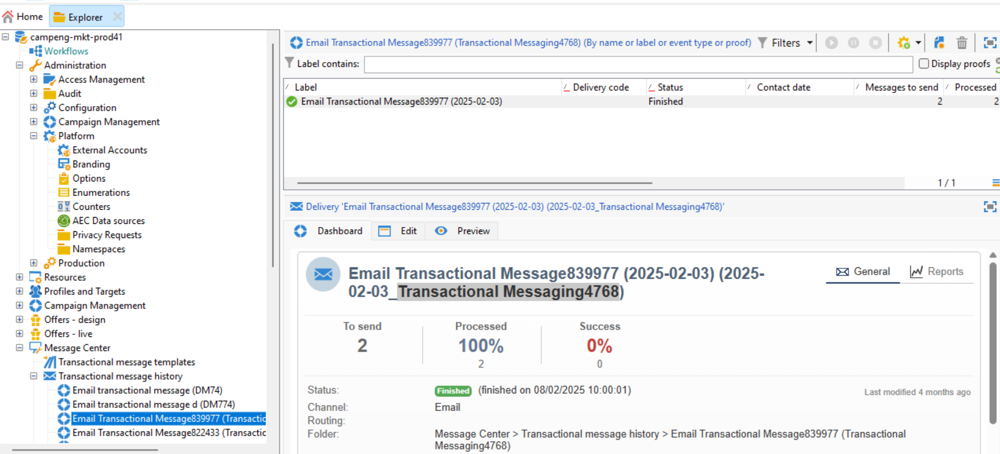

# Tilldela ert varumärke {#branding-assign}

## Länka ett varumärke till en mall {#linking-a-brand-to-a-template}

Om du vill använda de parametrar som definierats för ett varumärke måste det vara länkat till en leveransmall. Om du vill göra det måste du skapa eller redigera en mall.

Din mall kommer att länkas till varumärket. I e-postredigeraren kommer element som **e-postadressen till standardavsändaren**, **standardavsändarens namn** eller **logotypen** att använda konfigurerade varumärkesdata.

>[!BEGINTABS]

>[!TAB Adobe Campaign Web]

Om du vill skapa en leveransmall kan du duplicera en inbyggd mall, konvertera en befintlig leverans till en mall eller skapa en leveransmall från början. [Läs mer](../../msg/delivery-template.md)

När mallen har skapats kan du koppla den till ett varumärke. Så här gör du:

1. Bläddra till fliken **[!UICONTROL Templates]** från den vänstra menyn i **[!UICONTROL Deliveries]** och välj en leveransmall.

   

1. Klicka på **[!UICONTROL Settings]**.

   

1. Gå till fältet **[!UICONTROL Delivery]** på fliken **[!UICONTROL Branding]** och markera det varumärke som du vill länka till mallen.

   

1. Bekräfta valet och spara mallen.

Nu kan du använda den här mallen för att skicka leveranser.

>[!TAB Adobe Campaign V8]

Om du vill skapa en leveransmall kan du duplicera en inbyggd mall, konvertera en befintlig leverans till en mall eller skapa en leveransmall från början. [Läs mer](https://experienceleague.adobe.com/docs/campaign/campaign-v8/send/create-templates.html?lang=sv-SE)

När mallen har skapats kan du koppla den till ett varumärke. Så här gör du:

1. Bläddra till **[!UICONTROL Resources]** `>` **[!UICONTROL Templates]** `>` **[!UICONTROL Delivery templates]** i Adobe Campaign Explorer.

1. Välj en leveransmall eller duplicera en befintlig.

   

1. Få åtkomst till **[!UICONTROL Properties]** för den valda leveransmallen.

   

1. Välj ditt varumärke i listrutan **[!UICONTROL General]** på fliken **[!UICONTROL Branding]**.

   

1. Välj **OK** när du har konfigurerat den.

Nu kan du använda den här mallen för att skicka leveranser.

>[!ENDTABS]

## Tilldela ett varumärke till din leverans {#assigning-a-brand-to-an-email}

>[!BEGINTABS]

>[!TAB Adobe Campaign Web]

Följ stegen nedan för att skapa en ny fristående leverans.

1. Bläddra till menyn **[!UICONTROL Deliveries]** i den vänstra listen och klicka på knappen **[!UICONTROL Create delivery]**.

   

1. Välj E-post eller Push-meddelande som kanal och välj en leveransmall i listan.

1. Bekräfta genom att klicka på knappen **[!UICONTROL Create delivery]**.

1. Klicka på **[!UICONTROL Properties]** på sidan **[!UICONTROL Settings]**.

   

1. Gå till fältet **[!UICONTROL Delivery]** på fliken **[!UICONTROL Branding]**.

   

1. Markera det varumärke som du vill länka till mallen.

   

1. Anpassa leveranserna ytterligare. Mer information om hur du skapar e-postmeddelanden finns i avsnittet [Skapa din första e-postadress](../../email/create-email.md).

>[!TAB Adobe Campaign V8]

Följ stegen nedan för att skapa en ny fristående leverans.

1. Bläddra till fliken **[!UICONTROL Campaigns]** om du vill skapa en ny leverans.

1. Klicka på **[!UICONTROL Deliveries]** och klicka på knappen **[!UICONTROL Create]** ovanför listan över befintliga leveranser.

   

1. Välj en leveransmall.

1. Få åtkomst till **[!UICONTROL Properties]** för den valda leveransmallen.

   

1. Välj ditt varumärke i listrutan **[!UICONTROL General]** på fliken **[!UICONTROL Branding]**.

   

1. Välj **OK** när du har konfigurerat den.

1. Anpassa leveranserna ytterligare. Mer information om hur du skapar e-postmeddelanden finns i avsnittet [Designa och skicka e-postmeddelanden](../../email/create-email.md).

>[!ENDTABS]

## Kontrollera varumärke som är kopplat till transaktionsmeddelanden {#check-branding-transactional}

>[!IMPORTANT]
>
>Det här avsnittet gäller endast för Transactional Messaging (Message Center).
>
>Transaktionsfunktioner är tillgängliga i gränssnittet för Campaign Web, men verifieringsstegen nedan måste utföras i klientkonsolen Campaign v8 (kontrollinstans).

Transaktionsleveranser som synkroniserats från körningsinstanser av Real-Time (RT) till kontrollinstansen replikerar inte egenskaper som routning eller branding. Dessa synkroniserade leveranser genereras varje vecka från samma mall för att visa leveransindikatorer i kontrollinstansen.

På grund av detta visar kontrollinstansen standardvarumärket. De faktiska varumärkes- och routningsinställningarna som används under meddelandekörningen definieras i transaktionsmeddelandemallen på kontrollinstansen.

Verifiera vilket varumärke som användes för ett transaktionsmeddelande:

1. Identifiera det interna namnet på transaktionsmallen som publicerats till Real-Time (till exempel `TransactionalMessaging4768`).

   

1. I kontrollinstansen söker du efter det här interna namnet under **Transactional message templates**.

   

1. Öppna mallen för att visa varumärket och andra relaterade egenskaper.
