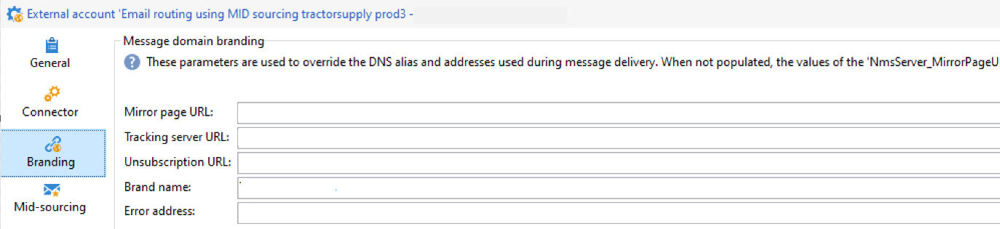

# Kom igång med varumärken {#branding-gs}

>[!AVAILABILITY]
>
>Den här kapaciteten är endast tillgänglig vid behov för nya implementeringar. Kontakta din Adobe-representant för att få åtkomst.

>[!IMPORTANT]
>
>Varumärken kan inte skapas eller ändras av slutanvändare: dessa åtgärder måste utföras av den tekniska administratören för Adobe Campaign. Kontakta Adobes kundtjänst om du har frågor.

Alla företag har varumärkesriktlinjer som definierar både visuella element och tekniska detaljer. Adobe Campaign hjälper er att hantera dessa riktlinjer centralt, så att ni kan presentera en enhetlig varumärkesbild för era kunder i allt ni gör, från logotyper i e-postmeddelanden till URL:er och domäner som används i era kampanjer.

Tekniska administratörer kan skapa och hantera flera varumärken inom Adobe Campaign. På så sätt kan ni definiera alla element som utgör er varumärkesidentitet, inklusive logotyper och till och med inställningar för e-postspårning. När de har skapats kan dessa varumärken enkelt kopplas till era leveranser.

Du kan lägga till nya entiteter i organisationen i Campaign eller skapa en ny typ av e-post som du måste skicka under en annan underdomän. Gör så här:

1. **Konfigurera en ny underdomän** - För alla nya underdomäner som ska användas av Adobe är det första steget att konfigurera den. Du kan göra detta via [Campaign Control Panel](https://experienceleague.adobe.com/docs/control-panel/using/subdomains-and-certificates/subdomains-branding.html?lang=sv) eller kontakta din Adobe tekniska kontakt. Läs mer om underdomänskonfigurationen [på den här sidan](https://experienceleague.adobe.com/sv/docs/deliverability-learn/deliverability-best-practice-guide/additional-resources/campaign/ac-domain-name-setup).

   >[!NOTE]
   >
   >Kontrollpanelen är tillgänglig för alla administratörsanvändare. Stegen för att bevilja administratörsåtkomst till en användare finns på [den här sidan](https://experienceleague.adobe.com/docs/control-panel/using/discover-control-panel/managing-permissions.html?lang=sv#discover-control-panel).

1. **Skapa en leveransmall** - När det nya varumärket är tillgängligt är det bästa sättet att skapa minst en ny tom leveransmall som refererar till det nya varumärket. [Läs mer](branding-assign.md).

1. **Kontrollera leveransriktlinjer** - Innan du börjar använda den nya domänen bör strategin diskuteras med Adobe Deliverability-teamet. De hjälper dig att definiera de bästa metoderna om en ny tillhörighet ska skapas för att till exempel dela IP-adresser mellan domäner och/eller om en rampplan ska definieras.

## Kompatibilitetsmeddelande {#compatibility-note}

Den nya centraliserade varumärkningsmodellen är inte kompatibel med den [äldre varumärkningskonfigurationen](https://experienceleague.adobe.com/docs/campaign-classic/using/transactional-messaging/configure-transactional-messaging/additional-configurations.htmml#configuring-multibranding){target="_blank"} som tidigare användes i klientkonsolen.

I det äldre tillvägagångssättet implementerade kunderna varumärken genom att utöka TextAccount-formuläret och använda fliken **Varumärke**.

Om din befintliga miljö använder denna äldre konfiguration kan den inte migreras direkt till den nya centraliserade varumärkesmodellen. Det krävs en fullständig omimplementering av varumärkesinställningarna för att det nya systemet ska kunna användas.