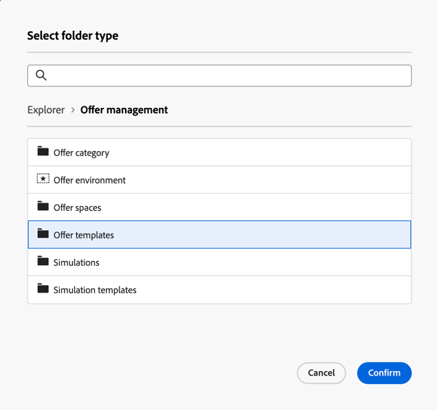

# Skapa och hantera en mapp

I Adobe Campaign kan du skapa nya mappar för att hantera ditt navigeringsträd. I **[!UICONTROL Explorer]** går du till den mapp där du vill skapa den nya mappen.

Under **[!UICONTROL ...]** knapp, du har **[!UICONTROL Create new folder]**

{zoomable="yes"}

När du skapar en ny mapp är mapptypen som standard den överordnade mappens typ.
I vårt exempel skapar vi en mapp i **[!UICONTROL Deliveries]** mapp.

{zoomable="yes"}

Du kan ändra typen av mapp genom att klicka på ikonen för typen Mapp och välja den i listan som visas:

{zoomable="yes"}

Du konfigurerar mapptypen genom att klicka på **[!UICONTROL Confirm]** -knappen.

Om du vill skapa en mapp utan en viss typ väljer du **[!UICONTROL Generic Folder]** typ.

I Adobe Campaign Console har du fått en förklaring om hur du skapar och hanterar en mapp [här](https://experienceleague.adobe.com/en/docs/campaign/campaign-v8/config/configuration/folders-and-views)och du kan konfigurera behörigheter för mappar. [Läs mer](https://experienceleague.adobe.com/en/docs/campaign/campaign-v8/admin/permissions/folder-permissions)
