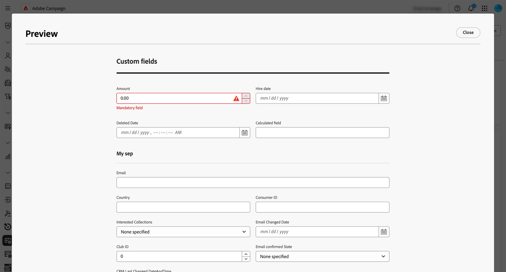

# Konfigurera anpassade fält {#custom-fields}

>[!CONTEXTUALHELP]
>id="acw_schema_editcustomfields"
>title="Screen Edition"
>abstract="Alla anpassade fält som visas i gränssnittet för den valda schemavisningen. Du kan ändra visningsordningen i gränssnittet med upp- och nedpilarna och gruppera fält i underavsnitt genom att lägga till avgränsare. Klicka på ellipsknappen om du vill ta bort ett anpassat fält eller redigera inställningar, t.ex. synlighetsvillkor."

>[!CONTEXTUALHELP]
>id="acw_schema_editcustomfields_settings_general"
>title="Allmänt"
>abstract="Definiera de allmänna inställningarna för det anpassade fältet. Om ingen etikett anges visas den etikett som definierats i schemat. Använd fältet **Synlig om** för att definiera ett villkor med hjälp av ett xtk-uttryck som styr när fältet visas. Du kan också markera fältet som obligatoriskt eller skrivskyddat i gränssnittet."

>[!CONTEXTUALHELP]
>id="acw_schema_editcustomfields_settings_link"
>title="Länkegenskaper"
>abstract="Använd frågemodelleraren för att ange regler för hur ett anpassat fält av länktyp ska visas. Begränsa till exempel listvärden baserat på indata från ett annat fält."

>[!CONTEXTUALHELP]
>id="acw_schema_editcustomfields_settings_layout"
>title="Layout"
>abstract="Som standard visas anpassade fält i gränssnittet i två kolumner. Växla med det här alternativet om du vill visa det anpassade fältet över skärmens hela bredd i stället för två kolumner."

>[!CONTEXTUALHELP]
>id="acw_schema_editcustomfields_separatorproperties"
>title="Separationsegenskaper"
>abstract="Ange namnet som ska visas i gränssnittet för underavsnittet."

<!-- NOT USED IN THE UI?-->

>[!CONTEXTUALHELP]
>id="acw_schema_editcustomfields_settings"
>title="Attributinställningar"
>abstract="Attributinställningar"

Anpassade fält är ytterligare attribut som läggs till i färdiga scheman via Adobe Campaign-konsolen. Med dem kan du anpassa scheman genom att ta med nya attribut som passar organisationens behov. Lär dig hur du utökar ett schema i [Adobe Campaign v8-dokumentationen](https://experienceleague.adobe.com/docs/campaign/campaign-v8/developer/shemas-forms/extend-schema.html){target="_blank"}.

Anpassade fält kan visas på olika skärmar, till exempel profilinformation i webbgränssnittet för Campaign. Administratörer kan styra vilka fält som visas och hur de visas. De här ändringarna gäller alla Campaign-användare.

>[!NOTE]
>
>Du måste ha administratörsbehörighet för att hantera anpassade fält.

Anpassade fält är tillgängliga för följande scheman:

* Kampanjer (nms)
* Planer (nms)
* Program (nms)
* Mottagare (nms)
* Fröadresser (nms)
* Leveranser (nms)

## Lägg till anpassade fält i gränssnittet {#add-custom}

>[!CONTEXTUALHELP]
>id="acw_schema_screen_definition"
>title="Skärmdefinition"
>abstract="Definiera listan med anpassade fält som ska redigeras för schemat och deras egenskaper. Klicka på knappen **Förhandsgranska** för att visa anpassade fält på en exempelskärm."

Följ de här stegen för att visa anpassade fält i gränssnittet:

1. Bläddra till **[!UICONTROL Schemas]**-menyn i den vänstra navigeringsrutan och leta reda på önskat schema.

   Använd filtret **[!UICONTROL Editable]** i filterrutan för att snabbt identifiera scheman med anpassade fält.

   

1. Markera schemanamnet i listan för att öppna det. En detaljerad schemavy visas. [Läs mer om schemainformation](../administration/schemas.md). Klicka på knappen **[!UICONTROL Screen edition]** för att komma åt anpassade fält. I det här exemplet läggs fält till för **[!UICONTROL Recipients]**-schemat.

   

   Listan med anpassade fält som visas i schemats gränssnitt visas.

1. Klicka på knappen **[!UICONTROL Preview]** om du vill visa anpassade fält på en exempelskärm.

   

   Här har fältet Belopp markerats som obligatoriskt.

   

1. Om du vill lägga till ett anpassat fält i gränssnittet klickar du på ellipsknappen och väljer något av följande alternativ:

   * **[!UICONTROL Select custom fields]**: Välj ett eller flera anpassade fält som ska visas i gränssnittet.
   * **[!UICONTROL Fill automatically the list of custom fields]**: Lägg till alla anpassade fält som definierats för schemat i gränssnittet.

   

1. När anpassade fält har lagts till kan du:

   * **Ändra ordning på fält**: Använd upp- och nedpilarna eller flytta fält med dra och släpp.
   * **Gör fält obligatoriska**: Markera kryssrutan **Obligatoriskt**.
   * **Redigera fältinställningar**: Klicka på ellipsknappen och välj **[!UICONTROL Edit]**. [Läs mer](#settings)
   * **Ta bort fält**: Klicka på ellipsknappen och välj **[!UICONTROL Delete]**.
   * **Ordna fält i underavsnitt i gränssnittet**: Klicka på ellipsknappen bredvid upp- och nedpilarna och välj **[!UICONTROL Add separator]**. [Läs mer](#separator)

## Konfigurera anpassade fältinställningar {#settings}

Om du vill konfigurera specifika inställningar för varje anpassat fält klickar du på ellipsknappen bredvid det önskade fältet och väljer **[!UICONTROL Edit]**.

Tillgängliga inställningar:

* **[!UICONTROL Attribute]**: Namnet på det anpassade fältet.
* **[!UICONTROL Label (custom)]**: Den etikett som ska visas i gränssnittet. Om ingen etikett anges visas den etikett som definierats i schemat.
* **[!UICONTROL Visible if]**: Definiera ett villkor med hjälp av ett xtk-uttryck som styr när fältet visas. Dölj till exempel det här fältet om ett annat fält är tomt.
* **[!UICONTROL Mandatory]**: Gör fältet obligatoriskt i gränssnittet.
* **[!UICONTROL Read-only]**: Gör fältet skrivskyddat i gränssnittet. Användarna kan inte redigera fältets värde.
* **[!UICONTROL Filter settings]** (för länktypsfält): Använd frågemodelleraren för att ange regler för hur ett anpassat fält av länktyp ska visas. Begränsa till exempel listvärden baserat på indata från ett annat fält.

  Du kan också referera till värdet som anges i andra fält i dina villkor med syntaxen `$(<field-name>)`. På så sätt kan du referera till det aktuella värdet för ett fält som det har angetts i formuläret, även om det ännu inte har sparats i databasen.

  I exemplet nedan kontrollerar villkoret om värdet i fältet @ref matchar värdet som anges i fältet @refCom. Om du däremot använder `@refCom` i stället för `$(@refCom)` refereras värdet för @ref-fältet så som det finns i databasen.

  +++Visa exempel

  

  +++

* **[!UICONTROL Span two columns]**: Som standard visas anpassade fält i gränssnittet i två kolumner. Växla med det här alternativet om du vill visa det anpassade fältet över skärmens hela bredd i stället för två kolumner.

## Ordna anpassade fält i underavsnitt {#separator}

Med användargränssnittet för Campaign-webben kan du lägga till avgränsare för att gruppera anpassade fält i gränssnittet så att de blir lättare att läsa. Gör så här:

1. Klicka på ellipsknappen bredvid upp- och nedpilarna och välj **[!UICONTROL Add separator]**.

1. En ny rad som representerar avgränsaren läggs till i listan. Klicka på ellipsknappen och välj **[!UICONTROL Edit]** för att ge underavsnittet ett namn.

1. Använd upp- och nedpilarna för att flytta avgränsaren till önskad plats. Fälten under avgränsaren grupperas under avgränsaren.

   I det här exemplet grupperas fälten&quot;Intresserad samling&quot; och&quot;Varumärke&quot; i ett underavsnitt av typen&quot;Samling&quot;.

   | Konfigurera anpassade fält | Återgivning i gränssnittet |
   |  ---  |  ---  |
   | {zoomable="yes"} | {zoomable="yes"} |