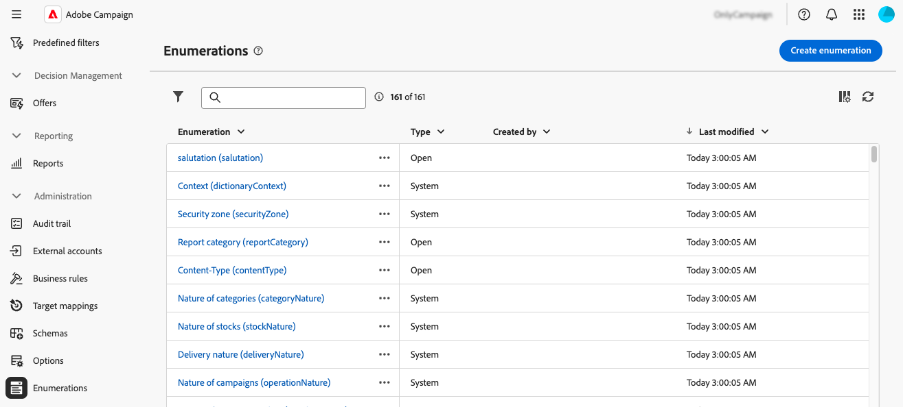
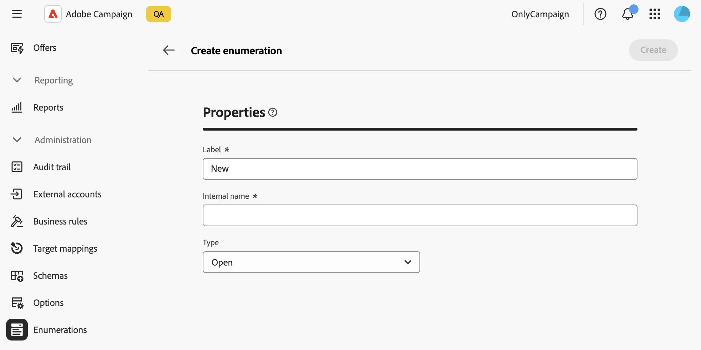

# Hantera uppräkningar {#enumerations}

>[!CONTEXTUALHELP]
>id="acw_enumerations_list"
>title="Uppräkningar"
>abstract="En uppräkning är en lista med värden som föreslås av systemet för att fylla i fält. Använd uppräkningar för att standardisera värdena för dessa fält, hjälp med inmatning av data eller användning inom frågor."

>[!CONTEXTUALHELP]
>id="acw_enumerations_properties"
>title="Egenskaper"
>abstract="Definiera uppräkningens egenskaper, till exempel namn, internt namn och typ. **[!UICONTROL Closed]** uppräkningar har en fast lista med värden som bara kan ändras från menyn **[!UICONTROL Enumerations]**. **[!UICONTROL Open]** uppräkningar tillåter användare att lägga till nya värden direkt i fälten baserat på den här uppräkningen. **[!UICONTROL System]** uppräkningar är associerade med systemfält. **[!UICONTROL Emoticon]** uppräkningar används för att uppdatera uttryckslistan."

>[!CONTEXTUALHELP]
>id="acw_enumerations_values"
>title="Lista med uppräkningsvärden"
>abstract="Om du vill lägga till ett värde i uppräkningen klickar du på knappen **[!UICONTROL Add value]** och konfigurerar den efter behov."

## Vad är uppräkningar? {#about}

En uppräkning är en lista med värden som föreslås av systemet för att fylla i fält. Använd uppräkningar för att standardisera värdena för dessa fält, hjälp med inmatning av data eller användning inom frågor. Värdelistan visas som en listruta där du kan välja vilket värde som ska anges i fältet. Listrutan möjliggör även prediktiv inmatning: ange de första bokstäverna och programmet fyller i resten.

Värdena för den här typen av fält definieras via menyn **[!UICONTROL Administration]** / **[!UICONTROL Enumerations]** i den vänstra navigeringsrutan.

## Skapa en uppräkning {#create}

Så här skapar du en uppräkning:

1. Navigera till menyn **[!UICONTROL Enumerations]** och klicka sedan på knappen **[!UICONTROL Create enumeration]**.

1. Ange en **[!UICONTROL Label]** och en **[!UICONTROL Internal name]** för uppräkningen.

   

1. Välj uppräkningen **[!UICONTROL Type]**:

   * **[!UICONTROL Closed]** uppräkningar har en fast lista med värden som bara kan ändras från menyn **[!UICONTROL Enumerations]**.
   * **[!UICONTROL Open]** uppräkningar tillåter användare att lägga till nya värden direkt i fälten baserat på den här uppräkningen.
   * **[!UICONTROL System]** uppräkningar är associerade med systemfält.
   * **[!UICONTROL Emoticon]** uppräkningar används för att uppdatera uttryckslistan.

1. Klicka på **[!UICONTROL Create]**. Uppräkningsinformationen visas så att du kan lägga till värden i listan.

   

1. Om du vill lägga till ett värde klickar du på knappen **[!UICONTROL Add value]** och konfigurerar det efter behov:

   * **[!UICONTROL Label]**: Etiketten som ska visas i uppräkningen.
   * **[!UICONTROL Internal name]**: Värdets interna namn (för systemuppräkningar).
   * **[!UICONTROL U+ (internal name)]** (uppräkning av uttryckssymboler): Unicode-koden för uttryckssymbolen (för uppräkningar med uttryckssymboler).

   

1. Spara ändringarna. Uppräkningen uppdateras nu på de skärmar där den används.

## Använd skiftläge: Lägg till fördefinierade värden i en uppräkning {#uc}

Som standard tillåter fältet &quot;Ursprung&quot; på skärmen för profilinformation användare att ange valfritt värde.

Varje gång en användare anger ett värde för fältet läggs värdet automatiskt till i uppräkningen &quot;Ursprung&quot;, vilket kan leda till redundanta, inkonsekventa eller felaktiga värden över tiden i värdelistan.

För att säkerställa att data är konsekventa och vägleder användare när de fyller i fältet kan du definiera en uppsättning fördefinierade värden. Följ de här stegen:

1. Gå till menyn **[!UICONTROL Enumerations]** och öppna uppräkningen &quot;Ursprung&quot;.

2. Granska listan över användarinmatade värden och rensa den. Klicka på ellipsknappen bredvid ett värde för att ta bort det. Om listan innehåller för många inkonsekvenser tar du bort hela uppräkningen och skapar den från grunden igen.

   

3. Lägg till fördefinierade värden. Om du vill göra det klickar du på knappen **[!UICONTROL Add value]** och anger de fördefinierade värden som användarna ska välja bland.

   

4. Om du vill framtvinga konsekvens växlar du uppräkningstypen till **[!UICONTROL Closed]**, vilket begränsar användare till fördefinierade värden.
Om du behöver ha flexibilitet bör du behålla den **[!UICONTROL Open]** så att nya användarposter tillåts.

5. Återgå till skärmen Profilinformation. Fältet &quot;Ursprung&quot; visar nu de fördefinierade värdena för markeringen.

   
