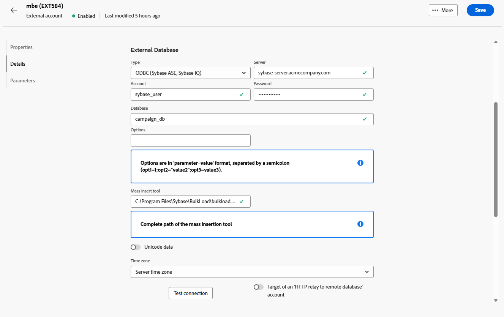

# Externa databaskonton {#external-accounts}

Använd ett externt databastyp för att ansluta Adobe Campaign till en tredjepartsdatabas.

Konfigurationsinställningarna för det externa kontot varierar beroende på vilken databasmotor du ansluter till. Detaljerade instruktioner för de databaser som stöds finns i avsnitten nedan.

## Amazon Redshift

Med det externa Amazon Redshift-kontot kan du ansluta Campaign-instansen till den externa Amazon Redshift-databasen.

Konfigurera ditt externa Amazon Redshift-konto i Adobe Campaign Web User Interface.

1. [Skapa ditt externa konto](external-account.md) och välj **[!UICONTROL External database]** som **[!UICONTROL Type]** och Amazon Redshift som **[!UICONTROL Provider type]** för ditt externa konto.

1. Klicka på **[!UICONTROL Create]**.

1. Om du vill konfigurera det externa kontot **[!UICONTROL Amazon Redshift]** fyller du i följande fält:

   * **[!UICONTROL Type]**: Amazon Redshift

   * **[!UICONTROL Server]**: Ange DNS-namnet för Redshift-servern.

   * **[!UICONTROL Account]**: Ange det användarnamn för Redshift som ska användas för autentisering.

   * **[!UICONTROL Password]**: Ange lösenordet som är kopplat till användarkontot.

   * **[!UICONTROL Database]**: Ange databasnamnet om det inte redan har definierats i DSN. Lämna fältet tomt om DSN innehåller databasen.

   * **[!UICONTROL Working schema]**: Ange schemanamnet där Adobe Campaign ska arbeta.

   * **[!UICONTROL Options]**: Lägg till alla avancerade konfigurationsalternativ som kan behövas för din miljö.

   * **[!UICONTROL Time zone]**: Välj eller ange serverns tidszon för att säkerställa korrekta tidsbaserade åtgärder.

   

1. När du har konfigurerat anslutningen skapar du Adobe Campaign SQL-funktionerna i din fjärrdatabas för Redshift. När de här funktionerna är tillgängliga klickar du på **[!UICONTROL Deploy functions]** för att aktivera dem.

1. Länka **[!UICONTROL Storage account]** för att optimera prestanda och möjliggöra snabbare datainläsningsprocesser mellan Adobe Campaign och Amazon Redshift.

1. Ange din **[!UICONTROL Account role]** som avgör vilka behörigheter Adobe Campaign ska använda när du interagerar med din Redshift-miljö.

## Amazon Redshift (äldre)

Med det externa Amazon Redshift-kontot (äldre) kan du ansluta Campaign-instansen till den externa Amazon Redshift-databasen.

Konfigurera ditt externa Amazon Redshift-konto (äldre) i Adobe Campaign webbanvändargränssnitt.

1. [Skapa ditt externa konto](external-account.md) och välj **[!UICONTROL External database]** som **[!UICONTROL Type]** och Amazon Redshift (äldre) som **[!UICONTROL Provider type]** för ditt externa konto.

1. Klicka på **[!UICONTROL Create]**.

1. Om du vill konfigurera det externa kontot **[!UICONTROL Amazon Redshift (legacy)]** fyller du i följande fält:

   * **[!UICONTROL Type]**: Amazon Redshift (äldre)

   * **[!UICONTROL Server]**: Ange DNS-namnet för Redshift-servern.

   * **[!UICONTROL Account]**: Ange det användarnamn för Redshift som ska användas för autentisering.

   * **[!UICONTROL Password]**: Ange lösenordet som är kopplat till användarkontot.

   * **[!UICONTROL Database]**: Ange databasnamnet om det inte redan har definierats i DSN. Lämna fältet tomt om DSN innehåller databasen.

   * **[!UICONTROL Working schema]**: Ange schemanamnet där Adobe Campaign ska arbeta.

   * **[!UICONTROL Time zone]**: Välj eller ange serverns tidszon för att säkerställa korrekta tidsbaserade åtgärder.

   

1. När du har konfigurerat anslutningen skapar du Adobe Campaign SQL-funktionerna i din fjärrdatabas för Redshift. När de här funktionerna är tillgängliga klickar du på **[!UICONTROL Deploy functions]** för att aktivera dem.

## Azure Synapse Analytics

Med det externa Azure Synapse Analytics-kontot kan ni ansluta Campaign-instansen till er externa Azure Synapse-databas.

Konfigurera ditt externa Azure Synapse Analytics-konto i Adobe Campaign Web User Interface.

1. [Skapa ditt externa konto](external-account.md) och välj **[!UICONTROL External database]** som **[!UICONTROL Type]** och Amazon Redshift som **[!UICONTROL Provider type]** för ditt externa konto.

1. Klicka på **[!UICONTROL Create]**.

1. Om du vill konfigurera det externa kontot **[!UICONTROL Azure Synapse Analytics]** fyller du i följande fält:

   * **[!UICONTROL Type]**: Azure Synapse Analytics

   * **[!UICONTROL Server]**: Ange URL-adressen för Azure Synapse-servern.

   * **[!UICONTROL Account]**: Ange det användarnamn som ska autentiseras med Synapse-databasen.

   * **[!UICONTROL Password]**: Ange lösenordet som är kopplat till kontot.

   * **[!UICONTROL Database]**: Ange måldatabasen som du vill att Adobe Campaign ska ansluta till.

   * **[!UICONTROL Tables and functions prefix]**: Som standard anges kontonamnet. Du kan justera det om du föredrar att använda ett annat prefix för att identifiera Campaign-relaterade objekt.

   * **[!UICONTROL Options]**: Lägg till alla avancerade konfigurationsalternativ som kan behövas för din miljö.

   * **[!UICONTROL Time zone]**: Välj eller ange serverns tidszon för att säkerställa korrekta tidsbaserade åtgärder.

   

1. Du kan välja att aktivera alternativet **[!UICONTROL Use a work tablespace for tables]** och sedan ange **[!UICONTROL Tablespace of tables]** där dina arbetsregister ska lagras.

1. Aktivera alternativet **[!UICONTROL Use a work tablespace for indexes]** om det behövs och ange sedan **[!UICONTROL Indexes tablespace]**.

   

1. När du har konfigurerat anslutningen skapar du Adobe Campaign SQL-funktionerna i din Azure Synapse Analytics-fjärrdatabas. När de här funktionerna är tillgängliga klickar du på **[!UICONTROL Deploy functions]** för att aktivera dem.

## Databricks

Med det externa databankskontot kan du ansluta Campaign-instansen till den externa databasen i dina databaser.

Konfigurera ditt externa databankskonto i Adobe Campaign webbanvändargränssnitt.

1. [Skapa ditt externa konto](external-account.md) och välj **[!UICONTROL External database]** som **[!UICONTROL Type]** och databaser för ditt externa konto som **[!UICONTROL Provider type]**.

1. Klicka på **[!UICONTROL Create]**.

1. Om du vill konfigurera det externa kontot **[!UICONTROL Databricks]** fyller du i följande fält:

   * **[!UICONTROL Type]**: Databricks

   * **[!UICONTROL Server]**: Ange DNS-namnet för databasservern.

   * **[!UICONTROL Account]**: Ange användarnamn för databaser som ska användas för autentisering.

   * **[!UICONTROL Password]**: Ange lösenordet som är kopplat till användarkontot.

   * **[!UICONTROL Catalog]**: Ange den katalog som du vill använda.

   * **[!UICONTROL Working schema]**: Ange namnet på schemat där Adobe Campaign ska skapa och hantera sina arbetsobjekt.

   * **[!UICONTROL Options]**: Lägg till alla avancerade konfigurationsalternativ som kan behövas för din miljö.

   

1. När du har konfigurerat anslutningen skapar du Adobe Campaign SQL-funktionerna i fjärrdatabasen. När de här funktionerna är tillgängliga klickar du på **[!UICONTROL Deploy functions]** för att aktivera dem.

1. Länka **[!UICONTROL Storage account]** för att optimera prestanda och möjliggöra snabbare datainläsningsprocesser mellan Adobe Campaign och Databricks.

## Google BigQuery

Med det externa Google BigQuery-kontot kan du ansluta Campaign-instansen till din externa Google BigQuery-databas.

Konfigurera ditt externa Google BigQuery-konto i Adobe Campaign Web User Interface.

1. [Skapa ditt externa konto](external-account.md) och välj **[!UICONTROL External database]** som **[!UICONTROL Type]** och Google BigQuery som **[!UICONTROL Provider type]** för ditt externa konto.

1. Klicka på **[!UICONTROL Create]**.

1. Om du vill konfigurera det externa kontot **[!UICONTROL Google BigQuery]** fyller du i följande fält:

   * **[!UICONTROL Type]**: Google BigQuery

   * **[!UICONTROL Account]**: Ange användarnamnet eller tjänstkontot som Adobe Campaign ska använda för att ansluta till BigQuery.

   * **[!UICONTROL Login file upload method]**: Välj hur du vill tillhandahålla nyckelordet för tjänstkontot antingen genom att ange nyckelfilens sökväg manuellt eller genom att överföra nyckelfilen direkt till servern.

   * **[!UICONTROL Server]**: Om du väljer alternativet för manuell inmatning anger du serverns URL.

   * **[!UICONTROL Project]**: Ange det projekt-ID för Google Cloud som är kopplat till din BigQuery-instans.

   * **[!UICONTROL Dataset]**: Ange namnet på datauppsättningen där Adobe Campaign ska lagra och fråga efter data.

   * **[!UICONTROL Options]**: Lägg till alla avancerade konfigurationsalternativ som kan behövas för din miljö.

   

1. Under **[!UICONTROL Parameters]** klistrar du in innehållet i JSON-filen för tjänstkontonyckeln för att autentisera Adobe Campaign med Google BigQuery.

1. När du har konfigurerat anslutningen skapar du Adobe Campaign SQL-funktionerna i din Google BigQuery-fjärrdatabas. När de här funktionerna är tillgängliga klickar du på **[!UICONTROL Deploy functions]** för att aktivera dem.

1. Om miljön kräver proxyåtkomst för att ansluta till BigQuery-servern konfigurerar du proxyinställningarna.

   Börja med att välja proxytyp: http, http_no_tunnel, sockor4 eller sockor5.

1. Fyll i följande proxykonfigurationsfält för att upprätta säker åtkomst:

   * **[!UICONTROL Proxy Host]**: Proxyserverns adress.
   * **[!UICONTROL Proxy Port]**: Den port som används av proxyservern.
   * **[!UICONTROL Proxy UID]**: Användar-ID:t för autentisering med proxyservern, om det behövs.
   * **[!UICONTROL Proxy Host]**: Lösenordet som motsvarar Proxy UID (om tillämpligt).

   

## Microsoft SQL Server

Med det externa Microsoft SQL Server-kontot kan du ansluta Campaign-instansen till din externa Microsoft SQL Server-databas.

Konfigurera ditt externa Microsoft SQL Server-konto i Adobe Campaign Web User Interface.

1. [Skapa ditt externa konto](external-account.md) och välj **[!UICONTROL External database]** som **[!UICONTROL Type]** och Microsoft SQL Server som **[!UICONTROL Provider type]** för ditt externa konto.

1. Klicka på **[!UICONTROL Create]**.

1. Om du vill konfigurera det externa kontot **[!UICONTROL Microsoft SQL Server]** fyller du i följande fält:

   * **[!UICONTROL Type]**: Microsoft SQL Server

   * **[!UICONTROL Server]**: Ange DNS-namnet för din Microsoft SQL Server.

   * **[!UICONTROL Account]**: Ange det Microsoft SQL Server-användarnamn som ska användas för autentisering.

   * **[!UICONTROL Password]**: Ange lösenordet som är kopplat till användarkontot.

   * **[!UICONTROL Database]**: Ange databasnamnet om det inte redan har definierats i DSN. Lämna fältet tomt om DSN innehåller databasen.

   * **[!UICONTROL Options]**: Lägg till alla avancerade konfigurationsalternativ som kan behövas för din miljö.

   * **[!UICONTROL Tables and functions prefix]**: Som standard anges kontonamnet. Du kan justera det om du föredrar att använda ett annat prefix för att identifiera Campaign-relaterade objekt.

   * **[!UICONTROL Time zone]**: Välj eller ange serverns tidszon för att säkerställa korrekta tidsbaserade åtgärder.

   

1. Du kan välja att aktivera alternativet **[!UICONTROL Use a work tablespace for tables]** och sedan ange **[!UICONTROL Tablespace of tables]** där dina arbetsregister ska lagras.

1. Aktivera alternativet **[!UICONTROL Use a work tablespace for indexes]** om det behövs och ange sedan **[!UICONTROL Indexes tablespace]**.

1. När du har konfigurerat anslutningen skapar du Adobe Campaign SQL-funktionerna i din Microsoft SQL Server-fjärrdatabas. När de här funktionerna är tillgängliga klickar du på **[!UICONTROL Deploy functions]** för att aktivera dem.

## MySQL

Med det externa MySQL-kontot kan du ansluta Campaign-instansen till din externa MySQL-databas.
Konfigurera ditt externa MySQL-konto i Adobe Campaign Web User Interface.

1. [Skapa ditt externa konto](external-account.md) och välj **[!UICONTROL External database]** som **[!UICONTROL Type]** och MySQL som **[!UICONTROL Provider type]** för ditt externa konto.

1. Klicka på **[!UICONTROL Create]**.

1. Om du vill konfigurera det externa kontot **[!UICONTROL MySQL]** fyller du i följande fält:

   * **[!UICONTROL Type]**: MySQL

   * **[!UICONTROL Server]**: Ange DNS-namnet för MySQL-servern.

   * **[!UICONTROL Account]**: Ange det MySQL-användarnamn som ska användas för autentisering.

   * **[!UICONTROL Password]**: Ange lösenordet som är kopplat till användarkontot.

   * **[!UICONTROL Database]**: Ange databasnamnet om det inte redan har definierats i DSN. Lämna fältet tomt om DSN innehåller databasen.

   * **[!UICONTROL Time zone]**: Välj eller ange serverns tidszon för att säkerställa korrekta tidsbaserade åtgärder.

   

1. Du kan välja att aktivera alternativet **[!UICONTROL Use a work tablespace for tables]** och sedan ange **[!UICONTROL Tablespace of tables]** där dina arbetsregister ska lagras.

1. Aktivera alternativet **[!UICONTROL Use a work tablespace for indexes]** om det behövs och ange sedan **[!UICONTROL Indexes tablespace]**.

1. När du har konfigurerat anslutningen skapar du Adobe Campaign SQL-funktionerna i din MySQL-fjärrdatabas. När de här funktionerna är tillgängliga klickar du på **[!UICONTROL Deploy functions]** för att aktivera dem.

## Netezza

Med Netezza externa konto kan du ansluta Campaign-instansen till din externa Netezza-databas.

Konfigurera ditt externa Netezza-konto i Adobe Campaign Web User Interface.

1. [Skapa ditt externa konto](external-account.md) och välj **[!UICONTROL External database]** som ditt externa kontos **[!UICONTROL Type]** och Netezza som **[!UICONTROL Provider type]**.

1. Klicka på **[!UICONTROL Create]**.

1. Om du vill konfigurera det externa kontot **[!UICONTROL Netezza]** fyller du i följande fält:

   * **[!UICONTROL Type]**: Netezza

   * **[!UICONTROL Server]**: Ange DNS-namnet för din Netezza-server.

   * **[!UICONTROL Account]**: Ange det Netezza-användarnamn som ska användas för autentisering.

   * **[!UICONTROL Password]**: Ange lösenordet som är kopplat till användarkontot.

   * **[!UICONTROL Database]**: Ange databasnamnet om det inte redan har definierats i DSN. Lämna fältet tomt om DSN innehåller databasen.

   * **[!UICONTROL Time zone]**: Välj eller ange serverns tidszon för att säkerställa korrekta tidsbaserade åtgärder.

   

1. Du kan välja att aktivera alternativet **[!UICONTROL Use a work tablespace for tables]** och sedan ange **[!UICONTROL Tablespace of tables]** där dina arbetsregister ska lagras.

1. Aktivera alternativet **[!UICONTROL Use a work tablespace for indexes]** om det behövs och ange sedan **[!UICONTROL Indexes tablespace]**.

1. När du har konfigurerat anslutningen skapar du Adobe Campaign SQL-funktionerna i Netezza fjärrdatabas. När de här funktionerna är tillgängliga klickar du på **[!UICONTROL Deploy functions]** för att aktivera dem.

## ODBC (Sybase ASE, Sybase IQ)

Med det externa ODBC-kontot (Sybase ASE, Sybase IQ) kan du ansluta Campaign-instansen till din externa ODBC-databas (Sybase ASE, Sybase IQ).
Konfigurera ditt externa ODBC-konto (Sybase ASE, Sybase IQ) i Adobe Campaign Web User Interface.

1. [Skapa ditt externa konto](external-account.md) och välj **[!UICONTROL External database]** som **[!UICONTROL Type]** och ODBC (Sybase ASE, Sybase IQ) som **[!UICONTROL Provider type]**.

1. Klicka på **[!UICONTROL Create]**.

1. Om du vill konfigurera det externa kontot **[!UICONTROL ODBC (Sybase ASE, Sybase IQ)]** fyller du i följande fält:

   * **[!UICONTROL Type]**: ODBC (Sybase ASE, Sybase IQ)

   * **[!UICONTROL Server]**: Ange DNS-namnet för ODBC-servern (Sybase ASE, Sybase IQ).

   * **[!UICONTROL Account]**: Ange det användarnamn för ODBC-servern (Sybase ASE, Sybase IQ) som ska användas för autentisering.

   * **[!UICONTROL Password]**: Ange lösenordet som är kopplat till användarkontot.

   * **[!UICONTROL Database]**: Ange databasnamnet om det inte redan har definierats i DSN. Lämna fältet tomt om DSN innehåller databasen.

   * **[!UICONTROL Options]**: Lägg till alla avancerade konfigurationsalternativ som kan behövas för din miljö.

   * **[!UICONTROL Mass insert tool]**: Ange den fullständiga sökvägen till den körbara filen för massinfogningsverktyget.

   * **[!UICONTROL Time zone]**: Välj eller ange serverns tidszon för att säkerställa korrekta tidsbaserade åtgärder.

   

1. Du kan välja att aktivera alternativet **[!UICONTROL Use a work tablespace for tables]** och sedan ange **[!UICONTROL Tablespace of tables]** där dina arbetsregister ska lagras.

1. Aktivera alternativet **[!UICONTROL Use a work tablespace for indexes]** om det behövs och ange sedan **[!UICONTROL Indexes tablespace]**.

1. När du har konfigurerat anslutningen skapar du Adobe Campaign SQL-funktionerna i ODBC-fjärrdatabasen. När de här funktionerna är tillgängliga klickar du på **[!UICONTROL Deploy functions]** för att aktivera dem.

## HTTP-relä till fjärrdatabas

Med HTTP-reläet till det externa fjärrdatabaskontot kan du ansluta Campaign-instansen till HTTP-reläet till den externa fjärrdatabasens databas.

Konfigurera HTTP-reläet till det externa fjärrdatabaskontot i Adobe Campaign Web User Interface.

1. [Skapa ditt externa konto](external-account.md) och välj **[!UICONTROL External database]** som **[!UICONTROL Type]** och Amazon Redshift som **[!UICONTROL Provider type]** för ditt externa konto.

1. Klicka på **[!UICONTROL Create]**.

1. Om du vill konfigurera det externa kontot **[!UICONTROL HTTP relay to remote database]** fyller du i följande fält:

   * **[!UICONTROL Type]**: HTTP-relä till fjärrdatabas

   * **[!UICONTROL Server]**: Ange den fullständiga URL:en för HTTP-reläservern som ansluter till fjärrdatabasen.

   * **[!UICONTROL Account]**: Ange det användarnamn som används för att autentisera med HTTP-reläservern.

   * **[!UICONTROL Password]**: Ange lösenordet som är kopplat till det här kontot.

   * **[!UICONTROL Datasource]**: Ange måldatabasen som Adobe Campaign ska ansluta till via reläet.

   * **[!UICONTROL Options]**: Lägg till alla avancerade konfigurationsalternativ som kan behövas för din miljö.

   

1. Du kan välja att aktivera alternativet **[!UICONTROL Use a work tablespace for tables]** och sedan ange **[!UICONTROL Tablespace of tables]** där dina arbetsregister ska lagras.

1. Aktivera alternativet **[!UICONTROL Use a work tablespace for indexes]** om det behövs och ange sedan **[!UICONTROL Indexes tablespace]**.

1. När du har konfigurerat anslutningen skapar du Adobe Campaign SQL-funktionerna i HTTP-fjärrreläet till fjärrdatabasen. När de här funktionerna är tillgängliga klickar du på **[!UICONTROL Deploy functions]** för att aktivera dem.

## Oracle

Med Oracle externa konto kan du ansluta Campaign-instansen till din externa Oracle-databas.
Konfigurera ditt externa Oracle-konto i Adobe Campaign Web User Interface.

1. [Skapa ditt externa konto](external-account.md) och välj **[!UICONTROL External database]** som ditt externa kontos **[!UICONTROL Type]** och Oracle som **[!UICONTROL Provider type]**.

1. Klicka på **[!UICONTROL Create]**.

1. Om du vill konfigurera det externa kontot **[!UICONTROL Oracle]** fyller du i följande fält:

   * **[!UICONTROL Type]**: Oracle

   * **[!UICONTROL Server]**: Ange DNS-namnet för din Oracle-server.

   * **[!UICONTROL Account]**: Ange det Oracle-användarnamn som ska användas för autentisering.

   * **[!UICONTROL Password]**: Ange lösenordet som är kopplat till användarkontot.

   * **[!UICONTROL Time zone]**: Välj eller ange serverns tidszon för att säkerställa korrekta tidsbaserade åtgärder.

   

1. Du kan välja att aktivera alternativet **[!UICONTROL Use a work tablespace for tables]** och sedan ange **[!UICONTROL Tablespace of tables]** där dina arbetsregister ska lagras.

1. Aktivera alternativet **[!UICONTROL Use a work tablespace for indexes]** om det behövs och ange sedan **[!UICONTROL Indexes tablespace]**.

1. När du har konfigurerat anslutningen skapar du Adobe Campaign SQL-funktionerna i Oracle fjärrdatabas. När de här funktionerna är tillgängliga klickar du på **[!UICONTROL Deploy functions]** för att aktivera dem.

## PostgreSQL

Med det externa PostgreSQL-kontot kan du ansluta Campaign-instansen till den externa PostgreSQL-databasen.
Konfigurera ditt externa PostgreSQL-konto i Adobe Campaign Web User Interface.

1. [Skapa ditt externa konto](external-account.md) och välj **[!UICONTROL External database]** som **[!UICONTROL Type]** och PostgreSQL som **[!UICONTROL Provider type]** för ditt externa konto.

1. Klicka på **[!UICONTROL Create]**.

1. Om du vill konfigurera det externa kontot **[!UICONTROL PostgreSQL]** fyller du i följande fält:

   * **[!UICONTROL Type]**: PostgreSQL

   * **[!UICONTROL Server]**: Ange DNS-namnet för PostgreSQL-servern.

   * **[!UICONTROL Account]**: Ange det PostgreSQL-användarnamn som ska användas för autentisering.

   * **[!UICONTROL Password]**: Ange lösenordet som är kopplat till användarkontot.

   * **[!UICONTROL Database]**: Ange databasnamnet om det inte redan har definierats i DSN. Lämna fältet tomt om DSN innehåller databasen.

   * **[!UICONTROL Working schema]**: Ange namnet på schemat där Adobe Campaign ska skapa och hantera sina arbetsobjekt.

   * **[!UICONTROL Time zone]**: Välj eller ange serverns tidszon för att säkerställa korrekta tidsbaserade åtgärder.

   

1. Du kan välja att aktivera alternativet **[!UICONTROL Use a work tablespace for tables]** och sedan ange **[!UICONTROL Tablespace of tables]** där dina arbetsregister ska lagras.

1. Aktivera alternativet **[!UICONTROL Use a work tablespace for indexes]** om det behövs och ange sedan **[!UICONTROL Indexes tablespace]**.

1. När du har konfigurerat anslutningen skapar du Adobe Campaign SQL-funktionerna i PostgreSQL-fjärrdatabasen. När de här funktionerna är tillgängliga klickar du på **[!UICONTROL Deploy functions]** för att aktivera dem.

## SAP HANA

Med SAP HANA externa konto kan du ansluta Campaign-instansen till din externa SAP HANA-databas.

Konfigurera ditt externa SAP HANA-konto i Adobe Campaign Web User Interface.

1. [Skapa ditt externa konto](external-account.md) och välj **[!UICONTROL External database]** som ditt externa kontos **[!UICONTROL Type]** och SAP HANA som **[!UICONTROL Provider type]**.

1. Klicka på **[!UICONTROL Create]**.

1. Om du vill konfigurera det externa kontot **[!UICONTROL SAP HANA]** fyller du i följande fält:

   * **[!UICONTROL Type]**: SAP HANA

   * **[!UICONTROL Server]**: Ange DNS-namnet för din SAP HANA-server.

   * **[!UICONTROL Account]**: Ange det SAP HANA-användarnamn som ska användas för autentisering.

   * **[!UICONTROL Password]**: Ange lösenordet som är kopplat till användarkontot.

   * **[!UICONTROL Options]**: Lägg till alla avancerade konfigurationsalternativ som kan behövas för din miljö.

   * **[!UICONTROL Working schema]**: Ange namnet på schemat där Adobe Campaign ska skapa och hantera sina arbetsobjekt.

   * **[!UICONTROL Time zone]**: Välj eller ange serverns tidszon för att säkerställa korrekta tidsbaserade åtgärder.

   

1. Du kan välja att aktivera alternativet **[!UICONTROL Use a work tablespace for tables]** och sedan ange **[!UICONTROL Tablespace of tables]** där dina arbetsregister ska lagras.

1. Aktivera alternativet **[!UICONTROL Use a work tablespace for indexes]** om det behövs och ange sedan **[!UICONTROL Indexes tablespace]**.

1. När du har konfigurerat anslutningen skapar du Adobe Campaign SQL-funktionerna i SAP HANA fjärrdatabas. När de här funktionerna är tillgängliga klickar du på **[!UICONTROL Deploy functions]** för att aktivera dem.

## Snowflake

Med Snowflake externa konto kan du ansluta Campaign-instansen till din externa Snowflake-databas.

Konfigurera ditt externa Snowflake-konto i Adobe Campaign Web User Interface.

1. [Skapa ditt externa konto](external-account.md) och välj **[!UICONTROL External database]** som ditt externa kontos **[!UICONTROL Type]** och Snowflake som **[!UICONTROL Provider type]**.

1. Klicka på **[!UICONTROL Create]**.

1. Om du vill konfigurera det externa kontot **[!UICONTROL Snowflake]** fyller du i följande fält:

   * **[!UICONTROL Type]**: Snowflake

   * **[!UICONTROL Server]**: Ange DNS-namnet för din Snowflake-server.

   * **[!UICONTROL Account]**: Ange det Snowflake-användarnamn som ska användas för autentisering.

   * **[!UICONTROL Password]**: Ange lösenordet som är kopplat till användarkontot.

   * **[!UICONTROL Database]**: Ange databasnamnet om det inte redan har definierats i DSN. Lämna fältet tomt om DSN innehåller databasen.

   * **[!UICONTROL Working schema]**: Ange namnet på schemat där Adobe Campaign ska skapa och hantera sina arbetsobjekt.

   * **[!UICONTROL Options]**: Lägg till alla avancerade konfigurationsalternativ som kan behövas för din miljö.

   * **[!UICONTROL Time zone]**: Välj eller ange serverns tidszon för att säkerställa korrekta tidsbaserade åtgärder.

   

1. När du har konfigurerat anslutningen skapar du Adobe Campaign SQL-funktionerna i Snowflake fjärrdatabas. När de här funktionerna är tillgängliga klickar du på **[!UICONTROL Deploy functions]** för att aktivera dem.

1. Om du använder autentisering med nyckelpar går du till menyn **[!UICONTROL keypair.auth]** och anger de värden som krävs för:

   * **[!UICONTROL Password]**: Lösenfrasen skyddar den privata nyckeln, om tillämpligt.

   * **[!UICONTROL Private key]**: Den privata nyckel som används för att autentisera Snowflake-kontot.

## Teradata

Med Teradata externa konto kan du ansluta Campaign-instansen till din externa Teradata-databas.

Konfigurera ditt externa Teradata-konto i Adobe Campaign Web User Interface.

1. [Skapa ditt externa konto](external-account.md) och välj **[!UICONTROL External database]** som ditt externa kontos **[!UICONTROL Type]** och Teradata som **[!UICONTROL Provider type]**.

1. Klicka på **[!UICONTROL Create]**.

1. Om du vill konfigurera det externa kontot **[!UICONTROL Teradata]** fyller du i följande fält:

   * **[!UICONTROL Type]**: Teradata

   * **[!UICONTROL Server]**: Ange DNS-namnet för din Teradata-server.

   * **[!UICONTROL Account]**: Ange det Teradata-användarnamn som ska användas för autentisering.

   * **[!UICONTROL Password]**: Ange lösenordet som är kopplat till användarkontot.

   * **[!UICONTROL Database]**: Ange databasnamnet om det inte redan har definierats i DSN. Lämna fältet tomt om DSN innehåller databasen.

   * **[!UICONTROL Options]**: Lägg till alla avancerade konfigurationsalternativ som kan behövas för din miljö.

   * **[!UICONTROL Time zone]**: Välj eller ange serverns tidszon för att säkerställa korrekta tidsbaserade åtgärder.

   

1. Du kan välja att aktivera alternativet **[!UICONTROL Use a work tablespace for tables]** och sedan ange **[!UICONTROL Tablespace of tables]** där dina arbetsregister ska lagras.

1. Aktivera alternativet **[!UICONTROL Use a work tablespace for indexes]** om det behövs och ange sedan **[!UICONTROL Indexes tablespace]**.

1. När du har konfigurerat anslutningen skapar du Adobe Campaign SQL-funktionerna i Teradata fjärrdatabas. När de här funktionerna är tillgängliga klickar du på **[!UICONTROL Deploy functions]** för att aktivera dem.

1. Om det behövs anger du din **[!UICONTROL PostConnect Script]** om du vill att ett skript ska köras automatiskt efter att varje anslutning har upprättats. Aktivera alternativet **[!UICONTROL Run every time]** om du vill att skriptet ska köras varje gång.

## Vertica Analytics

Konfigurera ditt externa Vertica Analytics-konto i Adobe Campaign Web User Interface.

1. [Skapa ditt externa konto](external-account.md) och välj **[!UICONTROL External database]** som ditt externa kontos **[!UICONTROL Type]** och Vertica Analytics som **[!UICONTROL Provider type]**.

1. Klicka på **[!UICONTROL Create]**.

1. Om du vill konfigurera det externa kontot **[!UICONTROL Vertica Analytics]** fyller du i följande fält:

   * **[!UICONTROL Type]**: Vertica Analytics

   * **[!UICONTROL Server]**: Ange DNS-namnet för din Vertica Analytics-server.

   * **[!UICONTROL Account]**: Ange det Vertica Analytics-användarnamn som ska användas för autentisering.

   * **[!UICONTROL Password]**: Ange lösenordet som är kopplat till användarkontot.

   * **[!UICONTROL Database]**: Ange databasnamnet om det inte redan har definierats i DSN. Lämna fältet tomt om DSN innehåller databasen.

   * **[!UICONTROL Working schema]**: Ange namnet på schemat där Adobe Campaign ska skapa och hantera sina arbetsobjekt.

   * **[!UICONTROL Options]**: Lägg till alla avancerade konfigurationsalternativ som kan behövas för din miljö.

   * **[!UICONTROL Time zone]**: Välj eller ange serverns tidszon för att säkerställa korrekta tidsbaserade åtgärder.

   

1. När du har konfigurerat anslutningen skapar du Adobe Campaign SQL-funktionerna i Vertica Analytics fjärrdatabas. När de här funktionerna är tillgängliga klickar du på **[!UICONTROL Deploy functions]** för att aktivera dem.

## Microsoft Fabric {#fabric}

Med det externa Microsoft Fabric-kontot kan du ansluta Campaign-instansen till din externa Microsoft Fabric-databas.

Konfigurera ditt externa Microsoft Fabric-konto i Adobe Campaign Web User Interface.

1. [Skapa ditt externa konto](external-account.md) och välj **[!UICONTROL External database]** som **[!UICONTROL Type]** och Microsoft Fabric som **[!UICONTROL Provider type]** för ditt externa konto.

1. Klicka på **[!UICONTROL Create]**.

1. Om du vill konfigurera det externa kontot **[!UICONTROL Microsoft Fabric]** fyller du i följande fält:

   * **[!UICONTROL Type]**: Microsoft Fabric

   * **[!UICONTROL Server]**: Ange DNS-namnet för Microsoft Fabric-servern.

   * **[!UICONTROL Account]**: Ange användarnamnet (eller tjänstens huvudnamn) för Microsoft Fabric som ska användas för autentisering.

   * **[!UICONTROL Password]**: Ange det lösenord eller den hemlighet som är associerad med kontot.

   * **[!UICONTROL Options]**: Lägg till alla avancerade konfigurationsalternativ som kan behövas för din miljö.

   

1. När du har konfigurerat anslutningen skapar du Adobe Campaign SQL-funktionerna i din fjärrdatabas för Redshift. När de här funktionerna är tillgängliga klickar du på **[!UICONTROL Deploy functions]** för att aktivera dem.

1. Länka **[!UICONTROL Storage account]** för att optimera prestanda och möjliggöra snabbare datainläsningsprocesser mellan Adobe Campaign och Microsoft Fabric.

1. Ange din **[!UICONTROL Account role]** som avgör vilka behörigheter Adobe Campaign ska använda när du interagerar med din Redshift-miljö.
