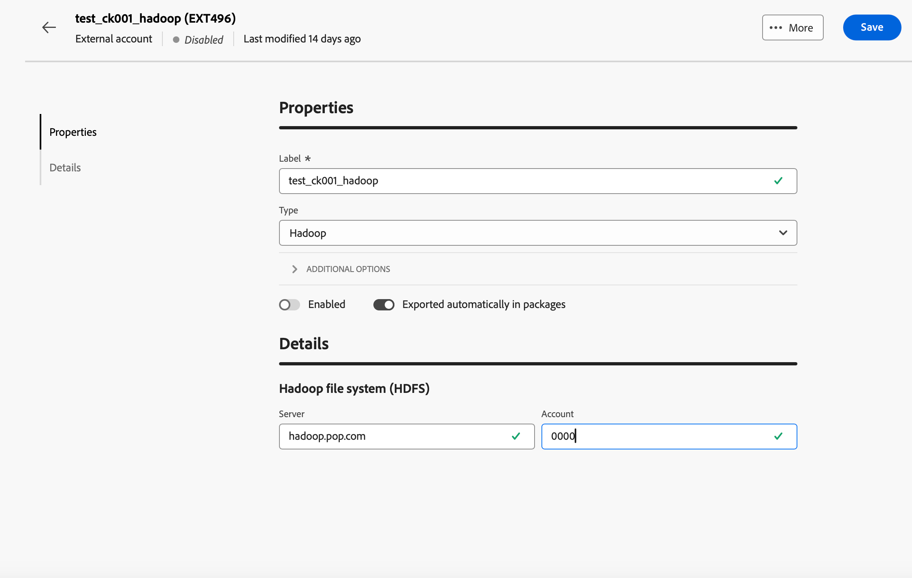

# Hantera externa konton {#external-accounts}

Adobe Campaign innehåller förkonfigurerade externa konton för enkel integrering med olika system. Om du vill ansluta till fler plattformar eller anpassa anslutningarna efter arbetsflödet skapar du nya externa konton med webbanvändargränssnittet. Detta garanterar smidiga dataöverföringar.

## Skapa ett externt konto {#create-ext-account}

Följ stegen nedan om du vill skapa ett nytt externt konto. Detaljerade inställningar beror på typen av externt konto. [Läs mer](#campaign-specific)

1. Välj **[!UICONTROL External accounts]** under **[!UICONTROL Administration]** på den vänstra panelmenyn.

1. Klicka på **[!UICONTROL Create external account]**.

   

1. Ange din **[!UICONTROL Label]** och välj det externa kontot **[!UICONTROL Type]**.

   >[!NOTE]
   >
   >Inställningarna för Campaign-specifika typer beskrivs i [det här avsnittet](#campaign-specific).

   

1. Klicka på **[!UICONTROL Create]**.

1. Ändra sökvägen **[!UICONTROL Internal name]** eller **[!UICONTROL Folder]** i listrutan **[!UICONTROL Additional options]** om det behövs.

   

1. Aktivera alternativet **[!UICONTROL Exported automatically in packages]** för att automatiskt exportera data som hanteras av det här externa kontot. <!--Exported where??-->

   

1. Konfigurera åtkomst till kontot i avsnittet **[!UICONTROL Details]** genom att ange autentiseringsuppgifter baserat på den valda externa kontotypen. [Läs mer](#bounce)

1. Klicka på **[!UICONTROL Test connection]** för att verifiera att konfigurationen är korrekt.

1. Duplicera eller ta bort ditt externa konto på menyn **[!UICONTROL More...]**.

   

1. När konfigurationen är klar klickar du på **[!UICONTROL Save]**.

## Kampanjspecifika externa konton {#campaign-specific}

Beroende på vilken typ av externt konto du har valt följer du stegen nedan för att konfigurera kontoinställningarna.

### Studsa e-post (POP3) {#bounce}

Det externa kontot för studsmeddelanden anger det externa POP3-kontot som används för att ansluta till e-posttjänsten. Alla servrar som konfigurerats för POP3-åtkomst kan ta emot returmeddelanden.

Om du vill konfigurera det externa kontot **[!UICONTROL Bounce mails (POP3)]** fyller du i följande fält:

* **[!UICONTROL Server]** - URL för POP3-servern.

* **[!UICONTROL Port]** - portnummer för POP3-anslutning (standardport är 110).

* **[!UICONTROL Account]** - Användarens namn.

* **[!UICONTROL Password]** - Lösenord för användarkonto.

* **[!UICONTROL Encryption]** - Typ av vald kryptering, inklusive:
   * Som standard (POP3 om port 110, POP3S om port 995).
   * POP3 som byter till SSL efter att ha skickat STARTTLS.
   * POP3 ej skyddad (port 110 som standard).
   * POP3-skyddad över SSL (port 995 som standard).

* **[!UICONTROL Function]** - Välj **[!UICONTROL Inbound email]** om du vill konfigurera kontot för att ta emot inkommande e-post eller **[!UICONTROL SOAP router]** om du vill hantera SOAP-begäranden.

>[!IMPORTANT]
>
>Innan du konfigurerar ditt POP3-externa konto med Microsoft OAuth 2.0 måste du först registrera programmet i Azure-portalen. Mer information finns på [den här sidan](https://learn.microsoft.com/en-us/entra/identity-platform/quickstart-register-app){target=_blank}.

Om du vill konfigurera en POP3-extern med Microsoft OAuth 2.0 markerar du alternativet Microsoft OAuth 2.0 och fyller i följande fält:

* **[!UICONTROL Azure Tenant]**

  Azure ID (eller klientorganisations-ID) finns i listrutan Grundläggande i programöversikten på Azure-portalen.

* **[!UICONTROL Azure Client ID]**

  Klient-ID (eller program-ID (klient)) finns i listrutan Grundläggande i programöversikten på Azure-portalen.

* **[!UICONTROL Azure Client Secret]**

  Klienthemligt ID finns i kolumnen Klienthemligheter på menyn Certifikat och hemligheter för ditt program i Azure-portalen.

* **[!UICONTROL Azure Redirect URL]**

  Omdirigerings-URL:en finns på autentiseringsmenyn för ditt program i Azure-portalen. Det ska sluta med följande syntax: nl/jsp/oauth.jsp, t.ex. `https://redirect.adobe.net/nl/jsp/oauth.jsp`.

Internetåtkomst krävs för installation och för att använda knappen Testa anslutning i klientkonsolen. Efter installationen kan inMail-processen kommunicera med Microsoft-servrar utan Internet.

När du har angett de olika inloggningsuppgifterna kan du klicka på Konfigurera anslutningen för att slutföra konfigurationen av det externa kontot.

### Routning {#routing}

Följ stegen nedan för att konfigurera ett specifikt externt konto för externa leveranser.

1. Skapa ett externt konto. [Läs mer](../administration/external-account.md#create-ext-account)

1. Välj typen **[!UICONTROL Routing]**.

   {zoomable="yes"}

1. Markera kanalen och klicka på **[!UICONTROL Create]**.

1. I avsnittet för det externa kontot **[!UICONTROL Details]** markeras **[!UICONTROL External]** som standard som **[!UICONTROL Delivery mode]**.

   {zoomable="yes"}

   >[!NOTE]
   >
   >För närvarande är **[!UICONTROL External]** det enda tillgängliga läget.

1. Om du vill hantera processen efter leveranskörningen kan du göra det externt till ett arbetsflöde för efterbearbetning. Skapa ett arbetsflöde med en [extern signal](../workflows/activities/external-signal.md)-aktivitet och välj den i fältet **[!UICONTROL Post-processing]**.

   {zoomable="yes"}

1. I fältet **[!UICONTROL Activity]** redigerar du namnet på arbetsflödesaktiviteten för efterbearbetning som visas i loggarna. <!--you can edit the name of the activity that will be created if you add an external or bulk delivery to a workflow-->

### Körningsinstans {#instance-exec}

Om du har en segmenterad arkitektur ska du identifiera de körningsinstanser som är associerade med kontrollinstansen och upprätta anslutningar mellan dem. Transaktionsmeddelandemallar distribueras på körningsinstansen.

Så här konfigurerar du det externa kontot **[!UICONTROL Execution instance]**:

* **[!UICONTROL URL]** - URL för servern där körningsinstansen är installerad.

* **[!UICONTROL Account]** - Namnet på kontot, matchar Message Center Agent enligt operatormappen.

* **[!UICONTROL Password]** - Lösenord för kontot enligt definitionen i operatormappen.

* **[!UICONTROL Method]** - Välj mellan webbtjänsten eller FDA (Federated Data Access).

  Välj FDA-konto för FDA. Observera att Campaign-anslutningen till externa system är begränsad till avancerade användare och endast tillgänglig från klientkonsolen. [Läs mer](https://experienceleague.adobe.com/sv/docs/campaign/campaign-v8/connect/fda#_blank)

* **[!UICONTROL Create archiving workflow]** - För varje körningsinstans som är registrerad i meddelandecentret, oavsett om du har en eller flera instanser, skapar du ett separat arkiveringsarbetsflöde för varje externt konto som är associerat med körningsinstansen.

## Externa konton för integrering av Adobe-lösningar

### Adobe Experience Cloud

Om du vill ansluta till Adobe Campaign-konsolen med en Adobe ID måste du konfigurera det externa Adobe Experience Cloud-kontot (MAC).

* **[!UICONTROL IMS server]**

  URL för IMS-servern. Se till att både fas- och produktionsinstanser pekar på samma IMS-produktionsslutpunkt.

* **[!UICONTROL IMS scope]**

  Omfattningar som definieras här måste vara en delmängd av de som tillhandahålls av IMS.

* **[!UICONTROL IMS client identifier]**

  ID för IMS-klienten.

* **[!UICONTROL IMS client secret]**

  Autentiseringsuppgifter för din IMS-klienthemlighet.

* **[!UICONTROL Callback server]**

  Åtkomst-URL för din Adobe Campaign-instans.

* **[!UICONTROL IMS organization ID]**

  ID för din organisation. Information om hur du hittar ditt organisations-ID finns på [den här sidan](https://experienceleague.adobe.com/docs/core-services/interface/administration/organizations.html?lang=sv){target=_blank}.

* **[!UICONTROL Association mask]**

  Syntax som gör att konfigurationsnamn i Enterprise Dashboard kan synkroniseras med grupper i Adobe Campaign.

* **[!UICONTROL Server]**

  URL för din Adobe Experience Cloud-instans.

* **[!UICONTROL Tenant]**

  Namn på din Adobe Experience Cloud-klient.

## Externa konton för dataöverföring

### Amazon Simple Storage Service (S3) {#amazon-simple-storage-service--s3--external-account}

Kopplingen Amazon Simple Storage Service (S3) kan användas för att importera eller exportera data till Adobe Campaign. Den kan ställas in i en arbetsflödesaktivitet. Mer information finns på [den här sidan](https://experienceleague.adobe.com/sv/docs/campaign-web/v8/wf/design-workflows/transfer-file){target=_blank}.

När du konfigurerar det nya externa kontot måste du ange följande information:

* **[!UICONTROL AWS S3 Account Server]**

  URL-adressen till servern ska fyllas i enligt följande:

  `  <S3bucket name>.s3.amazonaws.com/<s3object path>`

* **[!UICONTROL AWS access key ID]**

  Information om var du hittar ditt ID för AWS-åtkomstnyckel finns på [sidan](https://docs.aws.amazon.com/general/latest/gr/aws-sec-cred-types.html#access-keys-and-secret-access-keys).

* **[!UICONTROL Secret access key to AWS]**

  Om du vill veta var du hittar din hemliga åtkomstnyckel till AWS kan du läsa den här [sidan](https://aws.amazon.com/fr/blogs/security/wheres-my-secret-access-key/).

* **[!UICONTROL AWS Region]**

  Mer information om AWS finns på [sidan](https://aws.amazon.com/about-aws/global-infrastructure/regions_az/).

* Med kryssrutan **[!UICONTROL Use server side encryption]** kan du lagra filen i S3-krypterat läge.

Mer information om var du hittar åtkomstnyckel-ID och hemlig åtkomstnyckel finns i [dokumentationen för Amazon Web Services](https://docs.aws.amazon.com/general/latest/gr/aws-sec-cred-types.html#access-keys-and-secret-access-keys).

### Azure Blob Storage {#azure-blob-external-account}

Det externa kontot **[!UICONTROL Azure Blob Storage]** kan användas för att importera eller exportera data till Adobe Campaign med hjälp av en **[!UICONTROL Transfer file]**-arbetsflödesaktivitet. Mer information om detta finns i [det här avsnittet](https://experienceleague.adobe.com/sv/docs/campaign-web/v8/wf/design-workflows/transfer-file){target=_blank}.

Om du vill konfigurera **[!UICONTROL Azure external account]** så att den fungerar med Adobe Campaign måste du ange följande information:

* **[!UICONTROL Server]**

  URL för din Azure Blob-lagringsserver.

* **[!UICONTROL Encryption]**

  Typ av vald kryptering mellan **[!UICONTROL None]** eller **[!UICONTROL SSL]**.

* **[!UICONTROL Access key]**

  Om du vill veta var du hittar din **[!UICONTROL Access key]** kan du läsa den här [sidan](https://docs.microsoft.com/en-us/azure/storage/common/storage-account-keys-manage?tabs=azure-portal).

## Hadoop

Med Hadoop externa konto kan du ansluta Campaign-instansen till din externa Hadoop-databas. Du kan läsa mer om Hadoop i [dokumentationen för Campaign V7-konsolen](https://experienceleague.adobe.com/sv/docs/campaign-classic/using/installing-campaign-classic/accessing-external-database/configure-fda/config-databases/configure-fda-hadoop){target=_blank}.

* **[!UICONTROL Server]**

  URL till din Hadoop-lagringsserver.

* **[!UICONTROL Account]**

  Namn på ditt Hadoop-serverkonto.
