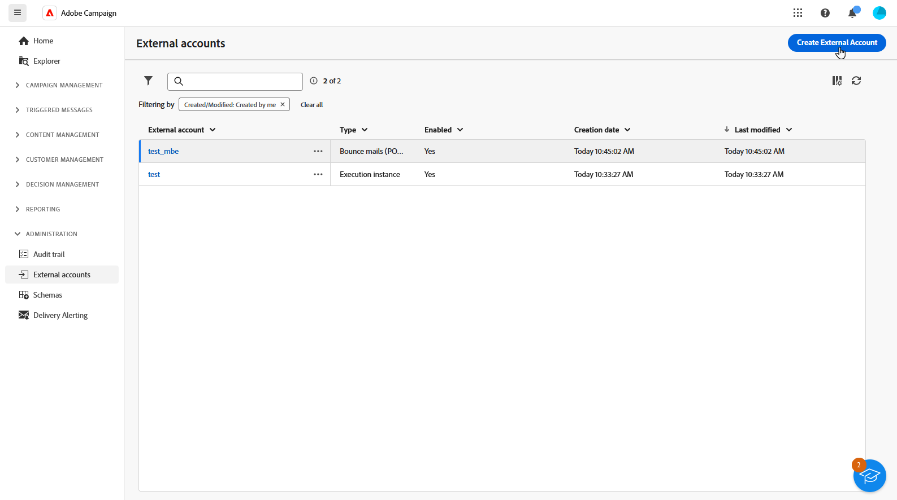
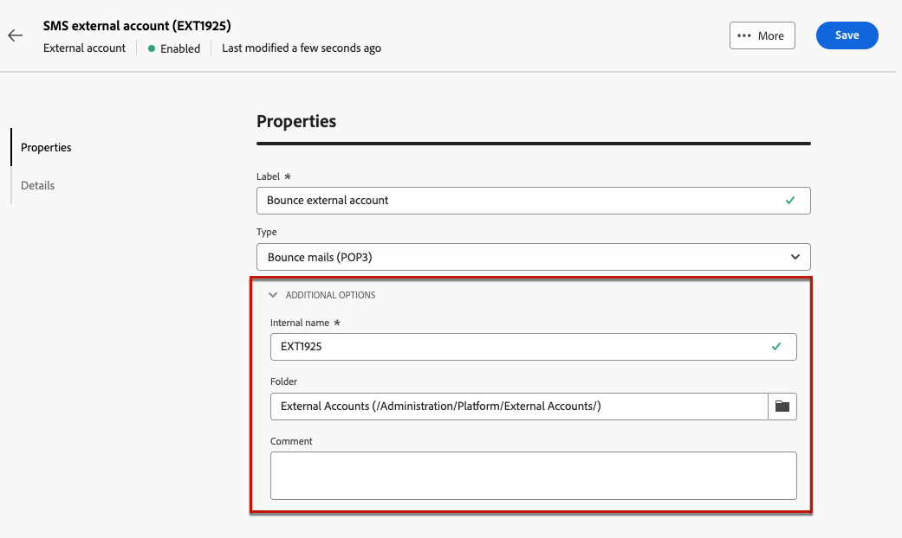
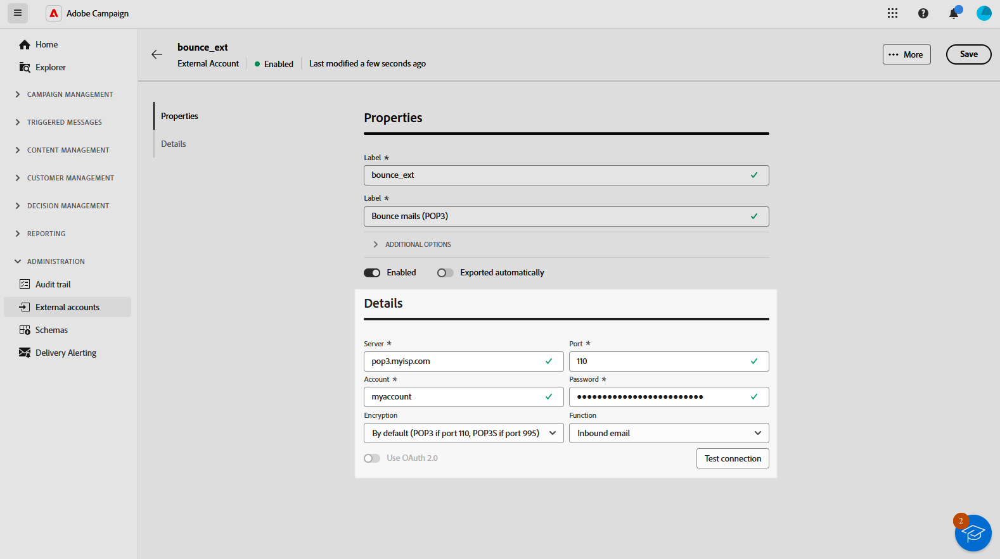
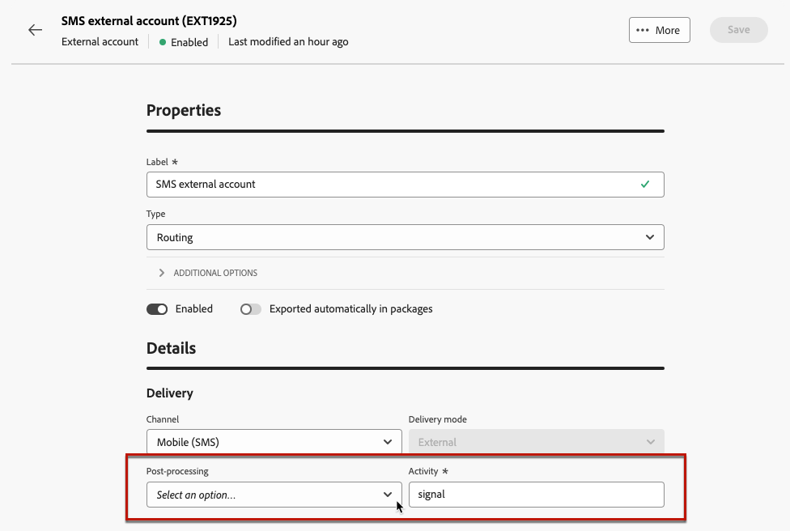

# Hantera externa konton {#external-accounts}

>[!AVAILABILITY]
>
>* Externa konton är för närvarande bara tillgängliga för studsmeddelanden (POP3), routning och körningsinstansen. Ytterligare kontotyper läggs till senare.
>
>* Externa konton som inte stöds och som skapats i Adobe Campaign-konsolen visas i webbanvändargränssnittet, men kan inte redigeras eller öppnas.

Adobe Campaign innehåller förkonfigurerade externa konton för enkel integrering med olika system. Om du vill ansluta till fler plattformar eller anpassa anslutningarna efter arbetsflödet skapar du nya externa konton med webbanvändargränssnittet. Detta garanterar smidiga dataöverföringar.

## Skapa ett externt konto {#create-ext-account}

Följ stegen nedan om du vill skapa ett nytt externt konto. Detaljerade inställningar beror på typen av externt konto. [Läs mer](#campaign-specific)

1. Välj **[!UICONTROL External accounts]** under **[!UICONTROL Administration]** på den vänstra panelmenyn.

1. Klicka på **[!UICONTROL Create external account]**.

   

1. Ange din **[!UICONTROL Label]** och välj det externa kontot **[!UICONTROL Type]**.

   >[!NOTE]
   >
   >Inställningarna för Campaign-specifika typer beskrivs i [det här avsnittet](#campaign-specific).

   

1. Klicka på **[!UICONTROL Create]**.

1. Ändra sökvägen **[!UICONTROL Internal name]** eller **[!UICONTROL Folder]** i listrutan **[!UICONTROL Additional options]** om det behövs.

   

1. Aktivera alternativet **[!UICONTROL Exported automatically in packages]** för att automatiskt exportera data som hanteras av det här externa kontot. <!--Exported where??-->

   

1. Konfigurera åtkomst till kontot i avsnittet **[!UICONTROL Details]** genom att ange autentiseringsuppgifter baserat på den valda externa kontotypen. [Läs mer](#bounce)

1. Klicka på **[!UICONTROL Test connection]** för att verifiera att konfigurationen är korrekt.

1. Duplicera eller ta bort ditt externa konto på menyn **[!UICONTROL More...]**.

   

1. När konfigurationen är klar klickar du på **[!UICONTROL Save]**.

## Kampanjspecifika externa konton {#campaign-specific}

Beroende på vilken typ av externt konto du har valt följer du stegen nedan för att konfigurera kontoinställningarna.

### Studsa e-post (POP3) {#bounce}

>[!AVAILABILITY]
>
> OAuth 2.0 stöds för närvarande inte.

Det externa kontot för studsmeddelanden anger det externa POP3-kontot som används för att ansluta till e-posttjänsten. Alla servrar som konfigurerats för POP3-åtkomst kan ta emot returmeddelanden.

Om du vill konfigurera det externa kontot **[!UICONTROL Bounce mails (POP3)]** fyller du i följande fält:

* **[!UICONTROL Server]** - URL för POP3-servern.

* **[!UICONTROL Port]** - portnummer för POP3-anslutning (standardport är 110).

* **[!UICONTROL Account]** - Användarens namn.

* **[!UICONTROL Password]** - Lösenord för användarkonto.

* **[!UICONTROL Encryption]** - Typ av vald kryptering, inklusive:
   * Som standard (POP3 om port 110, POP3S om port 995).
   * POP3 som byter till SSL efter att ha skickat STARTTLS.
   * POP3 ej skyddad (port 110 som standard).
   * POP3-skyddad över SSL (port 995 som standard).

* **[!UICONTROL Function]** - Välj **[!UICONTROL Inbound email]** om du vill konfigurera kontot för att ta emot inkommande e-post eller **[!UICONTROL SOAP router]** om du vill hantera SOAP-begäranden.

### Routning {#routing}

Följ stegen nedan för att konfigurera ett specifikt externt konto för externa leveranser.

1. Skapa ett externt konto. [Läs mer](../administration/external-account.md#create-ext-account)

1. Välj typen **[!UICONTROL Routing]**.

   {zoomable="yes"}

1. Markera kanalen och klicka på **[!UICONTROL Create]**.

1. I avsnittet för det externa kontot **[!UICONTROL Details]** markeras **[!UICONTROL External]** som standard som **[!UICONTROL Delivery mode]**.

   {zoomable="yes"}

   >[!NOTE]
   >
   >För närvarande är **[!UICONTROL External]** det enda tillgängliga läget.

1. Om du vill hantera processen efter leveranskörningen kan du göra det externt till ett arbetsflöde för efterbearbetning. Skapa ett arbetsflöde med en [extern signal](../workflows/activities/external-signal.md)-aktivitet och välj den i fältet **[!UICONTROL Post-processing]**.

   {zoomable="yes"}

1. I fältet **[!UICONTROL Activity]** redigerar du namnet på arbetsflödesaktiviteten för efterbearbetning som visas i loggarna. <!--you can edit the name of the activity that will be created if you add an external or bulk delivery to a workflow-->

### Körningsinstans {#instance-exec}

Om du har en segmenterad arkitektur ska du identifiera de körningsinstanser som är associerade med kontrollinstansen och upprätta anslutningar mellan dem. Transaktionsmeddelandemallar distribueras på körningsinstansen.

Så här konfigurerar du det externa kontot **[!UICONTROL Execution instance]**:

* **[!UICONTROL URL]** - URL för servern där körningsinstansen är installerad.

* **[!UICONTROL Account]** - Namnet på kontot, matchar Message Center Agent enligt operatormappen.

* **[!UICONTROL Password]** - Lösenord för kontot enligt definitionen i operatormappen.

* **[!UICONTROL Method]** - Välj mellan webbtjänsten eller FDA (Federated Data Access).

  Välj FDA-konto för FDA. Observera att Campaign-anslutningen till externa system är begränsad till avancerade användare och endast tillgänglig från klientkonsolen. [Läs mer](https://experienceleague.adobe.com/sv/docs/campaign/campaign-v8/connect/fda#_blank)

* **[!UICONTROL Create archiving workflow]** - För varje körningsinstans som är registrerad i meddelandecentret, oavsett om du har en eller flera instanser, skapar du ett separat arkiveringsarbetsflöde för varje externt konto som är associerat med körningsinstansen.