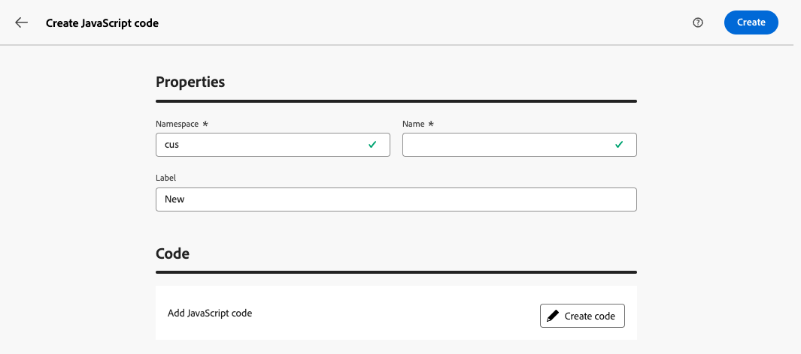

# Arbeta med JavaScript-koder {#javascript-codes}

>[!CONTEXTUALHELP]
>id="acw_javascript_codes_list"
>title="JavaScript"
>abstract="JavaScript"

>[!CONTEXTUALHELP]
>id="acw_javascript_codes_create"
>title="Skapa JavaScript-kod"
>abstract="Skapa JavaScript-kod"

## Om JavaScript-koder {#about}

Med JavaScript-koder kan du skapa återanvändbara funktioner som kan användas i olika arbetsflöden, ungefär som i ett bibliotek. Dessa funktioner lagras på menyn **[!UICONTROL Administration]** > **[!UICONTROL JavaScript codes]** i den vänstra navigeringsrutan.


I kodlistan i JavaScript kan du:

* **Duplicera eller ta bort en kod**: Klicka på ellipsknappen och välj önskad åtgärd.
* **Ändra en kod**: Klicka på en kods namn för att öppna dess egenskaper, göra ändringarna och spara.
* **Skapa en ny JavaScript-kod**: Klicka på knappen **[!UICONTROL Create JavaScript code]**.

>[!NOTE]
>
>Även om platsen för JavaScript-kodsmenyn skiljer sig mellan Adobe Campaign-konsolen och webbgränssnittet är listan identisk och fungerar som en spegel.

## Skapa en JavaScript-kod {#create}

Så här skapar du en JavaScript-kod:

1. Navigera till menyn **[!UICONTROL JavaScript codes]** och klicka på knappen **[!UICONTROL Create JavaScript code]**.

1. Definiera kodens egenskaper:

   * **[!UICONTROL Namespace]**: Ange det namnområde som är relevant för dina anpassade resurser. Som standard är namnutrymmet&quot;cus&quot;, men det kan variera beroende på implementeringen.
   * **[!UICONTROL Name]**: Den unika identifierare som används för att referera till koden.
   * **[!UICONTROL Label]**: Den beskrivande etiketten som visas i listan med JavaScript-koder.

   

   >[!NOTE]
   >
   >När du har skapat fälten **[!UICONTROL Namespace]** och **[!UICONTROL Name]** kan de inte ändras. Om du vill göra ändringar duplicerar du koden och uppdaterar den efter behov.
   >
   >I Campaign-konsolen visas JavaScript-kodnamnet som en sammanfogning av dessa två fält.

1. Klicka på knappen **[!UICONTROL Create code]** för att definiera JavaScript-koden. I den vänstra rutan finns det två menyer där du kan använda fördefinierade funktioner för villkor och datumformatering.

   

1. Klicka på **[!UICONTROL Confirm]** om du vill spara koden.

1. När din JavaScript-kod är klar klickar du på **[!UICONTROL Create]**. JavaScript-koden kan nu användas i alla arbetsflöden.

## Använda en JavaScript-kod från ett arbetsflöde {#workflow}

### Läs in JavaScript-kodbibliotek {#library}

Du kan referera till JavaScript-koder i arbetsflöden för att undvika att skriva om kod för repetitiva uppgifter. Om du vill använda dessa koder läser du in motsvarande bibliotek i arbetsflödets initieringsskript. På så sätt kan du läsa in alla bibliotek som innehåller de funktioner som du vill använda i arbetsflödet en gång.

Så här läser du in ett bibliotek:

1. Öppna ett arbetsflöde och klicka på knappen **[!UICONTROL Settings]**.
1. Navigera till avsnittet **[!UICONTROL Initialization script]** och klicka på **[!UICONTROL Create code]**.

   

1. Använd syntaxen nedan i koden för att läsa in ett bibliotek:

   ```
   loadLibrary("/<namespace>/<name>")
   ```

   * Ersätt `<namespace>` med det namnområde som angavs när JavaScript-koden skapades.
   * Ersätt `<name>` med namnet på JavaScript-koden.

1. Klicka på **[!UICONTROL Confirm]** och spara inställningarna.

### Referensfunktioner i arbetsflöden {#reference}

När JavaScript-biblioteket har lästs in kan du referera till de funktioner som definierats i JavaScript-koden direkt i arbetsflödet, vanligtvis med en **[!UICONTROL JavaScript code]**-aktivitet.

