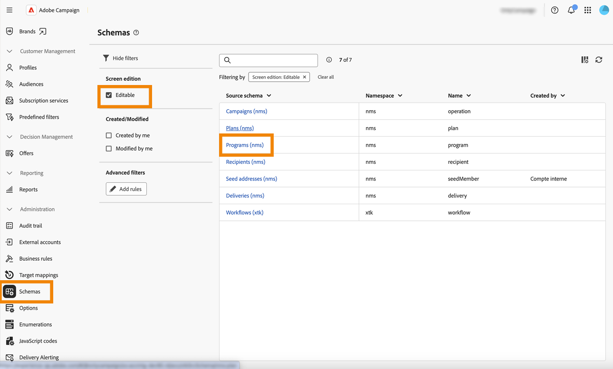

# Planer och program {#plan-and-programs}

>[!CONTEXTUALHELP]
>id="acw_homepage_welcome_rn4"
>title="Planer och program"
>abstract="Nu kan du konfigurera din mapphierarki för marknadsföringsplaner och program i gränssnittet för Campaign-webben."
>additional-url="https://experienceleague.adobe.com/docs/campaign-web/v8/release-notes/release-notes.html" text="Se versionsinformation"

Med Adobe Campaign kan du konfigurera mapphierarkin för marknadsföringsplaner och program.

Adobe rekommenderar följande hierarki för att kunna ordna dem bättre: Planera `>` program `>` kampanjer

* En **plan** kan innehålla flera program. Det definierar strategiska mål för en tidsperiod.
* Ett **program** kan innehålla andra program samt kampanjer, arbetsflöden och landningssidor.
* En **kampanj** kan innehålla leveranser, arbetsflöden och landningssidor.

## Skapa och konfigurera en plan {#create-plan}

Om du vill skapa en plan måste du skapa en mapp med mapptypen **[!UICONTROL Plan]** [Läs mer om hur du skapar en mapp](../get-started/work-with-folders.md).

{zoomable="yes"}

Gå till **[!UICONTROL Folder settings]** för din plan för att hantera den.

{zoomable="yes"}

Du kan definiera **[!UICONTROL Custom options]** och ange schemaläggningsdatumet för din plan.

{zoomable="yes"}

Så här hanterar du **[!UICONTROL Custom options]**:

1. Bläddra till **[!UICONTROL Schemas]**
1. Välj **[!UICONTROL Editable]**-scheman i filtren
1. Klicka på ikonen för **[!UICONTROL Edit custom details]**

{zoomable="yes"}

Du kan konfigurera dem:

{zoomable="yes"}

## Skapa och konfigurera ett program

Om du vill skapa ett program i din plan ([Läs mer om hur du skapar en plan](#create-plan)) måste du vara i din plan och skapa en mapp med mapptypen **[!UICONTROL Program]** [Läs mer om hur du skapar en mapp](../get-started/work-with-folders.md).

{zoomable="yes"}

Gå till **[!UICONTROL Folder settings]** för ditt program för att hantera det.

{zoomable="yes"}

Du kan definiera **[!UICONTROL Custom options]** och ange schemaläggningsdatum för ditt program.

{zoomable="yes"}

Så här hanterar du **[!UICONTROL Custom options]**:

1. Bläddra till **[!UICONTROL Schemas]**
1. Välj **[!UICONTROL Editable]**-scheman i filtren
1. Klicka på ikonen för **[!UICONTROL Edit custom details]**

{zoomable="yes"}

Du kan konfigurera dem:

{zoomable="yes"}

## Länka en kampanj till ett program

Du kan länka en kampanj till ett program på två sätt:

### Sätt 1: Du har redan ett program och vill skapa en länkad kampanj

Om du vill länka en ny kampanj till programmet skapar du en kampanj direkt i programmet:

{zoomable="yes"}

**[!UICONTROL Folder]**-inställningarna arkiveras automatiskt med sökvägen till ditt program.

{zoomable="yes"}

### Way #2: Du har redan en befintlig kampanj och vill länka den till ett befintligt program

Gå till knappen **[!UICONTROL Settings]** för kampanjen som du vill länka till ditt program:

{zoomable="yes"}

Klicka på ikonen **[!UICONTROL Folder]** i inställningarna för **[!UICONTROL Folder]** i **[!UICONTROL Properties]** för att välja din **[!UICONTROL Program]**-mapp.

{zoomable="yes"}

Markera mappen **[!UICONTROL Program]**, klicka på knappen **[!UICONTROL Confirm]** och sedan på knappen **[!UICONTROL Save and Close]**.

{zoomable="yes"}

Din kampanj visas nu i ditt program:

{zoomable="yes"}
