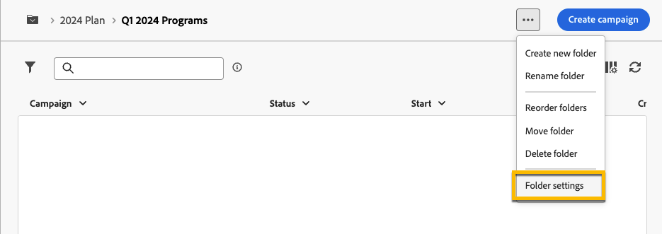
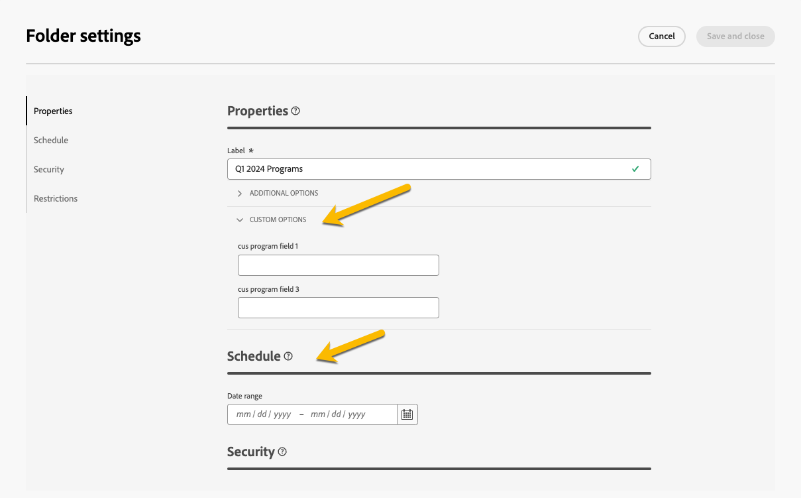

# Planer och program {#plan-and-programs}

Med Adobe Campaign kan du konfigurera mapphierarkin för marknadsföringsplaner och program.

Adobe rekommenderar följande hierarki för att bättre organisera de här komponenterna: Planera `>` program `>` - kampanjer.

* En **plan** kan innehålla flera program. Det definierar strategiska mål för en viss period.
* Ett **program** kan innehålla andra program samt kampanjer, arbetsflöden och landningssidor.
* En **kampanj** kan innehålla leveranser, arbetsflöden och landningssidor.

## Skapa och konfigurera en plan {#create-plan}

Skapa en mapp med mapptypen **[!UICONTROL Plan]** om du vill skapa en plan. [Läs mer om hur du skapar en mapp](../get-started/work-with-folders.md)

{zoomable="yes"}

Gå till **[!UICONTROL Folder settings]** för din plan för att hantera den.

{zoomable="yes"}

Definiera **[!UICONTROL Custom options]** och ange schemaläggningsdatumet för din plan.

{zoomable="yes"}

Så här hanterar du **[!UICONTROL Custom options]**:

1. Gå till **[!UICONTROL Schemas]**.
1. Välj **[!UICONTROL Editable]**-scheman i filtren.
1. Klicka på ikonen **[!UICONTROL Edit custom details]**.

{zoomable="yes"}

Konfigurera anpassade alternativ:

{zoomable="yes"}

## Skapa och konfigurera ett program

Om du vill skapa ett program i din plan ([Läs mer om hur du skapar en plan](#create-plan)) navigerar du till din plan och skapar en mapp med mapptypen **[!UICONTROL Program]**. [Läs mer om hur du skapar en mapp](../get-started/work-with-folders.md).

{zoomable="yes"}

Gå till **[!UICONTROL Folder settings]** för ditt program för att hantera det.

{zoomable="yes"}

Definiera **[!UICONTROL Custom options]** och ange schemaläggningsdatumet för ditt program.

{zoomable="yes"}

Så här hanterar du **[!UICONTROL Custom options]**:

1. Gå till **[!UICONTROL Schemas]**.
1. Välj **[!UICONTROL Editable]**-scheman i filtren.
1. Klicka på ikonen **[!UICONTROL Edit custom details]**.

{zoomable="yes"}

Konfigurera anpassade alternativ:

{zoomable="yes"}

## Länka en kampanj till ett program

Du kan länka en kampanj till ett program på två sätt:

### Sätt 1: Du har redan ett program och vill skapa en länkad kampanj

Om du vill länka en ny kampanj till ditt program skapar du kampanjen direkt i programmet.

{zoomable="yes"}

**[!UICONTROL Folder]**-inställningarna fylls automatiskt i med sökvägen till ditt program.

{zoomable="yes"}

### Way #2: Du har redan en befintlig kampanj och vill länka den till ett befintligt program

Gå till knappen **[!UICONTROL Settings]** för kampanjen som du vill länka till ditt program.

{zoomable="yes"}

Klicka på ikonen **[!UICONTROL Folder]** i inställningarna för **[!UICONTROL Folder]** i **[!UICONTROL Properties]** för att välja din **[!UICONTROL Program]**-mapp.

{zoomable="yes"}

Markera mappen **[!UICONTROL Program]**, klicka på knappen **[!UICONTROL Confirm]** och klicka sedan på knappen **[!UICONTROL Save and Close]** .

{zoomable="yes"}

Din kampanj visas nu i ditt program.

{zoomable="yes"}