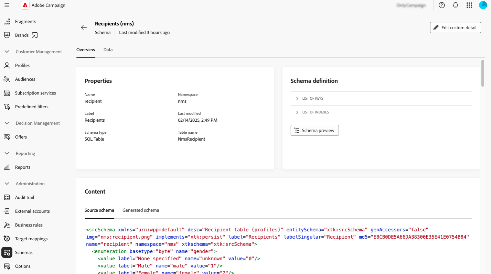

# Arbeta med scheman {#schemas}

>[!CONTEXTUALHELP]
>id="acw_schema"
>title="Scheman"
>abstract="**[!DNL Adobe Campaign]** använder XML-baserade scheman för att definiera den fysiska och logiska datastrukturen i programmet. På den här skärmen kan du visa alla befintliga scheman och komma åt informationen för ett schema genom att markera dess namn i listan. Det finns filter som kan användas för att förfina listan, t.ex. bara för redigerbara scheman."

## Om scheman {#about}

**[!DNL Adobe Campaign]** använder XML-baserade scheman för att definiera den fysiska och logiska datastrukturen i programmet. Ett schema är ett XML-dokument som är länkat till en databastabell som definierar:

* SQL-tabellstrukturen, inklusive tabellnamn, fält och relationer.
* XML-datastrukturen, inklusive element, attribut, hierarki, typer, standardvärden och etiketter.

Scheman spelar en nyckelroll i:

* Mappar programdata till databastabeller.
* Definiera relationer mellan dataobjekt.
* Ange struktur och egenskaper för varje fält.

Varje entitet i Adobe Campaign har ett dedikerat schema som säkerställer datakonsekvens och -organisation.

Detaljerad information om scheman finns i dokumentationen för [Campaign-konsolen](https://experienceleague.adobe.com/sv/docs/campaign/campaign-v8/developer/shemas-forms/schemas){target="_blank"}.

## Få åtkomst till scheman i webbanvändargränssnittet {#access}

Scheman är tillgängliga från menyn **[!UICONTROL Administration]** > **[!UICONTROL Schemas]**.

På den här skärmen kan du visa alla befintliga scheman. Det finns filter som kan användas för att förfina listan, t.ex. bara för redigerbara scheman.

Om du vill öppna ett schema markerar du dess namn. En detaljerad schemavy visas.

### Schemaöversikt {#overview}

Fliken **[!UICONTROL Overview]** innehåller en allmän vy av schemat:

* Avsnittet **[!UICONTROL Properties]** visar nyckelinformation, till exempel schemanamn, namnområde och associerat tabellnamn.

* Avsnittet **[!UICONTROL Schema definition]** innehåller information om schemadefinitionen, inklusive den primärnyckel som används för datavstämning och dess länkar till andra tabeller.

  Klicka på knappen **[!UICONTROL Schema preview]** för att visa de olika fält och länkar som schemat består av. På så sätt kan du kontrollera hela strukturen för ett schema. Om schemat har utökats med anpassade fält kan du visualisera alla tillägg.

* Avsnittet **[!UICONTROL Content]** visar XML-innehållet i schemat så att du kan växla mellan källan och den genererade syntaxen.

### Schemadata {#data}

Fliken **[!UICONTROL Data]** innehåller information om schemadata.

## Konfigurera skärmdefinitionen {#screen-definition}

### Redigera anpassade fält {#fields}

Anpassade fält är ytterligare attribut som läggs till i färdiga scheman via Adobe Campaign-konsolen. Med dem kan du anpassa scheman genom att ta med nya attribut som passar organisationens behov.

Anpassade fält kan visas på olika skärmar, till exempel profilinformation i webbgränssnittet för Campaign. Du kan styra vilka fält som visas och hur de visas i gränssnittet. Det gör du genom att klicka på knappen **[!UICONTROL Screen edition]** på menyn **[!UICONTROL Schemas]**.

Klicka på **[!UICONTROL Preview]** om du vill visa anpassade fält på en exempelskärm.

Mer information om hur du redigerar anpassade fält i ett schema finns i följande avsnitt: [Konfigurera anpassade fält](../administration/custom-fields.md).

### Lägg till samlingslistor {#collection-lists}

I det här avsnittet **Lista över anpassade listor** kan du definiera samlingslänkar, till exempel inköp. Relaterade data visas sedan på profilskärmar via en dedikerad flik.

>[!NOTE]
>
>Den här funktionen är för närvarande bara tillgänglig för mottagarschemat.

1. Om du vill lägga till en samlingslista i gränssnittet klickar du på ellipsknappen och väljer **Välj anpassade listor**.

   

1. Välj en av de tillgängliga anpassade listorna, till exempel köp, och klicka sedan på **Bekräfta**.

   

1. Bläddra till menyn **Profiler** och filtrera profiler som har köpt.

   

1. Klicka på en profil. Du ser att den nya fliken visas. Du kan lägga till fler kolumner om det behövs.

   
