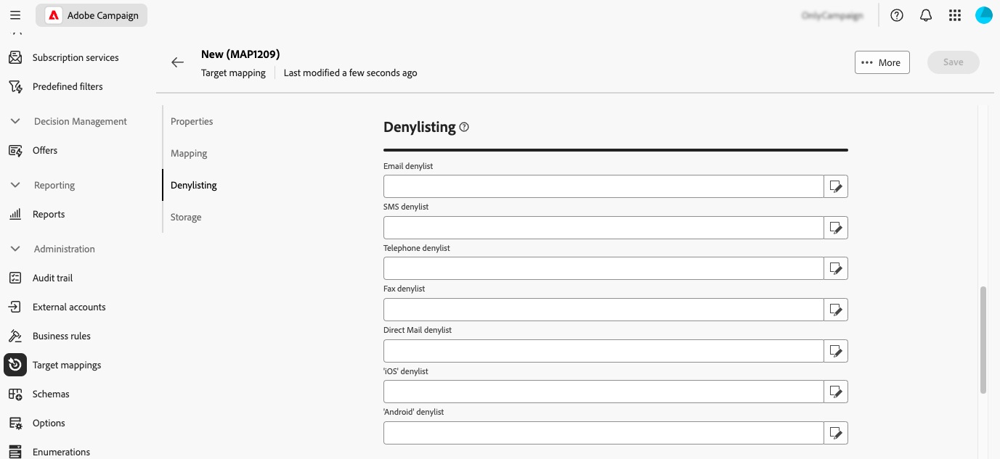

# Hantera målmappningar {#target-mappings}

>[!CONTEXTUALHELP]
>id="acw_homepage_welcome_rn2"
>title="Målmappningar"
>abstract="Nu kan du skapa målmappningar i Campaign Web User Interface. Målmappningar definierar hur olika leveranskanaler (e-post, SMS, push-meddelanden) länkar till datafälten i ett schema."
>additional-url="https://experienceleague.adobe.com/docs/campaign-web/v8/release-notes/release-notes.html" text="Se versionsinformation"

>[!CONTEXTUALHELP]
>id="acw_targetmapping_list"
>title="Målmappningar "
>abstract="Målmappningar"

## Om målmappningar {#about}

För varje kommunikationskanal används en standardmålmappning för att ange mottagarna som mål. Som standard har mallar för e-post och SMS-leverans **[!UICONTROL Recipients]** som mål. Målmappningen använder därför fälten i tabellen **nms:receive**. För push-meddelanden är standardmålmappningen **Subscriber applications (nms:appSubscriptionRcp)**, som är länkad till mottagartabellen.

Målmappningar är tillgängliga på menyn **[!UICONTROL Administration]** > **[!UICONTROL Target mappings]**. Från den här skärmen kan du komma åt information om varje målmappning eller skapa nya målmappningar som passar dina behov.

Mer information om de inbyggda målmappningarna som tillhandahålls med Adobe Campaign finns i dokumentationen för [klientkonsolen för Campaign v8](https://experienceleague.adobe.com/docs/campaign/campaign-v8/audience/add-profiles/target-mappings.html){target="_blank"}.

## Skapa en målmappning {#create-mapping}

>[!CONTEXTUALHELP]
>id="acw_targetmapping_properties"
>title="Egenskaper för målmappning"
>abstract="I avsnittet **[!UICONTROL Properties]** kan du definiera allmänna inställningar för målmappningen och målpopulationen."

>[!CONTEXTUALHELP]
>id="acw_targetmapping_mapping"
>title="Målmappning"
>abstract="I avsnittet **[!UICONTROL Mapping]** kan du identifiera vilka attribut från målmappningens schema som ska användas för de olika leveransadressfälten."

>[!CONTEXTUALHELP]
>id="acw_targetmapping_denylist"
>title="Blockeringslista för målmappning"
>abstract="Blockeringslista för målmappning"

>[!CONTEXTUALHELP]
>id="acw_targetmapping_storage"
>title="Lagring för målmappning"
>abstract="I avsnittet **[!UICONTROL Storage]** kan du identifiera var loggarna måste lagras."

Om du vill skapa en ny målmappning går du till menyn **[!UICONTROL Administration]** > **[!UICONTROL Target mappings]**. Klicka på knappen **[!UICONTROL Create mapping]** och följ sedan stegen som beskrivs i avsnitten nedan.

1. I avsnittet **[!UICONTROL Properties]** anger du **[!UICONTROL Label]** för målmappningen.

1. Expandera avsnittet **[!UICONTROL Additional options]** för att definiera avancerade inställningar som målmappningens interna namn, lagringsmapp och beskrivning.

1. Välj målpopulation. Du kan antingen:

   * **[!UICONTROL Use the targeting dimension directly]**: Välj den dimension som ska användas direkt i listan över tillgängliga dimensioner.
   * **[!UICONTROL Use linked data]**: Börja från en måldimension (till exempel prenumerationer) och växla sedan till måldimensionen som du vill ha som mål (till exempel mottagare).

   

1. Om den valda dimensionen inte redan används av en befintlig målmappning måste scheman för att lagra loggarna skapas. Ytterligare alternativ är tillgängliga i avsnittet **[!UICONTROL Storage]**. Expandera avsnittet nedan om du vill ha mer information.

   +++Lagringsalternativ för nya målningsdimensioner

   1. **[!UICONTROL Namespace]**: Identifiera det namnutrymme som ska användas för att skapa loggarna.
   1. **[!UICONTROL Suffix of the extension schema]**: Ange ett suffix för det nya schemat.

      I exemplet nedan blir utsändningsnamnet&quot;cusbroadlogSupplier&quot;.

      

   1. **[!UICONTROL Delivery logs]**: Aktivera alternativen i det här avsnittet om du vill utöka de sändande loggarna med ett segmentkodsfält eller ett fält som innehåller IP-adressen för leveransen. Du kan till exempel spara en segmentkod som beräknas under arbetsflödet i de sändande loggarna för att finjustera målet senare. Detta gör det möjligt att rikta in profiler med den här specifika segmentkoden.

   1. **[!UICONTROL Exclusions]**: Ange hur exkluderingsloggarna ska lagras.

   1. **[!UICONTROL Tracking logs]**: Aktivera alternativet **[!UICONTROL Generate a schema for tracking]** för att generera ett lagringsschema för spårningsloggar.

   +++

1. Använd avsnittet **[!UICONTROL Mapping]** för att identifiera vilka attribut från målmappningens schema som ska användas för varje leveransadressfält. För varje fält väljer du det attribut du vill mappa. Du kan också skapa ett uttryck som identifierar fältet. Du kan till exempel använda en lägre funktion för adressattributet.

   

1. När målmappningen är klar klickar du på knappen **[!UICONTROL Create]**. Målmappningen och alla relaterade scheman för loggarna skapas automatiskt.

När målmappningen har skapats visas ytterligare två avsnitt på skärmen:

* **[!UICONTROL Denylisting]**: I det här avsnittet kan du identifiera attributen från målmappningens schema som ska användas för blockeringslista.

  

* **[!UICONTROL Storage]**: I det här avsnittet kan du identifiera de tabeller som ska användas för att lagra loggar.

  

   * **[!UICONTROL Message schema]**: Identifierar schemat som ska användas för att lagra de sändande loggarna.
   * **[!UICONTROL Messages excluded]**: Anger hur lagring av leverans- och exkluderingsloggar ska hanteras.

      * **[!UICONTROL Store exclusions and messages in the same table]**
      * **[!UICONTROL Store messages only]**: Lagra inte undantag.
      * **[!UICONTROL Store exclusions and messages in separate tables]**: Välj det schema som ska användas för att lagra exkluderingsloggar i fältet **[!UICONTROL Rejection schema]**.

   * **[!UICONTROL Tracking logs]**: Välj var spårningsloggar ska lagras och standardtrafikkällan.
   * **[!UICONTROL Additional fields]**: Ange en lista med ytterligare fält som ska lagras i leveransloggarna. Dessa fält kan lagra information permanent om enskilda målmedlemmar (t.ex. `recipient/@firstName`) eller lagra ytterligare data som beräknas under arbetsflödet (t.ex. `[targetData/@offeCode]`).

     Välj **[!UICONTROL Add field]** om du vill göra det. Identifiera informationen som ska sparas i fältet **[!UICONTROL Source]** och attributet som ska användas i de sändande loggarna för att spara informationen i fältet **[!UICONTROL Destination]**.

     {width="50%" zoomable="yes"}