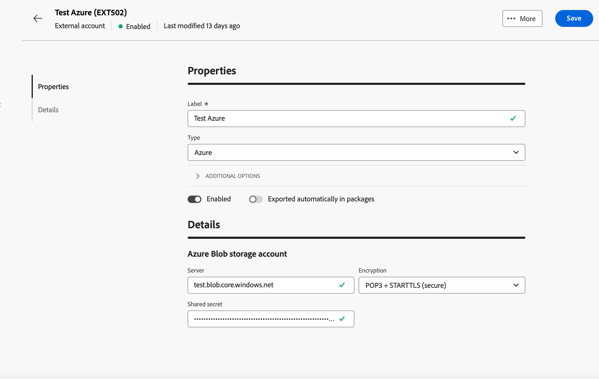

# Externa konton för överföringsdata {#transfer-external-account}

## Amazon Simple Storage Service (S3) {#amazon-simple-storage-service--s3--external-account}

Kopplingen Amazon Simple Storage Service (S3) kan användas för att importera eller exportera data till Adobe Campaign. Den kan ställas in i en arbetsflödesaktivitet. Mer information finns på [den här sidan](https://experienceleague.adobe.com/sv/docs/campaign-web/v8/wf/design-workflows/transfer-file){target=_blank}.

När du konfigurerar det nya externa kontot måste du ange följande information:

* **[!UICONTROL AWS S3 Account Server]**

  URL-adressen till servern ska fyllas i enligt följande:

  `  <S3bucket name>.s3.amazonaws.com/<s3object path>`

* **[!UICONTROL AWS access key ID]**

  Information om var du hittar ditt ID för AWS-åtkomstnyckel finns på [sidan](https://docs.aws.amazon.com/general/latest/gr/aws-sec-cred-types.html#access-keys-and-secret-access-keys).

* **[!UICONTROL Secret access key to AWS]**

  Om du vill veta var du hittar din hemliga åtkomstnyckel till AWS kan du läsa den här [sidan](https://aws.amazon.com/fr/blogs/security/wheres-my-secret-access-key/).

* **[!UICONTROL AWS Region]**

  Mer information om AWS finns på [sidan](https://aws.amazon.com/about-aws/global-infrastructure/regions_az/).

* Med kryssrutan **[!UICONTROL Use server side encryption]** kan du lagra filen i S3-krypterat läge.

Mer information om var du hittar åtkomstnyckel-ID och hemlig åtkomstnyckel finns i [dokumentationen för Amazon Web Services](https://docs.aws.amazon.com/general/latest/gr/aws-sec-cred-types.html#access-keys-and-secret-access-keys).

## Azure Blob Storage {#azure-blob-external-account}

Det externa kontot **[!UICONTROL Azure Blob Storage]** kan användas för att importera eller exportera data till Adobe Campaign med hjälp av en **[!UICONTROL Transfer file]**-arbetsflödesaktivitet. Mer information om detta finns i [det här avsnittet](https://experienceleague.adobe.com/sv/docs/campaign-web/v8/wf/design-workflows/transfer-file){target=_blank}.

Om du vill konfigurera **[!UICONTROL Azure external account]** så att den fungerar med Adobe Campaign måste du ange följande information:

* **[!UICONTROL Server]**

  URL för din Azure Blob-lagringsserver.

* **[!UICONTROL Encryption]**

  Typ av vald kryptering mellan **[!UICONTROL None]** eller **[!UICONTROL SSL]**.

* **[!UICONTROL Access key]**

  Om du vill veta var du hittar din **[!UICONTROL Access key]** kan du läsa den här [sidan](https://docs.microsoft.com/en-us/azure/storage/common/storage-account-keys-manage?tabs=azure-portal).

## SFTP

Med det externa SFTP-kontot kan du konfigurera och testa åtkomst till en server utanför Adobe Campaign.

Om du vill konfigurera det externa kontot **[!UICONTROL SFTP]** fyller du i följande fält:

* **[!UICONTROL Server]**

  Ange namn eller adress för SFTP-servern.

* **[!UICONTROL Port]**

  Ange portnumret för SFTP-anslutningen. Standardporten är 22.

* **[!UICONTROL Account]**

  Ange det användarnamn som används för att ansluta till SFTP-servern.

* **[!UICONTROL Password]**

  Ange lösenordet för SFTP-kontot.

* **[!UICONTROL SFTP authentication type]**

  Välj den metod som ska autentiseras med SFTP-servern. Alternativen är:

   * **[!UICONTROL Password]**: Autentisera med kontots lösenord.

   * **[!UICONTROL Public key]**: Autentisera med ett SSH-nyckelpar (privat och offentlig nyckel).

Om **[!UICONTROL Public key]**-autentisering har valts måste följande fält fyllas i:

* **[!UICONTROL Private key file]**

  Ange den privata SSH-nyckelfil som används för autentisering.

* **[!UICONTROL Public key file]**

  Ange motsvarande offentliga SSH-nyckel registrerad på SFTP-servern.

* **[!UICONTROL SSH Key passphrase]**

  Ange lösenfrasen för att dekryptera den privata nyckeln om den är skyddad.

## HTTP

Med det externa HTTP-kontot kan du konfigurera och testa åtkomst till en server utanför Adobe Campaign.

Om du vill konfigurera det externa kontot **[!UICONTROL HTTP]** fyller du i följande fält:

* **[!UICONTROL Server]**

  Ange namn eller adress för HTTP-servern.

* **[!UICONTROL Port]**

  Ange portnumret för HTTP-anslutningen. Standardporten är 80.

* **[!UICONTROL Account]**

  Ange användarnamn för autentisering.

* **[!UICONTROL Password]**

  Ange lösenordet som är kopplat till användarkontot.

* **[!UICONTROL SFTP authentication type]**

  Välj typ av autentiseringstyp för anslutningen. Alternativen är:

   * Lösenord
   * Offentlig nyckel

Om du använder **[!UICONTROL Public key]**-autentisering anger du obligatoriska värden för:**[!UICONTROL PublicKey Auth]**

* **[!UICONTROL Password]**: Lösenfrasen skyddar den privata nyckeln, om tillämpligt.

* **[!UICONTROL Private key]**: Den privata nyckel som används för att autentisera Snowflake-kontot.

## FTP

Med det externa FTP-kontot kan du konfigurera och testa åtkomst till en server utanför Adobe Campaign.

Om du vill konfigurera det externa kontot **[!UICONTROL FTP]** fyller du i följande fält:

* **[!UICONTROL Server]**

  Ange namn eller adress för FTP-servern.

* **[!UICONTROL Port]**

  Ange portnummer för FTP-anslutning. Standardporten är 21.

* **[!UICONTROL Account]**

  Ange användarnamn för autentisering.

* **[!UICONTROL Password]**

  Ange lösenordet som är kopplat till användarkontot.

* **[!UICONTROL Encryption]**

  Välj typ av kryptering för anslutningen. Alternativen är:

   * Som standard
   * POP3 + STARTTLS
   * POP3 ej skyddad
   * POP3 - säker