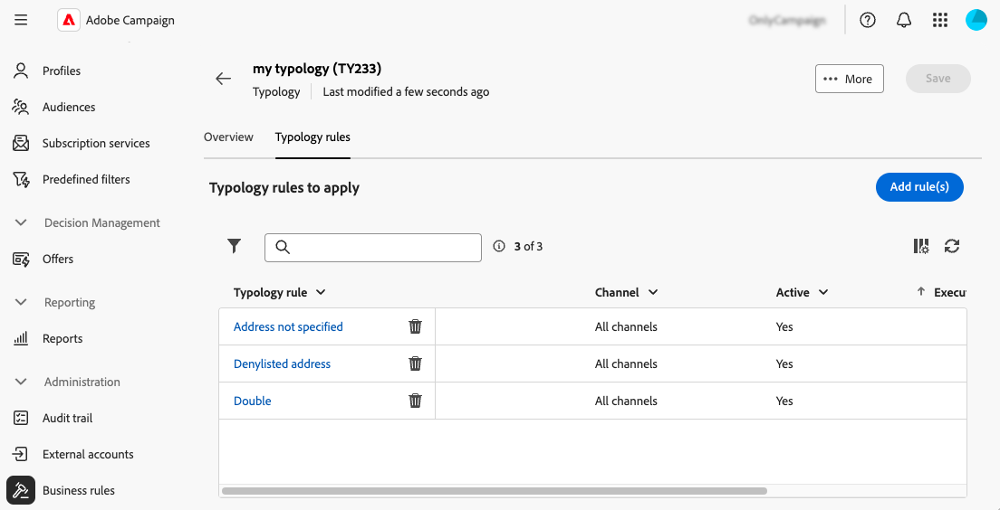

# Arbeta med affärsregler (typologier) {#typologies}

>[!CONTEXTUALHELP]
>id="acw_homepage_welcome_rn1"
>title="Affärsregler"
>abstract="Nu kan du skapa typologier och typologiregler i Adobe Campaign webbgränssnitt. Med typologier kan ni styra, filtrera och prioritera utskick av leveranser."
>additional-url="https://experienceleague.adobe.com/docs/campaign-web/v8/release-notes/release-notes.html?lang=sv-SE" text="Se versionsinformation"

>[!CONTEXTUALHELP]
>id="acw_business_rules"
>title="Typologiregler och typologiregler"
>abstract="Typologier gör att ni kan standardisera affärspraxis för alla leveranser. En typologi är en samling typologiregler som gör att du kan kontrollera, filtrera och prioritera skickandet av leveranser. Profiler som matchar kriterier inom en typologiregel exkluderas från leveransgrupperna under förberedelsefasen."

>[!CONTEXTUALHELP]
>id="acw_business_rules_typology_rules_type"
>title="Filtrering"
>abstract=" Det finns två typer av typologiregler:   **Kontroll**-regler som säkerställer meddelandekvalitet och giltighet före sändning, till exempel teckenvisning, SMS-längd, adressformat eller URL-förkortning.   **Filtrera** regler som exkluderar segment för målgruppen baserat på specifika kriterier som ålder, plats, land eller telefonnummer."

## Om typologier

Typologier gör att ni kan standardisera affärspraxis för alla leveranser. En **typologi** är en samling **typologiregler** som gör att du kan kontrollera, filtrera och prioritera sändning av leveranser. Profiler som matchar kriterier inom en typologiregel exkluderas från leveransgrupperna under förberedelsefasen.

Typologier ser till att dina leveranser alltid innehåller vissa element, t.ex. en länk för att avbryta prenumerationen eller en ämnesrad, eller filtreringsregler som utesluter grupper från det avsedda målet, t.ex. prenumeranter, konkurrenter eller icke-lojalitetskunder.

Typologier är tillgängliga via menyn **[!UICONTROL Administration]** > **[!UICONTROL Business rules]**. Från den här skärmen får du tillgång till alla befintliga typologier och typologiregler, eller skapa nya baserat på dina behov.

>[!NOTE]
>
>Listan **[!UICONTROL Typology rules]** visar alla befintliga regler som har skapats hittills i webbanvändargränssnittet eller klientkonsolen. Endast **Kontroll** - och **Filtrering**-regler kan skapas i webbanvändargränssnittet. Om du vill skapa andra typer av typologiregler, till exempel tryck- eller kapacitetsregler, använder du klientkonsolen Campaign v8. [Lär dig skapa typologiregler i klientkonsolen](https://experienceleague.adobe.com/sv/docs/campaign/automation/campaign-optimization/campaign-typologies){target="_blank"}

De viktigaste stegen för att tillämpa typologier i meddelanden är följande:

1. [Skapa en typologi](#typology).
1. [Skapa typologiregler](#typology-rules).
1. [Referera till typologiregler i typologin](#add-rules).
1. [Använd typologin för ett meddelande](#message).

## Skapa en typologi {#typology}

>[!CONTEXTUALHELP]
>id="acw_business_rules_typology_properties"
>title="Typologiegenskaper"
>abstract="Definiera typologiens egenskaper och expandera avsnittet **[!UICONTROL Additional options]** för att få åtkomst till avancerade inställningar. Använd fältet **[!UICONTROL IP affinity]** för att associera IP-tillhörigheter med typologier. På så sätt kan du bättre kontrollera utgående SMTP-trafik genom att definiera vilka specifika IP-adresser som kan användas för varje tillhörighet."

>[!CONTEXTUALHELP]
>id="acw_business_rules_typology_ip_affinity"
>title="IP-tillhörighet"
>abstract="Genom att hantera tillhörigheter med IP-adresser får du bättre kontroll över utgående SMTP-trafik genom att koppla olika IP-adresser till varje typ av trafik beroende på vilken typ av leveransåtgärd det är fråga om."

Så här skapar du en typologi:

1. Gå till menyn **[!UICONTROL Business rules]** och välj fliken **[!UICONTROL Typology]**.

1. Klicka på knappen **[!UICONTROL Create typology]** och ange **[!UICONTROL Label]** som typologi.

1. Expandera avsnittet **[!UICONTROL Additional options]** om du vill definiera avancerade inställningar, till exempel typologiens interna namn, lagringsmapp och beskrivning.

   

   >[!NOTE]
   >
   >I fältet **[!UICONTROL IP affinity]** kan du associera IP-tillhörigheter med typologier. Detta ger bättre kontroll över utgående SMTP-trafik genom att definiera vilka specifika IP-adresser som kan användas för varje tillhörighet. Du kan till exempel använda en affinitet per land eller underdomän. Du kan sedan skapa en typologi per land och länka varje tillhörighet till motsvarande typologi.

1. Klicka på **[!UICONTROL Create]** för att bekräfta att typologin har skapats.

Typologiinformationen är öppen. Från den här skärmen kan du direkt referera till befintliga typologiregler eller skapa nya typologiregler som du kan referera till senare:
* [Lär dig skapa en typologiregel](#add-rules)
* [Lär dig referera till regler i en typologi](#add-rules)

## Skapa en typologiregel {#typology-rule}

>[!CONTEXTUALHELP]
>id="acw_business_rules_typology_rules_properties"
>title="Egenskaper för typologiregel"
>abstract="Definiera typologiregelns egenskaper. **Kontroll**-regler verifierar meddelandekvalitet och giltighet före sändning, medan **Filtrering**-regler exkluderar segment för målgruppen baserat på specifika kriterier.  Du kan också ändra regelns körningsordning för att hantera sekvensen i vilken typologiregler körs när flera regler av samma typ körs under samma meddelandebearbetningsfas."

Om du vill skapa en typologiregel går du till menyn **[!UICONTROL Business rules]** och väljer fliken **[!UICONTROL Typology rules]**.

Klicka på knappen **[!UICONTROL Create typology rule]** och följ sedan stegen som beskrivs nedan.

### Definiera typologiregelns egenskaper {#properties}

Definiera typologiregelns egenskaper:

1. Ange **[!UICONTROL Label]** som regel.

   

1. Välj typologiregelns **[!UICONTROL Type]**:

   * **Kontroll**: Garanterar meddelandekvalitet och giltighet före sändning, t.ex. teckenvisning, SMS-längd, adressformat eller URL-förkortning. Dessa regler skapas med ett skriptgränssnitt som definierar komplex logik för innehållskontroller och ändringar.

   * **Filtrering**: Utesluter segment för målgruppen baserat på specifika kriterier som ålder, plats, land eller telefonnummer. Dessa regler är kopplade till en målinriktningsdimension.

   >[!NOTE]
   >
   >För närvarande går det bara att skapa typologireglerna **Kontroll** och **Filtering** från webbanvändargränssnittet. Om du vill skapa andra typer av regler använder du Klientkonsolen. [Lär dig skapa typologiregler i klientkonsolen](https://experienceleague.adobe.com/sv/docs/campaign/automation/campaign-optimization/campaign-typologies){target="_blank"}

1. Välj en **[!UICONTROL Channel]** som ska associeras med regeln.

1. Växla av alternativet **[!UICONTROL Active]** om du inte vill att regeln ska vara aktiv direkt efter att den har skapats.

1. Definiera regelns **[!UICONTROL Execution order]**.

   Som standard är typologiregelordningen inställd på 50. Anpassa det här värdet för att hantera den sekvens i vilken typologiregler ska köras när flera regler av samma typ körs under samma meddelandebearbetningsfas. En filtreringsregel med körningsordningen 20 körs till exempel före en filtreringsregel med körningsordningen 30.

1. Expandera avsnittet **[!UICONTROL Additional options]** om du vill komma åt avancerade inställningar, till exempel regelns interna namn, mapplagring och beskrivning.

1. För kontrollregler finns ytterligare två fält tillgängliga i de extra alternativen. Ange när regeln ska tillämpas och dess varningsnivå:

   * **[!UICONTROL Phase]**: Ange vid vilken tidpunkt i leveranscykeln regeln ska tillämpas. Välj värdet i listrutan **[!UICONTROL Phase]**. Expandera avsnittet nedan om du vill ha mer information om möjliga värden.

   +++Reglerfaser för kontroll:

   **[!UICONTROL At the start of targeting]**: Förhindra att personaliseringssteget körs om fel uppstår.

   **[!UICONTROL After targeting]**: Välj den här fasen om du behöver känna till målvolymen för att kunna använda kontrollregeln. Kontrollregeln **[!UICONTROL Check proof size]** gäller till exempel efter varje målfas. Den här regeln förhindrar meddelandepersonalisering om det finns för många korrekturmottagare.

   **[!UICONTROL At the start of personalization]**: Välj den här fasen om kontrollen gäller godkännande av meddelandeanpassning. Anpassning av meddelanden utförs under analysfasen.

   **[!UICONTROL At the end of the analysis]**: Tillämpa kontroller som kräver fullständig meddelandepersonalisering.

   +++

   * **[!UICONTROL Level]**: Ange aviseringsnivån för regeln. Expandera avsnittet nedan om du vill ha mer information.

   +++Ctrl-linjenivåer:

   **[!UICONTROL Error]**: Stoppa meddelandeförberedelsen.

   **[!UICONTROL Warning]**: Visa en varning i förberedelseloggarna.

   **[!UICONTROL Info]**: Visa information i förberedelseloggarna.

   **[!UICONTROL Verbose]**: Visa information i serverloggarna.

   +++

### Bygg regelinnehållet {#build}

>[!CONTEXTUALHELP]
>id="acw_business_rules_typology_rules_filtering"
>title="Filtrering"
>abstract="**Filtreringsreglerna** exkluderar segment för målgruppen baserat på specifika kriterier som ålder, plats, land eller telefonnummer. Markera typologiregelns måldimension och klicka på knappen **[!UICONTROL Add rules]** för att få åtkomst till frågemodelleraren och skapa regeln."

>[!CONTEXTUALHELP]
>id="acw_business_rules_typology_rules_code"
>title="Code"
>abstract="**Kontroll**-regler verifierar meddelandets kvalitet och giltighet innan det skickas, t.ex. teckenvisning, SMS-längd, adressformat eller URL-förkortning. Dessa regler skapas med JavaScript-kod."

När typologiregelns egenskaper har definierats skapar du regelns innehåll.

* För **kontrollregler** klickar du på knappen **Redigera kod** och anger logiken för regeln med JavaScript. I exemplet nedan skapas en regel som visar en varning i loggarna om målet är tomt.

  

* För **filtreringsregler** väljer du måldimensionen och klickar på knappen **[!UICONTROL Add rules]** för att definiera filtreringsvillkor med [frågemodelleraren](../query/query-modeler-overview.md).

  

När regeln är klar klickar du på knappen **[!UICONTROL Create]** för att skapa typologiregeln. Referera till regeln i en typologi för att använda den på meddelanden.

## Referera till typologiregler i en typologi {#add-rules}

Följ de här stegen för att referera till en eller flera regler i en typologi:

1. Navigera till fliken **[!UICONTROL Typology]** och öppna den typologi där du vill referera till reglerna.

1. Välj fliken **[!UICONTROL Typology rules]** och klicka på knappen **[!UICONTROL Add typology rule'(s)]**.

   

1. Välj en eller flera typologiregler som ska kopplas till typologin och bekräfta.

   

1. Klicka på **[!UICONTROL Save]**.

Du kan nu tillämpa typologin på meddelanden. När du är klar kommer alla markerade typologiregler att köras för att utföra de definierade kontrollerna.

## Tillämpa typologier på meddelanden {#message}

Om du vill tillämpa en typologi på en meddelande- eller meddelandemall väljer du typologin i meddelandeinställningarna. [Lär dig hur du konfigurerar leveransinställningar](../advanced-settings/delivery-settings.md#typology)

När typologireglerna som ingår i typologin har tillämpats körs de för att kontrollera leveransens giltighet under meddelandeförberedelsen. Profiler som matchar villkor inom en typologiregel exkluderas från leveransgrupperna.