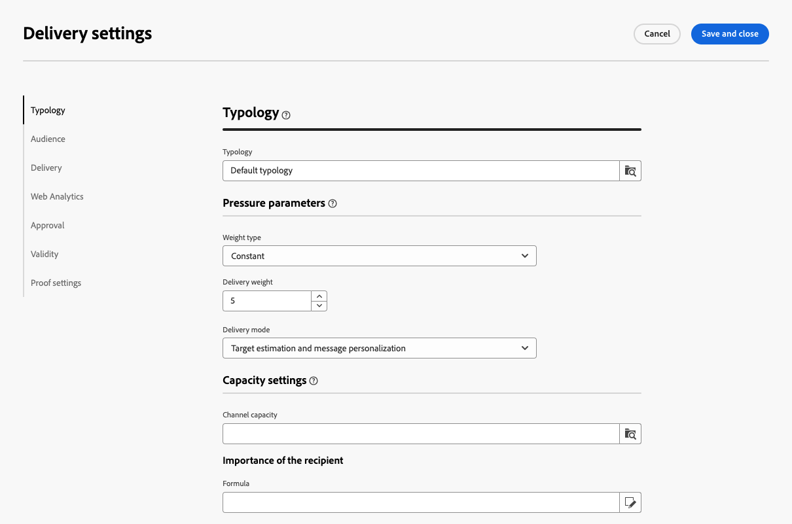

# Konfigurera leveransinställningar {#del-settings}

Leveransinställningarna är **tekniska leveransparametrar** som definieras i leveransmallen. De kan laddas över för varje leverans. De här inställningarna är tillgängliga från knappen **Inställningar** som är tillgänglig när du redigerar en leverans- eller leveransmall.

>[!CAUTION]
>
>Dessa inställningar beskrivs endast i informationssyfte. Vissa av dem beror på din konfiguration och dina behörigheter. De får inte ändras i den här versionen av produkten.

## Typologiinställningar {#typology}

>[!CONTEXTUALHELP]
>id="acw_email_settings_typology"
>title="Typologi"
>abstract="Typologier gör att ni kan standardisera affärspraxis för alla leveranser. En typologi är en samling typologiregler som gör att du kan kontrollera, filtrera och prioritera skickandet av leveranser. Profiler som matchar kriterier inom en typologiregel tas inte med i leveransgrupperna under beredningsfasen."

>[!CONTEXTUALHELP]
>id="acw_delivery_template_settings_typology"
>title="Typologiinställningar för leverans"
>abstract="Typologiregler gör att ni kan standardisera affärspraxis för alla leveranser. En typologi är en samling typologiregler som gör att du kan kontrollera, filtrera och prioritera skickandet av leveranser. Profiler som matchar kriterier inom en typologiregel tas inte med i leveransgrupperna under beredningsfasen."

Typologier är uppsättningar av **typologiregler** som körs under förberedelsefasen för att enkelt tillämpa flera filtreringsregler på en leverans samtidigt. De gör att marknadsförarna kan standardisera sina rutiner för alla leveranser när de kan styra, filtrera och prioritera leveransen. [Lär dig skapa typologier och typologiregler](../administration/typologies.md)

{zoomable="yes"}

### Trycket {#pressure-parameters}

>[!CONTEXTUALHELP]
>id="acw_email_settings_pressure_parameters"
>title="Tryckparametrar för leveransen"
>abstract="Med leveransvikter kan ni identifiera leveranser med högsta prioritet inom ramen för trötthetshantering. Meddelanden med högst vikt har prioritet."

>[!CONTEXTUALHELP]
>id="acw_delivery_template_settings_delivery_weight"
>title="Leveransvikt"
>abstract="Med leveransvikter kan ni identifiera leveranser med högsta prioritet inom ramen för tryckhantering. Meddelanden med högst vikt har prioritet."

I det här avsnittet kan du med tryckparametrar definiera en **tröskel** för att ställa in regler för trötthetshantering, vilket är det högsta antalet meddelanden som kan skickas till en profil under en viss period.

När denna tröskel har uppnåtts kan inga fler leveranser göras förrän efter den beaktade perioden. Med den här processen kan du automatiskt utesluta en profil från en leverans om ett meddelande överskrider det angivna tröskelvärdet och på så sätt undvika för många begäranden.

Tröskelvärden kan vara antingen konstanta eller variabla. Detta innebär att tröskelvärdena för en viss period kan variera från en profil till en annan eller till och med för samma profil.

I fältet **[!UICONTROL Weight type]** finns tre alternativ:

* **[!UICONTROL Constant]**
* **[!UICONTROL Depends on the recipient]**
* **[!UICONTROL Defined in each rule]**

Använd fältet **[!UICONTROL Delivery weight]** för att definiera leveransprioriteten. Varje leverans har en vikt som motsvarar dess prioritetsnivå. Som standard är vikten för en leverans inställd på 5. Med tryckregler kan du definiera vikten för de leveranser som de tillämpas på. Vikter kan antingen anges eller beräknas med en formel som passar mottagarna. Du kan till exempel definiera vikten för en leverans baserat på mottagarens intressen.

Använd fältet **[!UICONTROL Delivery mode]** för att välja målutvärderingsläget.

Tre olika lägen finns tillgängliga:

* **[!UICONTROL Target estimation and message personalization]**
* **[!UICONTROL Estimation and approval of the provisional target]**
* **[!UICONTROL Target evaluation]**

>[!NOTE]
>
>Trötthetshantering och tryckregler har konfigurerats i Campaign-klientkonsolen. Läs mer i [dokumentationen för Campaign v8 (klientkonsolen)](https://experienceleague.adobe.com/docs/campaign/automation/campaign-optimization/pressure-rules.html?lang=sv-SE){target="_blank"}.

### Kapacitetsinställningar {#capacity-settings}

>[!CONTEXTUALHELP]
>id="acw_email_settings_capacity_settings"
>title="Kapacitetsinställningar för leverans"
>abstract="Innan du skickar meddelanden ska du använda kapacitetsregler för att se till att din organisation kan behandla leveransen, de inkommande meddelanden som leveransen kan generera och antalet samtal som till exempel ska göras till kontaktprenumeranter. Kapacitetsregler definieras i Adobe Campaign v8-konsolen. På den här skärmen väljer du en regel som är kopplad till kanalen."

>[!CONTEXTUALHELP]
>id="acw_delivery_template_settings_recipient_importance"
>title="Mottagarens betydelse"
>abstract="Mottagarens betydelse är en formel som används för att avgöra vilka profiler som behålls när reglerna för kapacitetstypologi överskrids."

I det här avsnittet kan du välja en kapacitetsregel som definieras i Adobe Campaign v8-konsolen. Den här regeln är associerad med kanalen.

Fältet **[!UICONTROL Importance of the recipient]** är en formel som används för att avgöra vilka profiler som behålls när reglerna för kapacitetstypologi överskrids.

>[!NOTE]
>
>Typologiregler konfigureras i Campaign Client-konsolen. Läs mer i [dokumentationen för Campaign v8 (klientkonsolen)](https://experienceleague.adobe.com/docs/campaign/automation/campaign-optimization/consistency-rules.html?lang=sv-SE){target="_blank"}.

## Målgruppsinställningar {#audience}

>[!CONTEXTUALHELP]
>id="acw_email_settings_audience"
>title="Målgruppsinställningar för leveransen"
>abstract="Välj en **målmappning** bland de tillgängliga. Målmappningar definieras i Adobe Campaign v8-konsolen. Du kan också ange undantagsparametrar för leveransen."

I det här avsnittet kan du välja en **målmappning** bland de tillgängliga. Målmappningar definieras i Adobe Campaign v8-konsolen. Målmappningen är den typ av data som hanteras av en åtgärd. Det gör att du kan definiera målpopulationen: mottagare, avtalspliktiga mottagare, operatörer, prenumeranter osv. [Läs mer om målmappningar](../audience/targeting-dimensions.md).

I fältet **[!UICONTROL Exclusion]** kan du välja att exkludera profiler som inte längre vill bli kontaktade eller som sätts i karantän. [Läs mer](https://experienceleague.adobe.com/docs/campaign/campaign-v8/send/failures/quarantines.html?lang=sv-SE){target="_blank"}

## Leverans {#delivery}

>[!CONTEXTUALHELP]
>id="acw_email_settings_delivery"
>title="Globala inställningar för leverans"
>abstract="Leveransparametrar är tekniska inställningar som gäller för leveransen. Du kan ändra leverans- och rutinlägen, aktivera e-postkopia, skicka med hjälp av påfyllnader och även välja formatet för de e-postmeddelanden som skickas. Dessa alternativ är begränsade till expertanvändare."

**[!UICONTROL Delivery]** parametrar är tekniska inställningar som gäller för leveransen.

{zoomable="yes"}

Det integrerade externa **[!UICONTROL Routing]**-kontot tillhandahålls som standard. Den innehåller de tekniska parametrar som gör att programmet kan skicka leveranser.

Du kan definiera inställningarna för **[!UICONTROL Sending]** nedan.

* **[!UICONTROL Delivery priority]**: Använd det här alternativet om du vill ändra avsändarordningen för dina leveranser genom att ange deras prioritetsnivå: normal, hög eller låg.

* **[!UICONTROL Message batch quantity]**: Använd det här alternativet om du vill definiera antalet meddelanden som grupperas i samma XML-leveranspaket. Om parametern är inställd på 0 grupperas meddelandena automatiskt. Paketstorleken definieras av beräkningen `<delivery size>/1024`, med minst 8 och högst 256 meddelanden per paket.

  >[!IMPORTANT]
  >
  >När leveransen skapas genom duplicering av en befintlig, återställs den här parametern.

* **[!UICONTROL Test SMTP delivery]** (e-postkanal): Det här alternativet används för att testa att skicka via SMTP. E-postmeddelandet behandlas för anslutning till SMTP-servern, men skickas inte: För varje mottagare av e-postmeddelandet ansluter Campaign till SMTP-providerservern, kör SMTP RCPT TO-kommandot och stänger anslutningen före SMTP DATA-kommandot.

* **[!UICONTROL Email BCC]** (e-postkanal): Det här alternativet används för att lagra e-post på ett externt system via BCC genom att lägga till en e-postadress för hemlig kopia till meddelandemålet. Läs mer i [dokumentationen för Campaign v8 (klientkonsolen)](https://experienceleague.adobe.com/docs/campaign/campaign-v8/send/emails/email-bcc.html?lang=sv-SE){target="_blank"}.

I avsnittet **[!UICONTROL Wave definition]** väljer du alternativet **[!UICONTROL Send using multiple waves]** om du vill öka volymen som skickas med vågor stegvis. På så sätt undviker du att meddelanden markeras som skräppost eller när du vill begränsa antalet meddelanden per dag. Med vågor kan du dela upp leveranser i flera grupper i stället för att skicka stora mängder meddelanden samtidigt. [Läs mer](send-using-waves.md)

För e-postmeddelanden kan du även ändra **[!UICONTROL Mail formats]** för skickade meddelanden enligt nedan.

* **[!UICONTROL Use recipient preferences]** (standardläge): E-postformatet definieras enligt data som lagras i mottagarprofilen. Om en mottagare vill ta emot e-post i ett visst format är detta det format som skickas. Om fältet inte är ifyllt skickas ett alternativt e-postmeddelande (se nedan).

* **[!UICONTROL Let recipient mail client choose the most appropriate format]**: E-postmeddelandet innehåller båda formaten: text och HTML. Formatet som visas vid mottagning beror på konfigurationen av mottagarens e-postprogramvara (multipart-option).

  >[!IMPORTANT]
  >
  >Det här alternativet inkluderar båda versionerna av dokumentet. Det påverkar därför leveransfrekvensen eftersom e-poststorleken är större.

* **[!UICONTROL Send all messages in text format]**: E-postmeddelandet skickas i textformat. HTML-formatet skickas inte, utan används endast för spegelsidan när mottagaren klickar på e-postmeddelandet.

## Web Analytics {#web-analytics}

>[!CONTEXTUALHELP]
>id="acw_email_settings_webanalytics"
>title="Inställningar för webbanalys för leverans"
>abstract="Välj ett webbanalyskonto. Det här kontot är konfigurerat i Campaign Client-konsolen. Du kan också definiera de taggar som delas med analysverktyget som du använder."

I det här avsnittet kan du välja ett webbanalyskonto. Det här kontot är konfigurerat i Campaign-klientkonsolen.

Du kan också definiera de taggar som delas med analysverktyget som du använder.

>[!NOTE]
>
>Web Analytics-funktioner konfigureras i Campaign Client-konsolen. Läs mer i [dokumentationen för Campaign v8 (klientkonsolen)](https://experienceleague.adobe.com/docs/campaign/campaign-v8/connect/ac-aa.html?lang=sv-SE#external-account-ac){target="_blank"}.

## Försök igen {#retries}

>[!CONTEXTUALHELP]
>id="acw_delivery_template_settings_retries"
>title="Maximalt antal återförsök"
>abstract="Om ett meddelande misslyckas på grund av ett tillfälligt fel, utförs nya försök tills slutet av leveransens varaktighet är slut."

<!--Currently not visible in UI > ??-->

Meddelanden som inte har levererats tillfälligt på grund av ett mjukt eller ignorerat fel kan återförsökas automatiskt. Som standard schemaläggs fem återförsök till den första dagen i leveransen med ett minsta intervall på en timme som sprids ut över dygnets 24 timmar.

## Godkännande (e-postkanal) {#approval}

>[!CONTEXTUALHELP]
>id="acw_email_settings_approval"
>title="Godkännandeläge för leverans"
>abstract="Välj godkännandeläge. Om varningar genereras under leveransförberedelsen kan du konfigurera leveransen för att definiera om den fortfarande ska köras eller inte."

>[!CONTEXTUALHELP]
>id="acw_delivery_template_settings_approval"
>title="Godkännandeläge för leveranser"
>abstract="Välj godkännandeläge för leveranser baserat på den här mallen. Om varningar genereras under leveransförberedelsen kan du konfigurera leveransen för att definiera om den fortfarande ska köras eller inte."

Om varningar genereras under en förberedelse för e-postleverans kan du konfigurera leveransen för att definiera om den fortfarande ska köras eller inte. Som standard måste användaren bekräfta att e-postmeddelanden skickas i slutet av analysfasen: detta är **manuell** validering.

Du kan välja ett annat godkännandeläge i lämpligt fält. Tillgängliga lägen är:

* **[!UICONTROL Manual]**: I slutet av analysfasen måste användaren bekräfta leveransen för att kunna börja skicka.
* **[!UICONTROL Semi-Automatic]**: Skickandet börjar automatiskt om analysfasen inte genererar några varningsmeddelanden.
* **[!UICONTROL Automatic]**: Sändningen börjar automatiskt i slutet av analysfasen, oavsett resultatet.

## Giltighet {#validity}

>[!CONTEXTUALHELP]
>id="acw_email_settings_validity"
>title="Inställningsgiltighet"
>abstract="I fältet **Leveransvaraktighet** kan du ange gränsen för globala leveransförsök. Detta innebär att Adobe Campaign skickar meddelanden som börjar på startdatumet och sedan, för meddelanden som bara returnerar ett fel, kommer regelbundna, konfigurerbara försök att utföras tills giltighetsgränsen nås. Fältet **Resursens giltighetsgräns** används för överförda resurser, till exempel spegelsidor eller bilder. När gränsen har nåtts är resurserna inte längre tillgängliga."

>[!CONTEXTUALHELP]
>id="acw_delivery_template_settings_resources_validity"
>title="Giltighetsgräns för resurser"
>abstract="Fältet **Resursens giltighetsgräns** används för överförda resurser, till exempel spegelsidan eller bilderna. Resurserna är giltiga under en begränsad tid: när gränsen har nåtts är resurserna inte längre tillgängliga."

>[!CONTEXTUALHELP]
>id="acw_delivery_template_settings_delivery_duration"
>title="Leveransens varaktighet"
>abstract="I fältet **Leveransvaraktighet** kan du ange gränsen för globala leveransförsök. Detta innebär att Adobe Campaign skickar meddelanden som börjar på startdatumet och sedan, för meddelanden som bara returnerar ett fel, kommer regelbundna, konfigurerbara försök att utföras tills giltighetsgränsen nås."

<!--
>[!CONTEXTUALHELP]
>id="acw_email_settings_resources_validity"
>title="Resources validity limit"
>abstract="The Validity limit field is used for uploaded resources, such as the mirror page or images. These resources are valid for a limited time: once the limit is reached, resources are no longer available."
-->

### Giltighetsperiod {#validity-period}

I fältet **[!UICONTROL Delivery duration]** kan du ange gränsen för globala leveransförsök. Detta innebär att Adobe Campaign skickar meddelanden som börjar på startdatumet och sedan, för meddelanden som bara returnerar ett fel, kommer regelbundna, konfigurerbara försök att utföras tills giltighetsgränsen nås.

Du kan också välja att ange datum. Välj **[!UICONTROL Explicitly set validity dates]** om du vill göra det. I det här fallet kan du även ange datum för leveransdatum och giltighetsgräns. Den aktuella tiden används som standard, men du kan ändra den direkt i indatafältet.

**[!UICONTROL Resources validity limit]** används för överförda resurser, främst för spegelsidan och bilder. Resurserna på den här sidan är giltiga under en begränsad tid (för att spara diskutrymme). Efter den här gränsen är resurserna inte längre tillgängliga.

{zoomable="yes"}

<!--Change screenshot to be consistent with prod > not sure which version is correct-->

Läs mer om giltighetsperiod för leverans i [dokumentationen för Campaign v8 (klientkonsolen)](https://experienceleague.adobe.com/docs/campaign/campaign-v8/campaigns/send/failures/delivery-failures.html?lang=sv-SE#validity-period){target="_blank"}.

### Spegelvänd sidhantering (e-postkanal) {#mirror}

Spegelsidan är en HTML-sida som är tillgänglig online via en webbläsare. Innehållet är identiskt med e-postmeddelandet. Spegelsidan genereras som standard om länken infogas i innehållet i e-postmeddelandet.

Förutom standardläget är följande alternativ också tillgängliga:

* **[!UICONTROL Force the generation of the mirror page]**: Använd det här läget för att generera spegelsidan även om ingen länk till spegelsidan infogas i e-postmeddelandet.
* **[!UICONTROL Do not generate the mirror page]**: Använd det här läget för att undvika att skapa en spegelsida, även om länken finns i e-postmeddelandet.
* **[!UICONTROL Generates a mirror page accessible using only the message identifier]**: När spegelsidans länk inte finns i e-postinnehållet använder du det här alternativet för att aktivera åtkomst till spegelsidans innehåll från klientkonsolen i leveransloggfönstret.

### Spåra {#tracking}

<!--
>[!CONTEXTUALHELP]
>id="acw_email_settings_tracking_validity"
>title="Validity period"
>abstract="This option defines the duration for which the tracking is activated on the URLs."
-->

>[!CONTEXTUALHELP]
>id="acw_delivery_template_settings_tracking_validity"
>title="Giltighetsperiod"
>abstract="Giltighetsperioden anger den varaktighet som spårningen är aktiverad för i meddelande-URL:erna."

**[!UICONTROL Tracking]** parametrar definieras i det relaterade avsnittet. Möjliga alternativ är:

* **[!UICONTROL Tracking validity limit]**: Använd det här alternativet om du vill ändra hur länge spårningen aktiveras på URL-adresserna.
* **[!UICONTROL Substitution URL for expired URLs]**: Använd det här alternativet om du vill ange en URL till en reservwebbsida: den visas när spårningen har upphört att gälla.

## Korrekturinställningar {#test-setttings}

>[!CONTEXTUALHELP]
>id="acw_email_settings_testsettings"
>title="Definiera korrekturinställningarna för leveransen"
>abstract="Välj undantagsparametrarna och anpassa etiketten för korrektur."

<!--Test to be replaced with Proof everywhere - currently not consistent within UI > changed to Proof to reflect UI here but not consistent in documentation either-->

Du kan ange undantagsparametrar i det här avsnittet. Tillgängliga alternativ är:

* Med **[!UICONTROL Keep doubles]** kan du auktorisera flera leveranser till profiler som uppfyller flera målinriktningskriterier.
* Med **[!UICONTROL Keep denylisted addresses]** kan du från målet behålla profiler som inte längre används av leveransen, till exempel efter en avanmälan (avanmälan).
* Med **[!UICONTROL Keep quarantined addresses]** kan du hålla profiler med en adress som inte svarar från målet.

Du kan också anpassa etiketten för korrektur:

* Använd **[!UICONTROL Keep the delivery code for the proof]** för att associera till beviset med samma leveranskod som den som är definierad för leveransen som det hör till.
* Som standard anges korrekturens ämne med &quot;PROOF #&quot;, där # är korrekturets nummer. Du kan ändra prefixet i fältet **[!UICONTROL Label prefix]**.

## SMS-inställningar (SMS-kanal) {#sms-tab}

>[!CONTEXTUALHELP]
>id="acw_sms_delivery_settings"
>title="SMS-leveransinställningar"
>abstract="SMS-leveransparametrar är tekniska inställningar som gäller för din SMS-leverans. Du kan definiera avsändarens adress, tjänstparametrar, överföringsläge med mera. Dessa alternativ är begränsade till expertanvändare."

SMS-leveransparametrar är tekniska inställningar som gäller för din SMS-leverans. Du kan definiera avsändarens adress, tjänstparametrar, överföringsläge med mera. Dessa alternativ är begränsade till expertanvändare.

<!--

* **[!UICONTROL Sender address]**

  The field is limited to 21 characters by the SMPP specification, but some providers may allow longer values. Note also that very strict restrictions may be applied in some countries (length, content, allowed characters, …), so you may need to double-check that the content you place here is legal. Be especially careful when using personalized fields.

  This optional field allows you to override the sender address (oADC). Its content is placed in the *source_addr* field of the SUBMIT_SM PDU.

  Although the SMPP specification limits this field to 21 characters, some providers may support longer values. Be aware that certain countries impose strict regulations on sender addresses (regarding length, content, allowed characters, etc.), so always verify that your input complies with local requirements. Use extra caution when working with personalized fields.

  If this field is left empty, the value of the Source number field defined in the external account will be used instead. If both values are empty, the *source_addr* field will be left empty.

-->

* **[!UICONTROL Service type]**:

  Den här parametern skickas till providern som den är.

* **[!UICONTROL Service or program ID]**

  >[!NOTE]
  >
  >Användning av det här fältet rekommenderas inte. Tillvalsparametrar för SMPP, som finns i klientkonsolen, ger en mycket mer flexibel implementering.
  >
  >Det här fältet kan inte användas samtidigt med valfria SMPP-parametrar.

  I kombination med den matchande externa kontoinställningen tillåter att en valfri parameter skickas med varje MT. I det här fältet definieras värdedelen i TLV.

* **[!UICONTROL Transmission mode]**

  I det här fältet definieras vilken typ av SMS som ska skickas: om det är ett normalt meddelande eller ett flash-meddelande och om det ska lagras på den mobila enheten eller SIM-kortet. Den här inställningen överförs i det valfria fältet dest_addr_subunit i PDU:n SUBMIT_SM.

   * **Flash** anger värdet till 1. Skickar ett Flash SMS som visas direkt på skärmen och inte lagras.
   * **Normal** anger värdet till 0. Skickar ett standard-SMS.
   * **Sparad på mobilen** anger värdet till 2. Instruerar enheten att lagra SMS:et i det interna minnet.
   * **Sparad vid terminal** anger värdet till 3. Instruerar enheten att lagra SMS på SIM-kortet.

* **[!UICONTROL Priority, Communication type]**

  Dessa fält ignoreras av den utökade SMPP-kopplingen.

* **[!UICONTROL Maximum number of SMS per message]**

  Den här inställningen gäller endast om alternativet för meddelandenyttolast är inaktiverat (mer information finns i inställningarna för det externa kontot). Om meddelandet kräver mer SMS än det här värdet utlöses ett fel.

  SMS-protokollet tillåter att meddelanden delas upp i upp till 255 delar, men vissa mobila enheter kan ha svårt att återskapa meddelanden med mer än 10 delar (gränsen beror på enhetsmodellen). För tillförlitlighet är det bäst att begränsa meddelandena till högst fem delar.

  Observera att meddelandestorleken kan variera beroende på hur personaliserade meddelanden fungerar i Adobe Campaign. Ett stort antal långa meddelanden kan leda till ökade sändningskostnader, så att en rimlig gräns hjälper till att hålla kostnaderna i schack.

  Om du anger värdet 0 inaktiveras gränsen.

## SMTP-inställningar för e-postleverans {#smtp}

>[!CONTEXTUALHELP]
>id="acw_email_settings_smtp"
>title="SMTP-parametrar"
>abstract="Du kan lägga till ytterligare SMTP-parametrar i e-postleveransen."

Du kan lägga till ytterligare SMTP-parametrar i e-postleveransen. Du kan göra det på fliken SMTP i leveransinställningarna.

{zoomable="yes"}

### Teckenkodning {#character-encoding}

I avsnittet **[!UICONTROL Character encoding]** kan du ange en specifik kodning. Standardkodningen är UTF-8, som fungerar för de flesta tecken. Vissa e-postleverantörer kanske inte visar specialtecken korrekt om de inte har stöd för UTF-8-standardkodning.

Om du till exempel vill skicka ett e-postmeddelande med japanska tecken är det bättre att använda en kodning som specifikt stöder dessa tecken, så att din publik i Japan kan se allt korrekt.

Om du vill göra det aktiverar du växlingsknappen **[!UICONTROL Force the encoding used for messages]** och väljer rätt kodning i listan som stöder dina specialtecken.

{zoomable="yes"}

### Studsa e-postmeddelanden {#bounce-emails}

På fliken **[!UICONTROL SMTP]** i leveransinställningarna kan du även konfigurera hanteringen av studsmeddelanden.

* **[!UICONTROL Errors-to-address]**: Om du aktiverar växeln **[!UICONTROL Use the default error address defined for the platform]** tas studsade e-postmeddelanden emot i standardfelrutan för plattformen. Om du inte aktiverar den kan du definiera en specifik feladress för leveransen.

* **[!UICONTROL Bounce address]**: Du kan också definiera en annan adress dit obearbetade studsade e-postmeddelanden vidarebefordras. Med den här adressen kan du undersöka orsaken till att studsa när e-postmeddelanden inte automatiskt kunde kvalificeras av programmet.

Dessa två fält kan anpassas enligt beskrivningen i [det här avsnittet](../personalization/gs-personalization.md).

{zoomable="yes"}

### Ytterligare SMTP-rubriker {#smtp-headers}

Du kan lägga till **[!UICONTROL SMTP headers]** i din e-postleverans på fliken SMTP i leveransinställningarna.

Skriptet som anges i det här fönstret måste referera till en rubrik per rad i följande format: name:value.

Värden kodas automatiskt om det behövs.

{zoomable="yes"}

>[!IMPORTANT]
>
>Tillägg av ett skript för att infoga ytterligare SMTP-rubriker är reserverat för avancerade användare. Syntaxen för det här skriptet måste uppfylla kraven för den här innehållstypen: Inget oanvänt utrymme, ingen tom rad, o.s.v.

## Lägga till variabler {#variables-delivery}

>[!CONTEXTUALHELP]
>id="acw_delivery_settings_variable"
>title="Variabel"
>abstract="Du kan lägga till variabler i leveransen, vilket kan vara användbart för spårning och personalisering. Variablerna är tillgängliga både från ditt leveransinnehåll och dina arbetsflöden."

Du kan lägga till variabler i leveransen, vilket kan vara användbart för spårning och personalisering. Variablerna är tillgängliga både från ditt leveransinnehåll och dina arbetsflöden. Lagrade variabler används för att ange värden som förblir konstanta i alla meddelanden i leveransen. De kan också konfigureras i leveransmallar.

Bläddra till fliken **[!UICONTROL Variables]** så som visas nedan om du vill lägga till en variabel.

{zoomable="yes"}

Klicka på knappen **[!UICONTROL Add Variables]** för att ange information om variabeln. Du kan lägga till värdet direkt eller använda ett uttryck för det genom att aktivera kryssrutan **[!UICONTROL Value is the result of an expression]**. Klicka sedan på **[!UICONTROL Confirm]** för att spara ändringarna.

{zoomable="yes"}

Läs mer om [att använda variabler för personalisering](../personalization/personalize.md#variables-personalization) och [med variabler för dynamiskt innehåll](../personalization/conditions.md#variables-conditional).