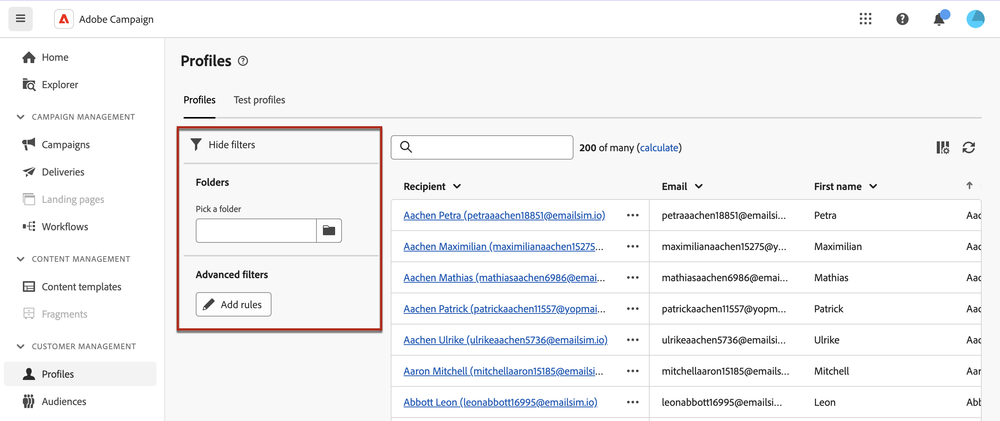

# Kom igång med profiler {#profiles}

>[!CONTEXTUALHELP]
>id="acw_recipients_list"
>title="Profiler"
>abstract="En profil är en post som är avsedd för att ta emot meddelanden som skickas av Adobe Campaign. I den här listan kan du visa profilens information utifrån dina behörigheter. Använd filteralternativen för att bläddra i den här listan. Du kan redigera och uppdatera en liten uppsättning profilattribut."

## Vad är en profil? {#what}

En **profil**, som också kallas mottagare i klientkonsolen, representerar en post som lagras i Campaign-databasen. Den fungerar som en nyckelkomponent för att [skapa målgrupper](create-audience.md) för leveranser och [lägga till personaliseringsdata](../personalization/personalize.md) i ditt innehåll. Adobe Campaign möjliggör smidig hantering av profiler, inklusive framtagning av nya tävlingsbidrag och tillgång till en heltäckande översikt över alla profilers attribut och serviceabonnemang via webbgränssnittet i Campaign.

Dessutom tillåter **[!UICONTROL test profiles]**, som identifieras som &quot;dirigeringsprofiler&quot; i klientkonsolen, mål för ytterligare mottagare som inte matchar målinriktningsvillkoren för en viss leverans. Dessa profiler innehåller fiktiv kontaktinformation eller kontaktinformation som styrs av avsändaren. Testprofiler är korrekturmottagare som används för att testa meddelanden genom att skicka korrektur. [Lär dig arbeta med testprofiler](test-profiles.md)

Både profiler och testprofiler är användbara för att testa leveranser innan de når den avsedda målgruppen. Detta gör det möjligt att förhandsgranska meddelandeinnehåll och personalisering, skicka korrektur för testning och validering, utvärdera e-poståtergivning på olika plattformar och enheter samt testa landningssidor. [Lär dig hur du förhandsgranskar och testar leveranser](../preview-test/preview-test.md)

➡️ [Upptäck den här funktionen i en video](#video)

## Öppna listan med profiler {#access}

Profiler är tillgängliga och redigerbara i Adobe Campaign Web från posten **[!UICONTROL Customer management]** > **Profiler** i den vänstra navigeringslisten. De kan också nås i vyn **[!UICONTROL Explorer]** från noden **[!UICONTROL Profiles & Targets]** > **[!UICONTROL Recipients]**. Därifrån kan du bläddra, skapa och hantera mappar eller undermappar samt kontrollera tillhörande behörigheter. [Lär dig skapa mappar](../get-started/permissions.md#folders).

>[!NOTE]
>
>Beroende på dina behörigheter kanske du inte har tillgång till den fullständiga listan över profiler som lagras i databasen. [Läs mer om behörigheter](../get-started/permissions.md)

Filtrera listan **[!UICONTROL Profiles]** med hjälp av sökfältet eller filtren som är tillgängliga från knappen **Visa filter** . Begränsa resultaten till en viss [mapp](../get-started/permissions.md#folders) med hjälp av listrutan eller lägg till regler med [frågemodelleraren](../query/query-modeler-overview.md).

{zoomable="yes"}

Om du vill få tillgång till information om en profil klickar du på dess namn i listan. En detaljerad vy av profilen öppnas så att du kan utforska dess attribut och de tjänster som profilen prenumererar på. [Lär dig utforska profilinformation](create-profile.md)

Om du vill ta bort en profil väljer du motsvarande alternativ på menyn **[!UICONTROL More actions]**.

## Instruktionsvideo {#video}

Lär dig hur du får tillgång till, hanterar och utforskar profiler med webbgränssnittet i Campaign.

>[!VIDEO](https://video.tv.adobe.com/v/3427293?quality=12)