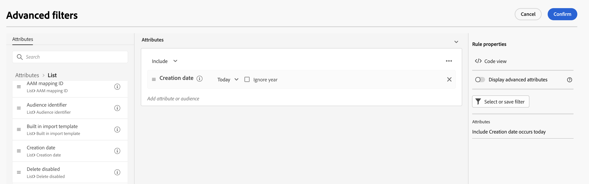

# Välj en befintlig målgrupp {#add-audience}

>[!CONTEXTUALHELP]
>id="acw_deliveries_email_audience_select"
>title="Välj en befintlig målgrupp"
>abstract="Bläddra i listan för att välja en befintlig målgrupp. Använd ikonen Visa filter om du vill filtrera listan eller markera en viss mapp."

I det här avsnittet beskrivs hur du väljer en befintlig målgrupp när du definierar målpopulationen för en leverans. När du definierar huvudmålet för en leverans kan du också:

* [Skapa en engångspublik](one-time-audience.md) med frågemodelleraren.
* [Läsa in en målgrupp från en extern fil](file-audience.md) (endast för e-post).

Målgrupper som kan användas i leveranser kan nås via **Målgrupp** vänster meny. De kommer från flera källor, till exempel kundkonsolen, målgruppsarbetsflöden för Campaign-webben eller Adobe Experience Platform. [Lär dig övervaka och hantera målgrupper](manage-audience.md)

Följ stegen nedan för att välja en befintlig målgrupp för ditt meddelande:

1. Från **Målgrupp** i leveransguiden klickar du på **[!UICONTROL Select audience]** knapp och sedan välja

   

1. Välj **[!UICONTROL Select audience]** för att använda en befintlig målgrupp. På den här skärmen visas alla befintliga målgrupper för den aktuella mappen.

   

   Om du vill välja en målgrupp från Adobe Experience Platform går du till `AEP Audiences folder` från skärmens filteravsnitt.

   

1. I filteravsnittet kan du komma åt filteralternativ för att förfina målgruppslistan. Det gör du genom att klicka **Lägg till regler** för att komma åt frågemodelleraren, som du kan använda för att skapa avancerade filter för en lista över målgrupper. [Lär dig använda frågemodelleraren](../query/query-modeler-overview.md)

   

1. Klicka **Bekräfta** för att lägga till er målgrupp som huvudmål för leveransen. När du är klar kan du fortfarande förfina målgruppen med frågemodelleraren genom att klicka på knappen **Redigera regler** -knappen.

   

   Ni kan också ställa in en kontrollgrupp för att mäta effekten av era kampanjer. Kontrollgruppen tar inte emot meddelandet. På så sätt kan du jämföra beteendet hos den population som fick meddelandet med beteendet hos kontakter som inte gjorde det. [Läs mer](control-group.md)
