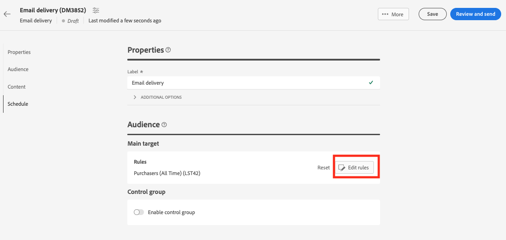

# Använda en Adobe Experience Platform-publik{#aep-audience}

Adobe Campaign Managed Cloud Service Destination och Source-anslutningarna möjliggör smidig integrering mellan Adobe Campaign och Adobe Experience Platform.

När ni har skapat en Adobe Experience Platform-målgrupp och den finns tillgänglig i klientkonsolen kan ni använda den på samma sätt som ni gör för en Campaign-målgrupp att personalisera och skicka meddelanden.

>[!NOTE]
>
>Om du vill använda Adobe Experience Platform målgrupper i Campaign måste du konfigurera integreringen med Adobe Sources and Destinations. Se [Kampanjdokumentation v8 (klientkonsol)](https://experienceleague.adobe.com/docs/campaign/campaign-v8/connect/ac-aep/ac-aep.html){target="_blank"}.

Om du vill välja målgrupp för en leverans kan du också:

* Bygg en ny publik. [Läs mer](segment-builder.md)
* Läsa in en målgrupp från en extern fil. [Läs mer](file-audience.md)
* Använd en befintlig Campaign-målgrupp. [Läs mer](add-audience.md).

Följ stegen nedan för att välja en Adobe Experience Platform-målgrupp för din leverans:

1. Från **Målgrupp** i leveransguiden klickar du på **[!UICONTROL Select audience]** -knappen.

   

1. Välj **[!UICONTROL Select audience]** för att använda en befintlig målgrupp. Om du vill skapa en ny målgrupp som ska användas i det här e-postmeddelandet väljer du **Skapa en egen**. Se detta [section](segment-builder.md).

   På den här skärmen visas alla befintliga målgrupper som definierats i Adobe Campaign klientkonsol för den aktuella mappen. Om du vill välja en målgrupp från Adobe Experience Platform går du till `AEP Audiences folder` från skärmens filteravsnitt.

   

   Du kan också definiera en regel som ska filtreras efter målgruppernas ursprung, enligt nedan:

   

1. Välj en målgrupp och klicka **Välj**.

1. Klicka **Redigera regler** om ni vill förfina er målgrupp.

   

1. Med regelbyggaren kan ni utöka målgruppen med ytterligare filter eller genom att kombinera olika målgrupper. Se det här [section](segment-builder.md).

1. Klicka **Spara**.

