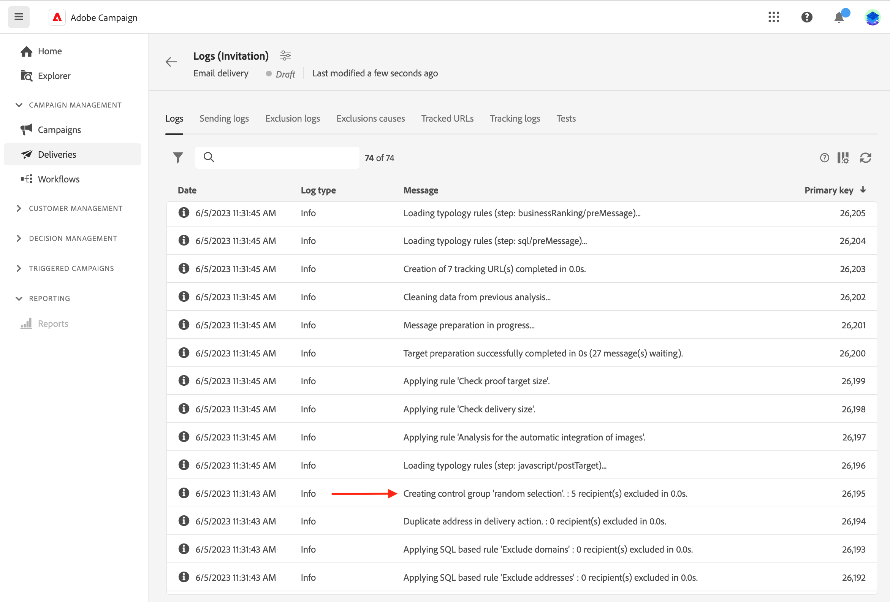

# Ange en kontrollgrupp {#control-group}

En kontrollgrupp är en underpopulation som är exkluderad från leveransen. Du kan definiera en kontrollgrupp för att undvika att skicka meddelanden till en del av publiken och jämföra beteendet efter leverans med huvudmålet. Det här alternativet hjälper er att mäta effekten av er kampanj.

## Aktivera kontrollgrupp{#add-a-control-group}

Om du vill lägga till en kontrollgrupp aktiverar du alternativet när du definierar målgruppen för leveransen. Kontrollgruppen kan extraheras slumpmässigt från huvudmålet och/eller väljas från en viss målgrupp. Det finns därför två sätt att definiera en kontrollgrupp:

* Extrahera ett antal profiler från huvudmålet.
* Uteslut vissa profiler från en lista eller baserat på villkor som definierats i en fråga.

Du kan kombinera båda metoderna när du definierar en kontrollgrupp.

Alla profiler som är en del av kontrollgruppen vid leveransförberedelsesteget tas bort från huvudmålet. De får inte meddelandet.

>[!CAUTION]
>
>Du kan inte använda kontrollgrupper när målpopulationen läses in [från en extern fil](file-audience.md).

Aktivera alternativet **[!UICONTROL Enable control group]** växla från **Målgrupp** på skärmen där leveransen skapas.

## Extrahera från mål {#extract-target}

>[!CONTEXTUALHELP]
>id="acw_deliveries_email_controlgroup_target"
>title="Extraheringsläge"
>abstract="En kontrollgrupp är en uppsättning profiler som är exkluderade från leveransen. För att definiera en kontrollgrupp kan du välja att extrahera – slumpmässigt eller baserat på en sortering – en procentandel eller ett fast antal profiler från målpopulationen."

### Skapa en kontrollgrupp {#build-extract-target}

För att definiera en kontrollgrupp kan du välja att extrahera – slumpmässigt eller baserat på en sortering – en procentandel eller ett fast antal profiler från målpopulationen. Om du föredrar att lägga till en extra fyllning väljer du **Ingen extrahering** och välj den extra fyllningen [som anges här](#extra-population).

Definiera först hur profilerna extraheras från målet: slumpmässigt eller baserat på en sortering.

Under **Kontrollgrupp** väljer du ett **Extraheringsläge**:

* **Slumpmässig**: När leveransen förbereds extraherar Adobe Campaign slumpmässigt ett antal profiler som motsvarar procentandelen eller det högsta antal som anges som storleksgräns.

* **Rankad efter attribut**: Med det här alternativet kan du exkludera en uppsättning profiler baserat på specifika attribut i en viss sorteringsordning.

Använd sedan **Storleksgräns** för att ange antalet profiler som du behöver extrahera från huvudmålet. Det kan vara ett obearbetat tal (till exempel 50 profiler som ska uteslutas) eller en procentandel av den initiala målgruppen (till exempel 5 % av huvudmålet).

### Exempel på kontrollgrupp{#control-group-sample}

Om du till exempel vill skapa en kontrollgrupp med de 100 nya unga mottagarna gör du så här:

1. Välj **Ålder** -fält som ett sorteringskriterium. Lämna **Stigande** sorteringsalternativ.
1. Lägg till **Skapad den** fält. Ändra till **Fallande** sorteringsalternativ.
1. Definiera 100 som tröskelvärde i **Storleksgräns** -avsnitt.

   

Dessa 100 nya unga mottagare exkluderas sedan från huvudmålet.

### Kontrollera kontrollgruppen {#check-control-group}

Du kan visa loggarna för att kontrollera och identifiera de exkluderade profilerna. Låt oss ta ett exempel på ett slumpmässigt undantag på fem profiler.

Efter leveransförberedelserna kan du se hur undantagen tillämpades:

* På kontrollpanelen för leveransen, före sändningen, kontrollerar du **Att exkludera** KPI.

  

* På fliken Loggar i leveransloggarna visas exkluderingssteget.

  
<!--

 * The **Exclusion logs** tab displays each profile and the related exclusion **Reason**.

    
-->

* The **Uteslutningsorsaker** visas antalet uteslutna profiler för varje typologiregel.

  

Mer information om leveransloggar finns i [section](../monitor/delivery-logs.md).

## Lägga till en extra population {#extra-population}

>[!CONTEXTUALHELP]
>id="acw_deliveries_email_controlgroup_extra"
>title="Extra population"
>abstract="En kontrollgrupp är en uppsättning profiler som är exkluderade från leveransen. Du kan utesluta en viss population från leveransgruppen genom att välja en befintlig målgrupp eller genom att definiera en fråga."

Ett annat sätt att definiera en kontrollgrupp är att välja en specifik population i en befintlig målgrupp eller genom att definiera en fråga.

Från **Extra population** i **Kontrollgrupp** definitionsskärmen klickar du på **[!UICONTROL Select Audience]** -knappen.

* Om du vill använda en befintlig målgrupp klickar du **Välj målgrupp**. Läs mer i [det här avsnittet](add-audience.md).

* Om du vill definiera en ny fråga väljer du **Skapa en egen** och definiera uteslutningskriterierna med regelbyggaren. Läs mer i [det här avsnittet](segment-builder.md).

Profilerna som ingår i målgruppen eller matchar resultatet av frågan är **exkluderad** från leveransmålet: de får inget meddelande.

## Jämför resultaten{#control-group-results}

När leveransen har skickats kan du extrahera de sändande loggarna för att jämföra beteendet mellan de profiler som inte fick kommunikationen och det faktiska målet. Du kan också använda leveransloggarna för att skapa en ny målinriktning.

Om du vill se vilka profiler som tagits bort från målet ska du kontrollera **Leveransloggar**. Läs mer [i det här avsnittet](#check-control-group).

