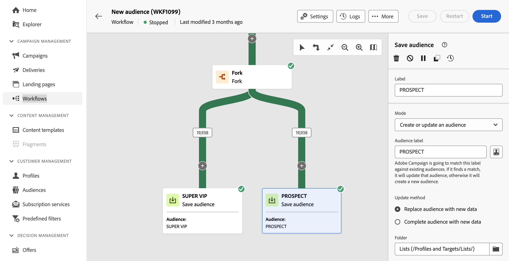

# Skapa målgrupper {#create-audiences}

>[!CONTEXTUALHELP]
>id="acw_homepage_welcome_rn3"
>title="Målgruppskomposition"
>abstract="Skapa nya målgrupper i ett visuellt arbetsflöde. Förutom att börja från scratch och skapa en enkel målgrupp kan ni också utnyttja arbetsflödesaktiviteter för att förfina er målgrupp. Kombinera flera olika målgrupper till en enda, berika er målgrupp med externa attribut eller dela upp en grupp i flera målgrupper baserat på valfria regler."
>additional-url="https://experienceleague.adobe.com/docs/campaign-web/v8/release-notes/release-notes.html" text="Se versionsinformation"

>[!CONTEXTUALHELP]
>id="acw_audiences_list"
>title="Målgrupper"
>abstract="Från den här skärmen kan du komma åt listan över alla målgrupper som kan användas i dina leveranser. Klicka **Skapa** skapa nya målgrupper i en visuell arbetsyta med hjälp av olika arbetsflödesaktiviteter som **Dela** eller **Exkludera**."

>[!CONTEXTUALHELP]
>id="acw_audiences_create_settings"
>title="Målgruppsinställningar"
>abstract="Ange målgruppens namn och ytterligare alternativ och klicka sedan på **Skapa publik** -knappen."

Med Campaign Web kan ni skapa nya målgrupper i ett visuellt arbetsflöde. Förutom att börja från scratch och skapa en enkel målgrupp kan ni också utnyttja arbetsflödesaktiviteter för att förfina er målgrupp. Ni kan till exempel kombinera flera olika målgrupper till en enda, berika er målgrupp med externa attribut eller dela upp en grupp i flera målgrupper baserat på valfria regler.

När ni väl har skapat ert arbetsflöde lagras målgrupperna automatiskt i Campaign-databasen tillsammans med era befintliga. Dessa målgrupper kan sedan målgruppsanpassas i arbetsflöden eller fristående leveranser.

➡️ [Upptäck den här funktionen i video](#video)

## Skapa din första målgrupp {#create}

Så här skapar du en målgrupp:

1. Navigera till **[!UICONTROL Audiences]** och klickar på **[!UICONTROL Create Audience]** i det övre högra hörnet.

1. Ett nytt arbetsflöde skapas automatiskt så att du kan kombinera aktiviteter för att skapa en målgrupp. Arbetsytan innehåller som standard två huvudaktiviteter:

   * Frågan **[!UICONTROL Build audience]** -aktiviteten är startpunkten i arbetsflödet, så att du kan skapa en målgrupp och använda den som grund för arbetsflödet.

   * The &quot;New audition&quot; **[!UICONTROL Save audience]** -aktiviteten är det sista steget i arbetsflödet så att du kan spara resultatet som en ny målgrupp.

   {zoomable=&quot;yes&quot;}

   >[!IMPORTANT]
   >
   >Målgruppsarbetsflöden lagras i **Arbetsflöden** -menyn, tillsammans med andra Campaign-arbetsflöden. De är särskilt utformade för att skapa målgrupper och kan identifieras med hjälp av deras vertikala arbetsyta.

1. För bättre läsbarhet rekommenderar vi att du ändrar namnet på arbetsflödet i arbetsflödesinställningens **Etikett** fält. [Lär dig hur du konfigurerar arbetsflödesinställningar](../workflows/workflow-settings.md)

1. Öppna **[!UICONTROL Build audience]** och använd frågemodelleraren för att definiera populationen som ska inkluderas i målgruppen genom att filtrera data i databasen. [Lär dig konfigurera en målgruppsaktivitet](../workflows/activities/build-audience.md)

1. Om du vill utföra ytterligare åtgärder för den population som är avsedd för arbetsflödet lägger du till så många aktiviteter som behövs och kopplar ihop dem. Mer information om hur du konfigurerar arbetsflödesaktiviteter finns i [arbetsflödesdokumentation](../workflows/activities/about-activities.md).

   >[!NOTE]
   >
   >Kanalaktiviteter är inte tillgängliga för målgruppsarbetsflöden.

   {zoomable=&quot;yes&quot;}

1. Konfigurera **[!UICONTROL Save audience]** för att ange hur du vill spara den beräknade populationen uppströms i arbetsflödet. [Lär dig konfigurera en Spara målgruppsaktivitet](../workflows/activities/save-audience.md)

1. När arbetsflödet är klart klickar du **[!UICONTROL Start]** för att genomföra det.

Arbetsflödet sparas i **[!UICONTROL Workflows]** -listan, medan de resulterande målgrupperna är tillgängliga i **[!UICONTROL Audiences]** lista med etiketten som definieras i **Spara målgrupper** aktivitet. Lär dig övervaka och hantera målgrupper i [det här avsnittet](manage-audience.md)

Nu kan ni använda den här målgruppen som huvudmål för en leverans. [Läs mer](add-audience.md)

## Exempel på målgruppsarbetsflöde {#example}

I exemplet nedan visas ett målgruppsarbetsflöde som är konfigurerat för att rikta sig till kvinnliga kunder som bor i New York och skapa två nya målgrupper beroende på deras senaste köp (Yoga eller Löpande utrustning).

{zoomable=&quot;yes&quot;}

1. The **[!UICONTROL Build audience]** Aktiviteten riktar sig till alla kvinnliga profiler som bor i New York.
1. The **[!UICONTROL Enrichment]** aktiviteten berikar publiken med information från inköpstabellen för att identifiera vilken typ av produkt kunderna har köpt.
1. The **[!UICONTROL Split]** aktiviteten delar upp arbetsflödet i två banor baserat på kundens senaste köp.
1. The **[!UICONTROL Save audience]** aktiviteter i slutet av varje bana skapar två nya målgrupper i databasen, inklusive den population som beräknas i varje bana.

## Redigera en målgrupp {#edit}

Du kan ändra en målgrupp som genererats från ett arbetsflöde när det behövs genom att köra motsvarande arbetsflöde igen. På så sätt kan ni enkelt uppdatera målgruppsdata eller förfina målgruppen genom att anpassa frågan efter era behov.

1. Navigera till **Målgrupper** och öppna den målgrupp du vill redigera.
1. I **Ökning** -fliken, **Senaste arbetsflöde** -avsnittet innehåller en länk till det arbetsflöde som används för att generera målgruppen. Klicka på den för att komma åt arbetsflödet.
1. Gör önskade ändringar och klicka på **Starta** om du vill köra arbetsflödet igen. När arbetsflödet är klart uppdateras målgruppen automatiskt med de senaste arbetsflödesresultaten.

Som standard ersätts hela målgruppens innehåll med nya data när du kör ett målgruppsarbetsflöde, vilket leder till att tidigare data går förlorade.

Om du inte vill ersätta befintliga målgruppsresultat konfigurerar du **Spara målgrupper** aktiviteter som passar era behov. Du kan till exempel ändra **Målgruppsetikett** för att lagra de nya resultaten i en ny målgrupp eller lägga till de nya resultaten i det befintliga målgruppsinnehållet utan att radera tidigare data. [Lär dig konfigurera en Spara målgruppsaktivitet](../workflows/activities/save-audience.md)

{zoomable=&quot;yes&quot;}

## Instruktionsvideo {#video}

Lär dig hur du bygger och hanterar målgrupper, hur du väljer målgrupper för en leverans och definierar kontrollgrupper.

>[!VIDEO](https://video.tv.adobe.com/v/3425861?quality=12)
