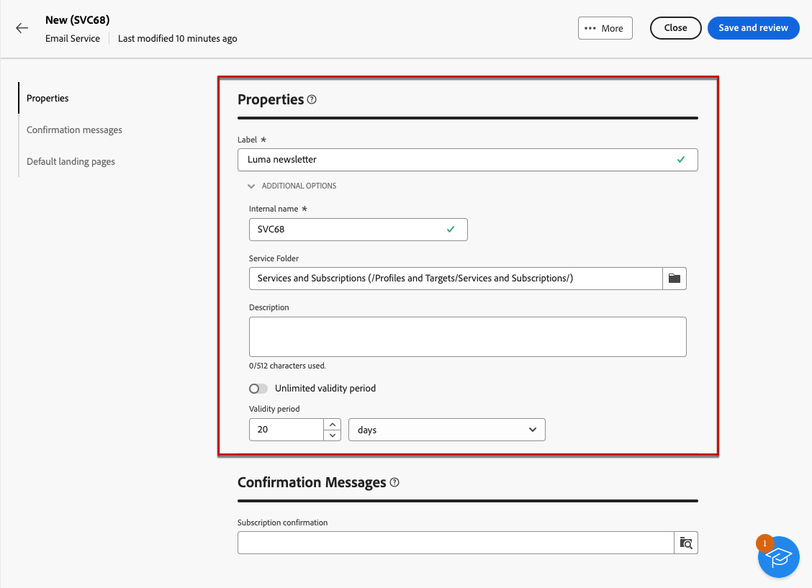

# Arbeta med prenumerationstjänster {#create-services}

>[!CONTEXTUALHELP]
>id="acw_subscriptions_list"
>title="Skapa och hantera tjänster"
>abstract="Använd Adobe Campaign för att skapa och övervaka tjänster som nyhetsbrev och för att kontrollera prenumerationer eller avbeställningar av dessa tjänster. Prenumerationer gäller endast för e-post och SMS-leverans."

Använd Adobe Campaign webben för att hantera och skapa t.ex. nyhetsbrev och för att kontrollera prenumerationer eller avbeställningar av dessa tjänster.

>[!NOTE]
>
>Prenumerationer gäller endast för e-post och SMS-leverans.

Flera tjänster kan definieras parallellt, till exempel: nyhetsbrev för specifika produktkategorier, teman eller områden på en webbplats, prenumerationer på olika typer av varningsmeddelanden och meddelanden i realtid.

Mer information om hur du hanterar prenumerationer och avbeställningar finns i [Kampanjdokumentation v8 (klientkonsol)](https://experienceleague.adobe.com/docs/campaign/campaign-v8/audience/subscriptions.html){target="_blank"}.

## Åtkomst till prenumerationstjänster {#access-services}

Följ stegen nedan för att få tillgång till prenumerationstjänster som är tillgängliga för din plattform.

1. Gå till **[!UICONTROL Subscription services]** menyn i den vänstra navigeringslisten.

   

1. Listan över alla befintliga prenumerationstjänster visas. Du kan söka efter tjänster och filtrera på kanalen, mappen eller använda avancerade filter.

   

1. Om du vill redigera en befintlig tjänst klickar du på dess namn.

1. Du kan ta bort eller duplicera en tjänst med hjälp av ikonen med tre punkter bredvid det här tjänstnamnet.<!--so all subscribers are unsuibscribed - need to mention?-->

## Skapa din första prenumerationstjänst {#create-service}

>[!CONTEXTUALHELP]
>id="acw_subscriptions_list_properties"
>title="Definiera dina serviceegenskaper"
>abstract="Ange prenumerationstjänstens etikett och definiera ytterligare alternativ, t.ex. en giltighetsperiod för tjänsten."

>[!CONTEXTUALHELP]
>id="acw_subscriptions_list_confirm"
>title="Välj ett bekräftelsemeddelande"
>abstract="När en användare prenumererar på eller avbeställer en tjänst kan du skicka ett bekräftelsemeddelande. Välj de mallar som ska användas för det meddelandet."

Följ stegen nedan för att skapa en prenumerationstjänst.

1. Markera knappen **[!UICONTROL Create subscription service]**.

   

1. Välj en kanal: **[!UICONTROL Email]** eller **[!UICONTROL SMS]**.

1. Ange en etikett och definiera ytterligare alternativ i tjänsteegenskaperna.

   

1. Som standard är prenumerationerna obegränsade. Du kan inaktivera **[!UICONTROL  Unlimited validity period]** för att definiera tjänstens giltighetsperiod.

   I exemplet nedan, efter 20 dagar:
   * Inga mottagare kommer att kunna prenumerera på tjänsten längre.
   * Alla prenumeranter på den här tjänsten kommer automatiskt att säga upp prenumerationen efter 20 dagar. [Läs mer](#automatic-unsubscription)

   

1. När en användare prenumererar på eller avbeställer en tjänst kan du skicka ett bekräftelsemeddelande. Välj de mallar som ska användas för det meddelandet utifrån ditt användningsfall. Dessa mallar måste konfigureras med **[!UICONTROL Subscriptions]** målmappning. [Läs mer](#create-confirmation-message)

   

1. Klicka på **[!UICONTROL Save and review]**. Den nya tjänsten läggs till i **[!UICONTROL Subscription services]** lista.

## Skapa ett bekräftelsemeddelande {#create-confirmation-message}

Om du vill skicka bekräftelsemeddelanden till de användare som prenumererar på eller avbeställer tjänsten måste du skapa en leveransmall med **[!UICONTROL Subscriptions]** målmappning, utan ett definierat mål. För att göra detta, följ nedanstående steg.

1. Skapa en leveransmall för prenumerationsbekräftelsen. [Lär dig mer](../msg/delivery-template.md)

1. Välj ingen målgrupp för den här leveransen. I stället kommer du åt **[!UICONTROL Delivery settings]**, går till [Målgrupp](../advanced-settings/delivery-settings.md#audience) och väljer **[!UICONTROL Subscriptions]** målmappning från listan.

   

   >[!NOTE]
   >
   >Om du inte markerar  **[!UICONTROL Subscriptions]** målmappning kommer dina prenumeranter inte att få något bekräftelsemeddelande. Målmappningar definieras i Campaign v8-konsolen. Läs mer om [Adobe Campaign v8-dokumentation](https://experienceleague.adobe.com/docs/campaign/campaign-v8/audience/add-profiles/target-mappings.html){target="_blank"}.

1. Redigera innehållet i leveransmallen, spara och stäng den.

   

   >[!NOTE]
   >
   >Läs mer om distributionskanaler och hur du definierar ett leveransinnehåll i [E-postkanal](../email/create-email.md) och [SMS-kanal](../sms/create-sms.md) -avsnitt.

1. Upprepa stegen ovan om du vill skapa en leveransmall för bekräftelsen av oprenumeration.

Nu kan du välja dessa meddelanden när [skapa en prenumerationstjänst](#create-service). Användare som prenumererar på eller avbeställer tjänsten får de valda bekräftelsemeddelandena.

## Lägg till prenumeranter till tjänsten {#add-subscribers}

När du har skapat en tjänst kan du lägga till prenumeranter manuellt. Följ stegen nedan.

1. Välj en befintlig tjänst från **[!UICONTROL Subscription services]** lista.

1. Välj **[!UICONTROL Subscribers]** och klicka **[!UICONTROL Add profiles]**.

   

1. Markera de profiler som du vill lägga till i listan och klicka på **[!UICONTROL Confirm]**.

   

1. Klicka på **[!UICONTROL Send]**.<!--if you click cancel, does it mean that no message is sent but recipients are still subscribed, or they are not subscribed? it's 2 different actions in the console)--> De valda mottagarna får prenumerationen [bekräftelsemeddelande](#create-confirmation-message) som du valde när [skapa tjänsten](#create-service).

   

De tillagda profilerna visas i **[!UICONTROL Subscribers]** lista. De prenumererar nu på din tjänst.

## Ta bort prenumeranter från tjänsten {#remove-subscribers}

### Avbeställ prenumerationer manuellt {#manual-unsubscription}

När du har lagt till prenumeranter i tjänsten kan du avbeställa dem manuellt. Följ stegen nedan.

1. Välj en befintlig tjänst från **[!UICONTROL Subscription services]** lista.

1. Klicka på ikonen med tre punkter bredvid det önskade mottagarnamnet och välj **[!UICONTROL Delete]**.

   

1. Bekräfta borttagning och klicka på **[!UICONTROL Send]**. Den valda mottagaren får en prenumeration [bekräftelsemeddelande](#create-confirmation-message) som du valde när [skapa tjänsten](#create-service).

   

Mottagaren tas bort från **[!UICONTROL Subscribers]** och prenumererar inte längre på din tjänst.

### Avbeställ automatiskt {#automatic-unsubscription}

En prenumerationstjänst kan ha en begränsad varaktighet. Mottagarna avbeställs automatiskt när giltighetsperioden går ut.

Den här perioden anges när [skapa tjänsten](#create-service). Från **[!UICONTROL Additional options]**, inaktivera **[!UICONTROL  Unlimited validity period]** och definiera en giltighetsperiod för tjänsten.

När den angivna tidsperioden har gått ut upphör alla prenumeranter automatiskt att prenumerera på tjänsten.

## Loggar och rapporter för prenumerationstjänster {#logs-and-reports}

För att mäta hur effektiva era prenumerationstjänster är för SMS- och e-postkanaler har du tillgång till loggarna och rapporterna för en viss tjänst.

1. Välj en befintlig tjänst från **[!UICONTROL Subscription services]** lista. Klicka **[!UICONTROL Calculate]** hämta det totala antalet prenumeranter.

   

1. På tjänstkontrollpanelen väljer du **[!UICONTROL Logs]** om du vill visa en lista över prenumeranter på tjänsten. Du kan kontrollera det totala antalet prenumeranter, namn och adress för varje mottagare och när de prenumererade eller avbröt prenumerationen. Du kan också filtrera på dem.

   

1. På tjänstkontrollpanelen väljer du **[!UICONTROL Reports]**. Kontrollera följande indikatorer:

   * The **[!UICONTROL Total numbers of subscribers]** visas.

   * Du kan visa antalet prenumerationer och avbeställningar under en viss period. Använd listrutan för att ändra tidsintervallet.

     

   * The **[!UICONTROL Overall evolution of subscriptions]** I diagrammet visas fördelningen per period, inklusive prenumerationer, icke-prenumerationer, utvecklingen i antal och lojalitetsprocenten.<!--what is Registered?-->

1. Använd **[!UICONTROL Reload]** för att hämta de senaste värdena från körningen och schemat för spårningsarbetsflödet.

## Leverera till abonnenterna av en tjänst

En gång [skapade en prenumerationstjänst](#create-service)kan ni inrikta er på att nå era prenumeranter i en leverans. Följ stegen nedan.

1. [Skapa en målgrupp](../audience/create-audience.md) inklusive prenumeranterna på den tjänst du har skapat:

   * I **[!UICONTROL Build audience]** aktivitet, visa avancerade attribut och markera **[!UICONTROL Recipient]** > **[!UICONTROL Subscriptions]** > **[!UICONTROL Service]**.

   * I det här exemplet väljer du de användare som prenumererar på tjänsten som har **Luma Newsletter** etikett.

   

1. [Skapa en leverans](../msg/gs-messages.md) och välj den målgrupp du skapade ovan.

   

1. Redigera meddelandeinnehållet efter behov och skicka leveransen.

   

Leveransen skickas endast till prenumeranterna av tjänsten.

