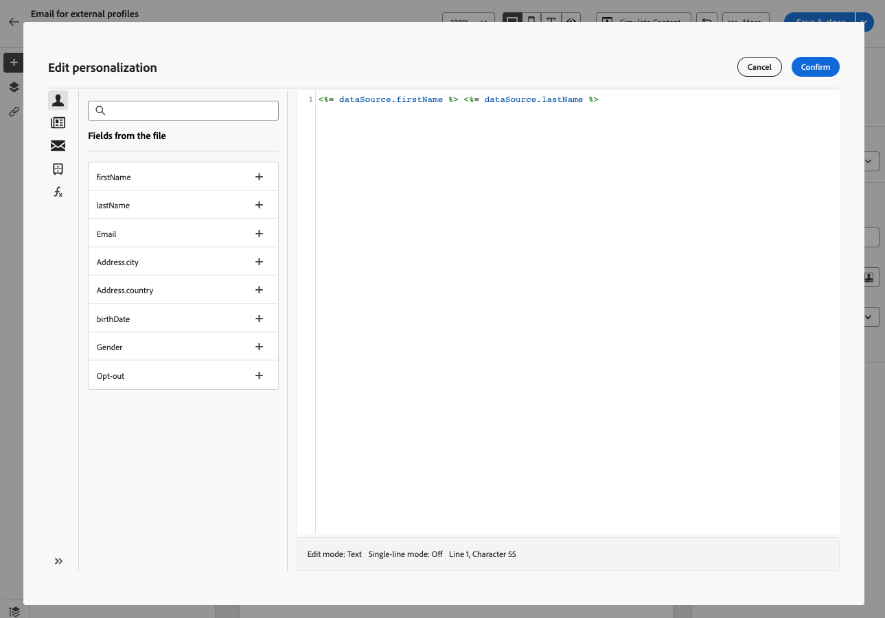

# Läsa in en e-postmålgrupp från en fil {#audience-from-file}

>[!CONTEXTUALHELP]
>id="acw_audience_fromfile_select"
>title="Välj fil"
>abstract="Välj den lokala fil som ska överföras. Format som stöds är TXT och CSV. Justera filformatet med exempelfilen som är länkad nedan."

>[!CONTEXTUALHELP]
>id="acw_audience_fromfile_columns"
>title="Kolumndefinition"
>abstract="Kontrollera formatet för de kolumner som ska infogas från den lokala filen."

>[!CONTEXTUALHELP]
>id="acw_audience_fromfile_formatting"
>title="Formateringsparametrar"
>abstract="Kontrollera formateringsparametrarna för filen."


>[!CONTEXTUALHELP]
>id="acw_audience_fromfile_preview"
>title="Förhandsgranska filen"
>abstract="Kontrollera förhandsgranskningen av filen. Den här skärmen visar endast upp till 30 poster."


Du kan inte överföra profiler direkt till Campaign från gränssnittet, men du kan ange målprofiler som lagras i en extern fil. Profiler läggs inte till i databasen, men alla fält i indatafilen är tillgängliga för [personalisering](../personalization/gs-personalization.md). Filformat som stöds är: text (TXT) och kommaavgränsade värden (CSV).

>[!CAUTION]
>
>* Den här funktionen är bara tillgänglig för **fristående e-postleveranser**. Det kan inte användas i arbetsflöden, eller med SMS- eller push-leveranser.
>
>* Du kan inte använda [kontrollgrupper](control-group.md) när målpopulationen läses in från en extern fil.
>
>* Profiler läggs inte till i databasen och är bara inlästa och tillgängliga för den här specifika fristående e-postleveransen.

## Välj och konfigurera filen {#upload}

Följ de här stegen för att ange profiler från en lokal fil direkt från e-postgränssnittet:

1. Öppna en befintlig e-postleverans, eller [skapa en ny e-postleverans](../email/create-email.md).
1. Fönstret för att skapa e-postleverans visas på **Målgrupp** klickar du på **Välj målgrupp** och väljer **Välj från fil** alternativ.

   

1. Markera den lokala fil som ska användas. Formatet måste justeras mot [exempelfil](#sample-file).
1. Förhandsgranska och kontrollera hur data mappas i skärmens centrala del.
1. Välj den kolumn som innehåller e-postadressen i dialogrutan **Adressfält** nedrullningsbar meny. Du kan också markera blockeringslista-kolumnen om du har sådan information i indatafilen.
1. Justera kolumninställningarna och formatera data från de tillgängliga alternativen.
1. Klicka **Bekräfta** när inställningarna är korrekta.

När du skapar och anpassar meddelandeinnehållet kan du välja fält från indatafilen i [Personaliseringsredigerare](../personalization/gs-personalization.md).



## Exempelfil {#sample-file}

>[!CONTEXTUALHELP]
>id="acw_audience_fromfile_samplefile"
>title="Läsa in en målgrupp från en fil"
>abstract="Filformat som stöds är TXT och CSV. Använd den första raden som kolumnrubrik. Justera filformatet med exempelfilen som finns på länken nedan."

Format som stöds är TXT och CSV. Den första raden är kolumnrubriken.

Justera filformatet med exempelfilen nedan:

```javascript
{
lastname,firstname,city,birthdate,email,denylist
Smith,Hayden,Paris,23/05/1985,hayden.smith@example.com,0
Mars,Daniel,London,17/11/1999,danny.mars@example.com,0
Smith,Clara,Roma,08/02/1979,clara.smith@example.com,0
Durance,Allison,San Francisco,15/12/2000,allison.durance@example.com,1
}
```

## Förhandsgranska och testa e-postmeddelandet {#test}

Med Campaign Web kan ni förhandsgranska och skicka testmeddelanden när ni använder en målgrupp som överförts från en fil. Följ dessa steg för att göra detta:

1. Klicka på **[!UICONTROL Simulate content button]** på skärmen där du redigerar leveransinnehåll och klickar på **[!UICONTROL Add test profile(s)]** -knappen.

1. Profilerna som finns i den överförda filen visas. Markera den eller de profiler som du vill använda för att förhandsgranska innehållet och klicka på **[!UICONTROL Select]**.

1. En förhandsgranskning av leveransinnehållet visas i den högra rutan på skärmen. Personaliserade element ersätts med data från den profil som valts i den vänstra rutan. [Läs mer om förhandsgranskning av leveransinnehåll](../preview-test/preview-content.md)

   

1. Klicka på knappen **[!UICONTROL Test]** -knappen.

1. Klicka på **[!UICONTROL Upload proof profiles]** och markera den TXT- eller CSV-fil som innehåller korrekturmottagarna.

   >[!CAUTION]
   >
   >Se till att filformatet matchar det som används för att överföra målgruppen. Alla formatfel visar en varning.

1. När korrekturmottagarna har lagts till och du är redo att skicka korrekturet klickar du på **[!UICONTROL Send test email]** och bekräfta sändningen.

   

1. Du kan när som helst övervaka sändningen av testmeddelandet med knappen Visa testets e-postlogg. [Läs mer om övervakning av testmeddelanden](../preview-test/test-deliveries.md#access-sent-test-deliveries-access-proofs)
