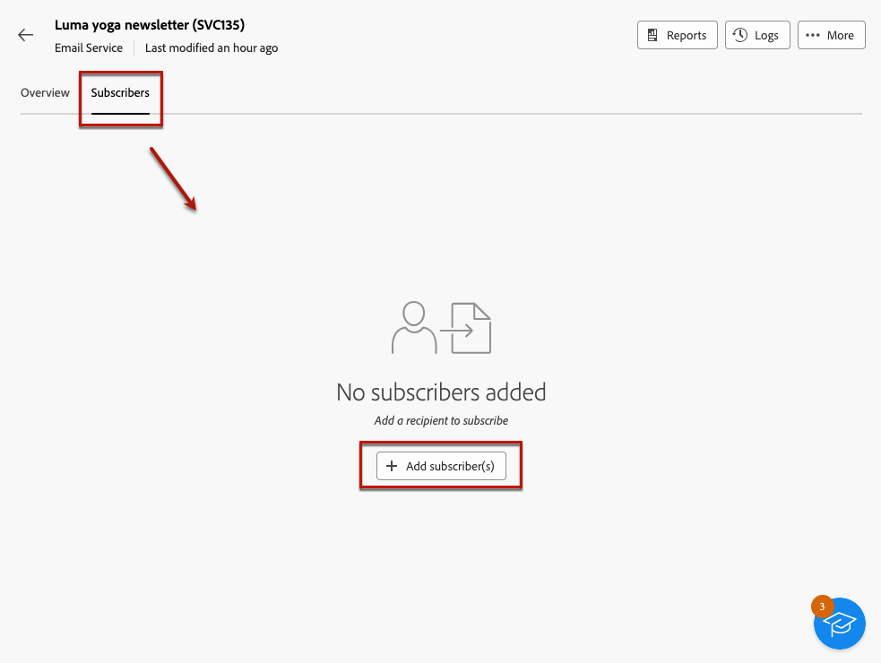

# Hantera prenumeranter på en tjänst {#manage-subscribers}

En gång [skapade en tjänst](manage-services.md#create-service)kan du lägga till prenumeranter, avbeställa prenumerationer och leverera till prenumeranterna av tjänsten.

## Lägg till prenumeranter till tjänsten {#add-subscribers}

Följ stegen nedan om du vill lägga till prenumeranter manuellt.

1. Välj en befintlig tjänst från **[!UICONTROL Subscription services]** lista.

1. Välj **[!UICONTROL Subscribers]** och klicka **[!UICONTROL Add profiles]**.

   

1. Markera de profiler som du vill lägga till i listan och klicka på **[!UICONTROL Confirm]**.

   

1. Klicka på **[!UICONTROL Send]**.<!--if you click cancel, does it mean that no message is sent but recipients are still subscribed, or they are not subscribed? it's 2 different actions in the console)--> De valda mottagarna får prenumerationen [bekräftelsemeddelande](manage-services.md#create-confirmation-message) som du valde när [skapa tjänsten](manage-services.md#create-service).

   

De tillagda profilerna visas i **[!UICONTROL Subscribers]** lista. De prenumererar nu på din tjänst.

## Ta bort prenumeranter från tjänsten {#remove-subscribers}

### Avbeställ prenumerationer manuellt {#manual-unsubscription}

En gång [tillagda prenumeranter](#add-subscribers) till tjänsten kan du avbeställa prenumerationen manuellt. Följ stegen nedan.

1. Välj en befintlig tjänst från **[!UICONTROL Subscription services]** lista.

1. Klicka på ikonen med tre punkter bredvid det önskade mottagarnamnet och välj **[!UICONTROL Delete]**.

   

1. Bekräfta borttagning och klicka på **[!UICONTROL Send]**. Den valda mottagaren får en prenumeration [bekräftelsemeddelande](manage-services.md#create-confirmation-message) som du valde när [skapa tjänsten](manage-services.md#create-service).

   

Mottagaren tas bort från **[!UICONTROL Subscribers]** och prenumererar inte längre på din tjänst.

### Avbeställ automatiskt {#automatic-unsubscription}

En prenumerationstjänst kan ha en begränsad varaktighet. Mottagarna avbeställs automatiskt när giltighetsperioden går ut.

Den här perioden anges när [skapa tjänsten](manage-services.md#create-service). Från **[!UICONTROL Additional options]**, inaktivera **[!UICONTROL  Unlimited validity period]** och definiera en giltighetsperiod för tjänsten.

När den angivna tidsperioden har gått ut upphör alla prenumeranter automatiskt att prenumerera på tjänsten.

## Leverera till abonnenterna av en tjänst

En gång [skapade en prenumerationstjänst](manage-services.md#create-service)kan ni inrikta er på att nå era prenumeranter i en leverans. Följ stegen nedan.

1. [Skapa en målgrupp](../audience/create-audience.md) inklusive prenumeranterna på den tjänst du har skapat:

   * I **[!UICONTROL Build audience]** aktivitet, visa avancerade attribut och markera **[!UICONTROL Recipient]** > **[!UICONTROL Subscriptions]** > **[!UICONTROL Service]**.

   * I det här exemplet väljer du de användare som prenumererar på tjänsten som har **Luma Newsletter** etikett.

   

1. [Skapa en leverans](../msg/gs-messages.md#create-delivery) och välj den målgrupp du skapade ovan.

   

1. Redigera meddelandeinnehållet efter behov och skicka leveransen.

   

Leveransen skickas endast till prenumeranterna av tjänsten.
