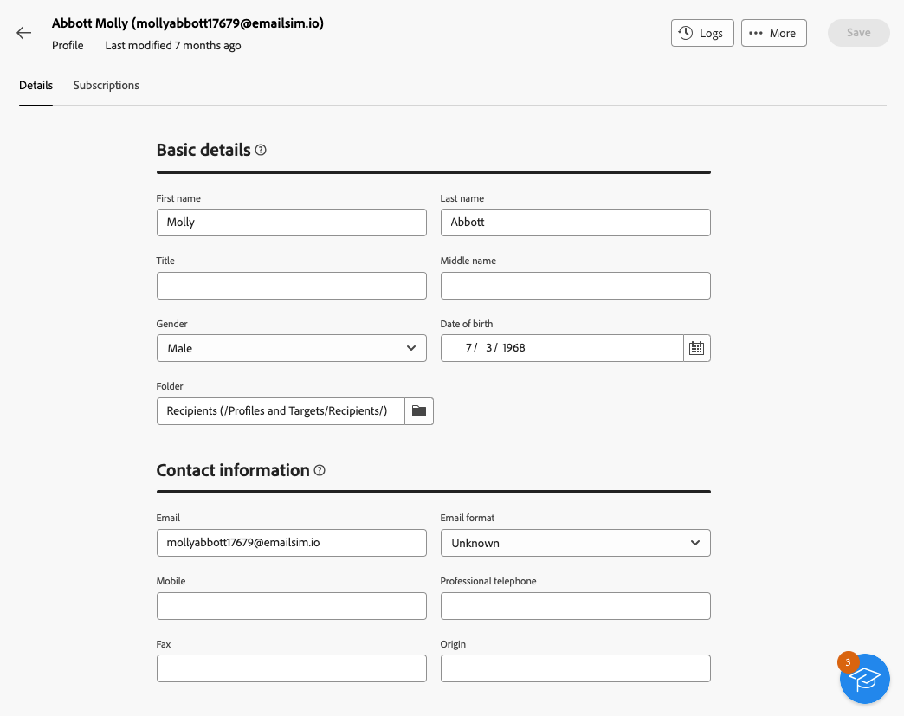

# Utforska profilinformation {#profile-view}

>[!CONTEXTUALHELP]
>id="acw_recipients_subscription_list"
>title="Prenumerationslista"
>abstract="På den här fliken visas alla tjänster som profilen prenumererar på."

Bläddra till **[!UICONTROL Customer management]** > **[!UICONTROL Profiles]** och klicka sedan på den profil du vill komma åt för att få tillgång till information om en profil.

Information om profilen är ordnad enligt följande:

* På fliken **[!UICONTROL Details]** kan du bläddra igenom profilens inbyggda och anpassade attribut. Om du vill redigera ett attribut gör du ändringar i det önskade fältet och klickar på knappen **[!UICONTROL Save]**. Detaljerad information om profilattribut finns i avsnittet [Skapa en profil](create-profile.md).

  {zoomable="yes"}

* Fliken **[!UICONTROL Subscriptions]** ger dig insikt i vilka tjänster profilen prenumererar på. [Läs mer om prenumerationstjänster](manage-services.md)

  {zoomable="yes"}

* Dessutom kan du med knappen **[!UICONTROL Logs]** i skärmens övre högra hörn visa historiken för profilens interaktioner via loggar för sändning, uteslutning och spårning. [Läs mer om leveransloggar](../monitor/delivery-logs.md)

  Från de här loggarna kan du även granska erbjudanden som presenteras för den valda profilen på fliken **[!UICONTROL Propositions]**. [Läs mer om erbjudanden](../msg/offers.md)

  {zoomable="yes"}
