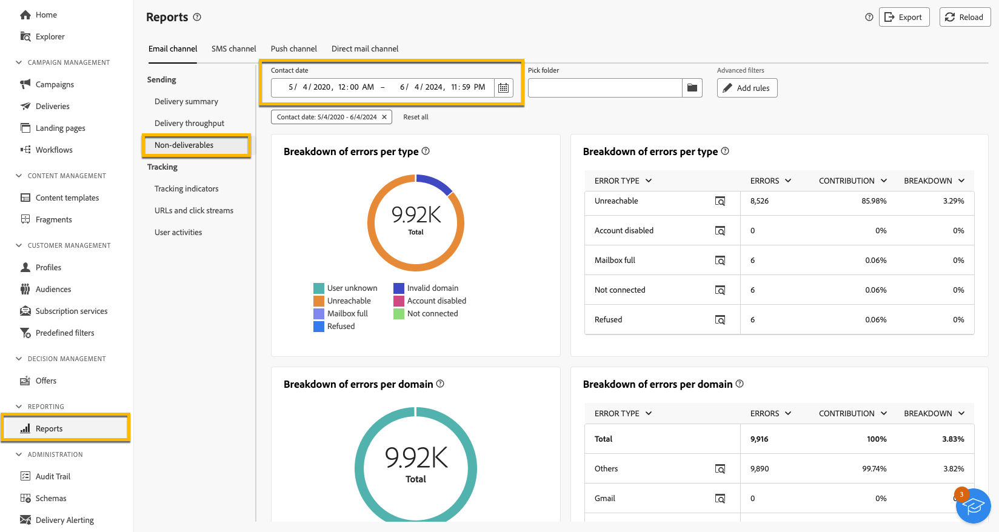

# Karantänhantering {#quarantines}

Adobe Campaign hanterar karantänadresser för e-post-, push- och SMS-kanaler.

Karantänen gäller bara för en **e-postadress**, ett **telefonnummer** eller en **enhetstoken**, men inte för själva profilen. En profil vars e-postadress är placerad i karantän kan till exempel uppdatera sin profil och ange en ny adress. Därefter kan den användas av leveransåtgärder igen. Om två profiler råkar ha samma telefonnummer, påverkas båda om numret sätts i karantän.

>[!CAUTION]
>
>Karantän i Adobe Campaign är skiftlägeskänsligt.

## Vad är karantän? {#quarantines-what}

Karantän är ett sätt att **hantera ogiltiga adresser i leveranser**.

Om en leverans har en hög frekvens av ogiltiga adresser kan den betraktas som skräppost. Genom att hantera adresserna i karantän kan du undvika att bli blocklist av internetleverantörer. Det här är viktigt för ditt rykte.

När en adress sätts i karantän i Adobe Campaign utesluts profilen automatiskt från målet under leveransanalysen.

Karantänen hjälper dig att minska SMS-sändningskostnaderna genom att utesluta felaktiga telefonnummer från leveranser.

Läs mer om karantäner i dokumentationen för [Campaign v8 (konsol)](https://experienceleague.adobe.com/en/docs/campaign/campaign-v8/send/failures/quarantines){target="_blank"}.

## Varför en adress skickas till karantän {#quarantines-why}

Det kan finnas många orsaker till att en adress skickas till karantän:

* Felaktiga telefonnummer för SMS
* För SMS, när profilen svarar på ett SMS-meddelande med ett nyckelord som &quot;STOP&quot;
* För e-post, när ditt meddelande rapporteras som skräppost. Meddelandet dirigeras automatiskt om till en teknisk brevlåda som hanteras av Adobe. Användarens e-postadress skickas sedan automatiskt till karantän med Blocklist status.
* En e-postadress kan sättas i karantän, till exempel när postlådan är full, om adressen inte finns eller om e-postservern inte är tillgänglig.

Läs mer om leveransfel i dokumentationen för [Campaign v8 (konsol)](https://experienceleague.adobe.com/en/docs/campaign/campaign-v8/send/failures/delivery-failures){target="_blank"}.

## Var hittar du karantänadresserna? {#quarantines-where}

Du kan visa alla karantänadresser för din instans i **[!UICONTROL Explorer]** > **[!UICONTROL Administration]** > **[!UICONTROL Campaign Management]** > **[!UICONTROL Non deliverables Management]** > **[!UICONTROL Non deliverables and addresses]**. I det här avsnittet listas element i karantän för e-post-, SMS- och push-meddelandekanaler.

{zoomable="yes"}

Du kan också få rapporten om karantänen i din instans:

{zoomable="yes"}

För varje leverans kan du även kontrollera leveranssammanfattningen: den visar antalet adresser i karantän i leveransmålet:

{zoomable="yes"}

Du kan ha fler möjligheter att hantera karantänadresserna i Adobe Campaign Console. [Läs mer](https://experienceleague.adobe.com/en/docs/campaign/campaign-v8/send/failures/quarantines#access-quarantined-addresses)
