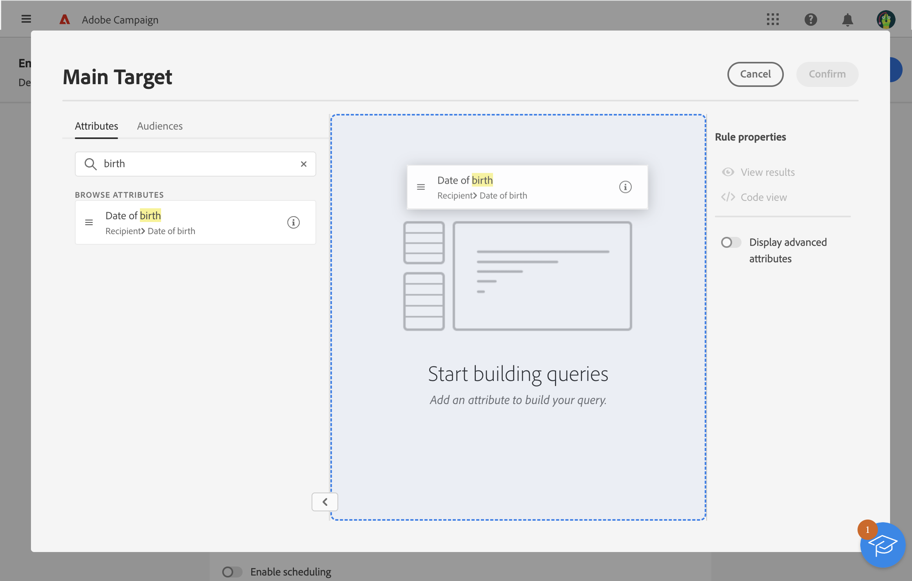

# Arbeta med regelbyggaren {#segment-builder}

Med regelbyggaren kan du definiera målgruppen för leveransen genom att filtrera data i databasen. Använd det för att skapa en målgrupp antingen från ett arbetsflöde med en **[!UICONTROL Build audience]**-aktivitet eller direkt när du skapar en leverans för att skapa en engångspublik.

* [Lär dig hur du skapar och sparar en publik](create-audience.md)
* [Lär dig skapa en engångspublik för en leverans](one-time-audience.md)

## Paletten

Paletten, som finns till vänster, innehåller alla element som du kan filtrera på för att skapa en målgrupp. Använd sökfältet för att snabbt hitta element. Flytta panelerna på paletten till arbetsytan för att konfigurera dem och ta hänsyn till dem.

{zoomable="yes"}{width="70%" align="left"}

Paletten är uppdelad i två flikar:

* **Attribut**: Den här fliken ger åtkomst till alla tillgängliga fält från schemat. Fältlistan beror på målschemat som definierats i e-postmallen.

* **Publiker**: På den här fliken kan du filtrera med en av de befintliga målgrupperna som definieras i Campaign Classic-konsolen eller från Adobe Experience Platform. Lär dig hur du övervakar och hanterar målgrupper i [det här avsnittet](manage-audience.md).

  >[!NOTE]
  >
  >Om du vill använda Adobe Experience Platform målgrupper konfigurerar du integreringen med Destinations. Mer information finns i [Adobe Experience Platform Destinations-dokumentationen](https://experienceleague.adobe.com/docs/experience-platform/destinations/home.htmll?lang=sv){target="_blank"}.

## Arbetsytan

Arbetsytan är den centrala zonen där du kan konfigurera och kombinera regler baserat på de element som läggs till från paletten. Om du vill lägga till en ny regel drar du en ruta från paletten och släpper den på arbetsytan. Sammanhangsspecifika alternativ visas baserat på vilken typ av data som läggs till.

{zoomable="yes"}{width="70%" align="left"}

## Rutan Regelegenskaper

På höger sida kan du utföra de åtgärder som listas nedan i rutan **Regelegenskaper**.

{zoomable="yes"}{width="70%" align="left"}

* **Visa resultat:** Visar listan över profiler som målgruppen har.
* **Kodvyn**: Visar en kodbaserad version av målgruppen i SQL.
* **Visa avancerade attribut**: Markera det här alternativet om du vill visa den fullständiga listan över attribut på den vänstra paletten, inklusive noder, grupperingar, 1-1-länkar och 1-N-länkar.
* **Beräkna**: Uppdaterar och visar antalet profiler som din fråga har som mål.
* **Välj eller spara filter**: Använd ett fördefinierat filter för att filtrera frågan eller spara frågan som ett nytt filter för framtida bruk. [Lär dig arbeta med fördefinierade filter](../get-started/predefined-filters.md).

  >[!IMPORTANT]
  >
  >I den här versionen av produkten är vissa fördefinierade filter inte tillgängliga i användargränssnittet. Du kan fortfarande använda dem. [Läs mer](../get-started/guardrails.md#predefined-filters-filters-guardrails-limitations).

* **Attribut**: Visar en beskrivning av den målgrupp som skapats.

## Exempel

I det här exemplet är en målgrupp byggd för att inrikta sig på alla kunder som bor i Atlanta eller Seattle och som är födda efter 1980.

1. Sök efter fältet **Födelsedatum** på fliken **Attribut** på paletten. Dra rutan och släpp den på arbetsytan.

   {zoomable="yes"}

1. Välj operatorn **Efter** på arbetsytan och ange önskat datum.

   {zoomable="yes"}

1. På paletten söker du efter fältet **Ort** och lägger till det på arbetsytan nedanför den första regeln.

   {zoomable="yes"}

1. Ange namnet på den första orten i textfältet och tryck sedan på Retur.

   {zoomable="yes"}

1. Upprepa den här åtgärden för namnet på den andra staden.

   {zoomable="yes"}

1. Klicka på **Visa resultat** för att visa listan och antalet mottagare som matchar frågan. Lägg till kolumner för att visualisera och kontrollera data. I det här exemplet lägger du till kolumnen **City** för att visa Atlanta och Seattle.

   {zoomable="yes"}

1. Klicka på **Bekräfta**.