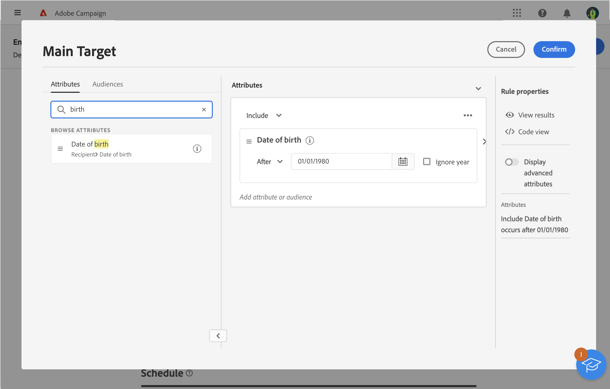

# Definiera en målgrupp med regelbyggaren {#segment-builder}

I det här avsnittet beskrivs hur du skapar en målgrupp när du utformar ett nytt e-postmeddelande. Den skapade målgruppen kan bara användas i det här e-postmeddelandet.

Med regelbyggaren kan du definiera den målgrupp som meddelandet riktar sig till genom att filtrera data i databasen. Om du vill välja en befintlig målgrupp kan du läsa detta [section](add-audience.md).

Mer information om regelverktyget finns i [Dokumentation för segmenteringstjänst](https://experienceleague.adobe.com/docs/experience-platform/segmentation/ui/segment-builder.html).

Så här skapar du en ny publik när du utformar ett e-postmeddelande:

1. Från **Målgrupp** i leveransguiden klickar du på **[!UICONTROL Select audience]** -knappen.

   

1. Välj **Skapa en egen**. Regelverktyget visas.

   

## Paletten

Paletten, som finns till vänster, innehåller alla element som du kan filtrera på för att skapa en målgrupp. Platserna i paletten måste flyttas till arbetsytan i mitten för att kunna konfigureras och beaktas. Paletten är uppdelad i två flikar:

* **Attribut**: På den här fliken kan du komma åt alla tillgängliga fält från schemat. Fältlistan beror på målschemat som definierats i e-postmallen.

   {width="70%" align="left"}

* **Målgrupper**: På den här fliken kan du filtrera med en av de befintliga målgrupperna som definieras i Campaign Classic-konsolen eller från Adobe Experience Platform.

   {width="70%" align="left"}

   >[!NOTE]
   >
   >Om du vill utnyttja Adobe Experience Platform målgrupper måste du konfigurera integreringen med Destinations. Se [Destinationsdokumentation](https://experienceleague.adobe.com/docs/experience-platform/destinations/home.htmll?lang=sv){target="_blank"}.

Du kan använda sökfältet för att snabbt hitta element.

## Arbetsytan

Arbetsytan är den centrala zon där du kan konfigurera och kombinera regler baserat på de element som läggs till från paletten. Om du vill lägga till en ny regel drar du en ruta från paletten och släpper den på arbetsytan. Därefter visas sammanhangsspecifika alternativ beroende på vilken typ av data som läggs till.

{width="70%" align="left"}

## Rutan Regelegenskaper

Till höger **Regelegenskaper** kan du utföra följande åtgärder:

{width="70%" align="left"}

* **Visa resultat:** visar en lista över mottagare som målgruppen har.
* **kodvyn**: visar en kodbaserad version av målgruppen i SQL.
* **Visa avancerade attribut**: Markera det här alternativet om du vill visa hela listan med attribut på den vänstra paletten: noder, grupperingar, 1-1 länkar, 1-N länkar.
* **Attribut**: visar en beskrivning av den skapade målgruppen.

## Exempel

I det här exemplet kommer vi att bygga upp en målgrupp för alla kunder som bor i Atlanta eller Seattle och som är födda efter 1980.

1. I **Attribut** palettens flik, sök efter **Födelsedatum** fält. Dra rutan och släpp den på arbetsytan.

   

1. Välj **Efter** och ange önskat datum.

   

1. På paletten söker du efter **Ort** och lägg till det på arbetsytan under den första regeln.

   

1. Ange namnet på den första orten i textfältet och tryck sedan på Retur.

   

1. Upprepa den här åtgärden för namnet på den andra staden.

   

1. Klicka **Visa resultat** för att visa listan och antalet mottagare som matchar frågan. Du kan också lägga till kolumner för att visa och kontrollera data. I vårt exempel lägger du till **Ort** och ska se Atlanta och Seattle.

   

1. Klicka **Bekräfta**.

Din målgrupp är definierad och klar att användas i ditt e-postmeddelande.