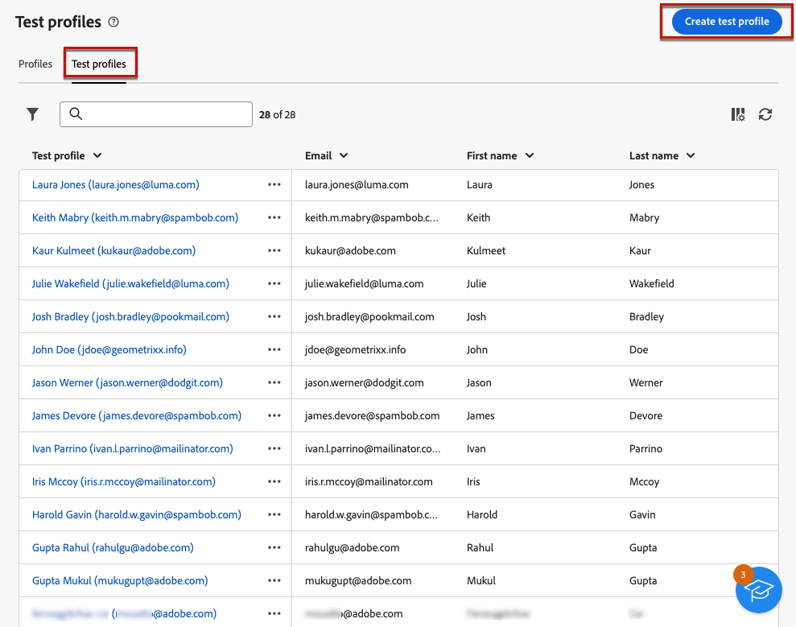

# Skapa och hantera testprofiler {#create-test-profiles}

>[!CONTEXTUALHELP]
>id="acw_recipients_testprofiles_menu"
>title="Skapa testprofiler"
>abstract="Testprofiler är ytterligare mottagare som gör att du kan förhandsgranska och testa personaliseringen och återgivningen innan du skickar meddelanden. Du kan välja en testprofil när du förhandsgranskar ett meddelandeinnehåll och skicka korrektur till testprofilerna för att kontrollera och validera meddelandets innehåll och inställningar."

Testprofiler används för att skicka korrektur och validera meddelandeinnehåll och inställningar. Dessa profiler är ytterligare mottagare som gör att du kan förhandsgranska och testa personaliseringen och återgivningen innan du skickar meddelanden. Du kan välja en testprofil när du förhandsgranskar ett meddelandeinnehåll och skicka korrektur till testprofilerna för att kontrollera och validera meddelandets innehåll och inställningar.

➡️ [Upptäck den här funktionen i videon](#video)

<!--Learn more about test profiles in the [Campaign v8 (client console) documentation](https://experienceleague.adobe.com/docs/campaign/campaign-v8/audience/add-profiles/test-profiles.html){target="_blank"}.-->

Stegen för att skicka korrektur till testprofiler beskrivs i [det här avsnittet](../preview-test/test-deliveries.md#test-profiles).

>[!NOTE]
>
>* Testprofiler skapas som dirigerade adresser i klientkonsolen.
>
>* Testprofiler exkluderas automatiskt från rapporter om följande leveransstatistik: **[!UICONTROL Clicks]**, **[!UICONTROL Opens]**, **[!UICONTROL Unsubscriptions]**.

## Få åtkomst till och hantera testprofiler {#access-test-profiles}

Om du vill komma åt testprofillistan väljer du **[!UICONTROL Customer management]** > **[!UICONTROL Profiles]** på den vänstra menyn och klickar på fliken **[!UICONTROL Test profiles]**.

{zoomable="yes"}

* Du kan filtrera på en viss [mapp](../get-started/permissions.md#folders) med listrutan eller lägga till regler med [frågemodelleraren](../query/query-modeler-overview.md).

  {zoomable="yes"}

* Du kan duplicera valfri testprofil och uppdatera den efter behov. Stegen för att redigera en testprofil är desamma som när [du skapar en testprofil](#create-test-profile).

* Om du vill ta bort en testprofil väljer du motsvarande alternativ på menyn **[!UICONTROL More actions]**.

  {zoomable="yes"}

* Om du vill redigera en testprofil klickar du på önskat objekt i listan. Stegen för att redigera en testprofil är desamma som när [du skapar en testprofil](#create-test-profile).

Du kan även komma åt testprofiler via vyn **[!UICONTROL Explorer]** från noden **[!UICONTROL Resources]** > **[!UICONTROL Campaign Management]** > **[!UICONTROL Seed addresses]** .

Därifrån kan du bläddra bland, skapa och hantera mappar och undermappar samt kontrollera tillhörande behörigheter. [Lär dig skapa mappar](../get-started/permissions.md#folders)

{zoomable="yes"}

I vyn **[!UICONTROL Explorer]** kan du även filtrera, ta bort, redigera och [skapa](#create-test-profile) testprofiler.

## Skapa en testprofil {#create-test-profile}

>[!CONTEXTUALHELP]
>id="acw_recipients_testprofiles_additionaldata"
>title="Testa profiler Ytterligare data"
>abstract="Ange de personaliseringsdata som används för leveranser som skapas i arbetsflödena för datahantering och som du vill tilldela ett specifikt värde till."

Så här skapar du en testprofil:

1. Bläddra till **[!UICONTROL Customer management]** > **[!UICONTROL Profiles]** och välj fliken **[!UICONTROL Test profiles]**.

1. Klicka på knappen **[!UICONTROL Create test profile]**.

   {zoomable="yes"}

1. Fyll i informationen om testprofilen efter behov. <!--Most of the fields are the same as when creating profiles. [Learn more]-->

   {zoomable="yes"}

   >[!NOTE]
   >
   >Fältet **[!UICONTROL Label]** fylls automatiskt i med det förnamn och efternamn som du definierade.

1. Som standard lagras testprofiler i mappen **[!UICONTROL Seed addresses]**. Du kan ändra den genom att bläddra till önskad plats. [Lär dig arbeta med mappar](../get-started/permissions.md#folders)

   <!--{zoomable="yes"}-->

<!--
You do not need to enter all fields of each tab when creating a seed address. Missing personalization elements are entered randomly during delivery analysis. (Not valid?)
-->

1. I avsnittet **[!UICONTROL Contact information]** anger du e-postadressen och andra relevanta data. E-postadressen visas inom hakparenteser efter testprofilens etikett.

   {zoomable="yes"}

1. Om du markerar kryssrutan **[!UICONTROL No longer contact (by any channel)]** visas testprofilen i blockeringslista. Den här mottagaren är inte längre riktad mot någon kanal (e-post, SMS etc.).

1. På fliken **[!UICONTROL Additional data]** anger du de personaliseringsdata som används för leveranser som har skapats i arbetsflödena för datahantering och som du vill tilldela ett specifikt värde till. [Läs mer om arbetsflöden](../workflows/gs-workflows.md)

   {zoomable="yes"}

   Kontrollera att ytterligare måldata har definierats med ett alias som börjar med @ i arbetsflödesaktiviteten **[!UICONTROL Enrichment]**. Annars kan du inte använda den korrekt med dina dirigerade adresser i leveransaktiviteten. [Läs mer om anrikningsaktiviteten](../workflows/activities/enrichment.md)

1. Klicka på knappen **[!UICONTROL Save]**.

Testprofilen som du nyss skapade kan nu användas för att skicka ett korrektur. [Läs mer](../preview-test/test-deliveries.md#test-profiles)

<!--Use test profiles in Direct mail? cf v7/v8-->

## Instruktionsvideo {#video}

Lär dig hur du skapar och hanterar testprofiler med webbgränssnittet i Campaign.

>[!VIDEO](https://video.tv.adobe.com/v/3442844?quality=12)