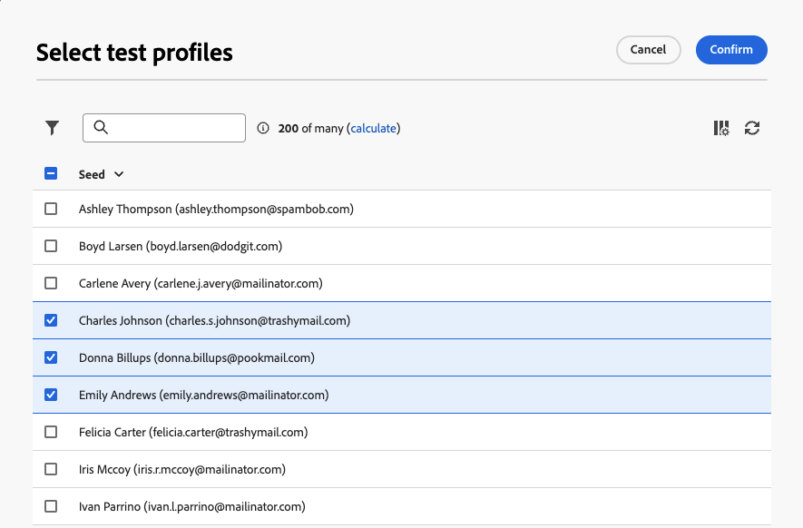

# Använda en svällningsgrupp {#trap-group}

En **[!UICONTROL trap group]** (kallas även **[!UICONTROL Seed list]**) används för att inkludera specifika adresser i leveranser för att övervaka och verifiera distributionsprocessen genom att rikta profiler som inte matchar de definierade målvillkoren. På så sätt kan mottagare som ligger utanför leveransomfånget ta emot leveransen, precis som andra målmottagare gör.

En **[!UICONTROL trap group]** är en grupp av **[!UICONTROL seed addresses]** med namnet **[!UICONTROL Test profile]** i webbgränssnittet för Campaign.

## Varför använda en svällningsgrupp {#why-trap-group}

Du kan använda **[!UICONTROL trap group]**:

1. **Som ett bevis**: alla medlemmar i **[!UICONTROL Trap group]** får leveransen som om de vore en del av målgruppen.

1. **För att skydda din e-postlista**: genom att ta emot det som mottagarna får, kommer varje **[!UICONTROL test profile]** i **[!UICONTROL Trap group]** att uppmärksammas om e-postlistan används av en tredje part.

>[!NOTE]
>
>Förutom att [skicka korrektur när leveransen ](../email/create-email.md#preview-test) skapas och från [kontrollgruppen](control-group.md) är det bra att lägga till en svällningsgrupp för att testa målgruppen.

## Om svällningsgrupper {#about-trap-group}

Testprofiler exkluderas automatiskt från rapporter om följande leveransstatistik: **Klicka**, **Öppnar**, **Avbeställ**. Rapporterna handlar bara om den verkliga publiken.

För en e-postleverans behövs bara e-postadressen för **[!UICONTROL Trap group]**. Anpassningen av andra fält fylls i slumpmässigt av Campaign.

## Lägg till en svällningsgrupp i en leverans {#trap-group-in-delivery}

Om du vill konfigurera **[!UICONTROL Trap group]** går du till **[!UICONTROL Audience]**-inställningarna för leveransen. Du har två alternativ:

* [Välj testprofiler](#select-test-profile)
* [Skapa villkor](#create-condition)

{zoomable="yes"}

### Välj testprofiler {#select-test-profiles}

När du väljer **Välj testprofiler** kan du använda knappen **Lägg till testprofiler** enligt nedan:

{zoomable="yes"}

När du klickar på knappen har du tillgång till de testprofiler du kan lägga till **[!UICONTROL trap group]**. Markera de som du vill använda.

Du kan också skapa nya testprofiler. [Läs mer](#create-seed)

{zoomable="yes"}

När du bekräftar testprofilerna kontrollerar du att du har rätt nummer under **[!UICONTROL Trap group]**.

{zoomable="yes"}

### Skapa villkor {#create-condition}

Med alternativet **[!UICONTROL Create condition]** kan du skapa en fråga för att definiera de testprofiler som du vill använda:

{zoomable="yes"}

Din fråga visas under **[!UICONTROL Trap group]**.

{zoomable="yes"}

## Skapa en ny testprofil {#create-seed}

Du kan skapa en ny **[!UICONTROL test profile]** från mappen **[!UICONTROL Explorer]** > **[!UICONTROL Ressources]** > **[!UICONTROL Campaign Management]** > **[!UICONTROL Seed members]**.

{zoomable="yes"}

Konfigurera alla inställningar för din **[!UICONTROL test profile]** som för alla profiler:

{zoomable="yes"}
