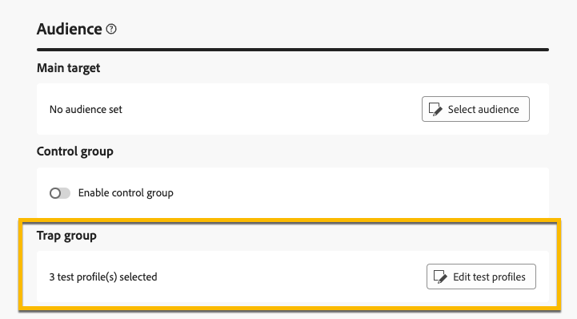

# Använd en **[!UICONTROL trap group]** {#trap-group}

A **[!UICONTROL trap group]** används för målmottagare som inte matchar de definierade målvillkoren. På så sätt kan mottagare som ligger utanför leveransomfånget ta emot leveransen, precis som andra målmottagare gör.
A **[!UICONTROL trap group]** är en **[!UICONTROL seed addresses]**.

## Varför använda **[!UICONTROL trap group]**

Du kan använda **[!UICONTROL trap group]** :

1. **Som bevis** : varje medlem i **[!UICONTROL Trap group]** får leveransen som om den vore en del av publiken.

1. **Skydda din e-postlista** : genom att ta emot det som målgruppen får, var och en **[!UICONTROL seed address]** i **[!UICONTROL Trap group]** kommer att uppmärksammas om e-postlistan används av en tredje part.

## Om **[!UICONTROL Trap group]**

dirigeringsadresser exkluderas automatiskt från rapporter om följande leveransstatistik: **Klickningar**, **Öppnar**, **Avbeställ**. Rapporterna handlar bara om den verkliga publiken.

För e-postleveranser behövs bara e-postadresser för **[!UICONTROL Trap group]** kommer personaliseringen av andra fält att fyllas i slumpmässigt av Campaign.

## Så här konfigurerar du en **[!UICONTROL Trap group]** i leveransen

Så här ställer du in en **[!UICONTROL Trap group]**, går till **[!UICONTROL Audience]** leveransinställningar. Du har två alternativ:
- [Välj testprofiler](#select-test-profile)
- [Skapa villkor](#create-condition)

{zoomable="yes"}

### Välj testprofiler {#select-test-profiles}

När du väljer&quot;Välj testprofiler&quot; visas fönstret nedan där du är inbjuden till **[!UICONTROL Add test profile(s)]** :

{zoomable="yes"}

När du klickar på knappen får du tillgång till de startadresser du kan lägga till **[!UICONTROL trap group]**. Markera de som du vill använda.
Du kan skapa nya dirigerade adresser. [Läs mer](#create-seed)

{zoomable="yes"}

Kontrollera att du har rätt nummer under när du bekräftar dina svällningsadresser **[!UICONTROL Trap group]**.

{zoomable="yes"}

### Skapa villkor {#create-condition}

Med **[!UICONTROL Create condition]** väljer du ett nytt fönster där du kan anpassa en fråga för att definiera de dirigerade adresser som du vill använda:

{zoomable="yes"}

Din fråga visas under **[!UICONTROL Trap group]**.

{zoomable="yes"}

## Så här skapar du en ny **[!UICONTROL seed address]** {#create-seed}

Du kan skapa en ny **[!UICONTROL seed address]** in **[!UICONTROL Explorer]** > **[!UICONTROL Ressources]** > **[!UICONTROL Campaign Management]** > **[!UICONTROL Seed members]**

{zoomable="yes"}

Du kan fylla i all information om din dirigerade medlem som om det vore en målgruppsprofil:

{zoomable="yes"}