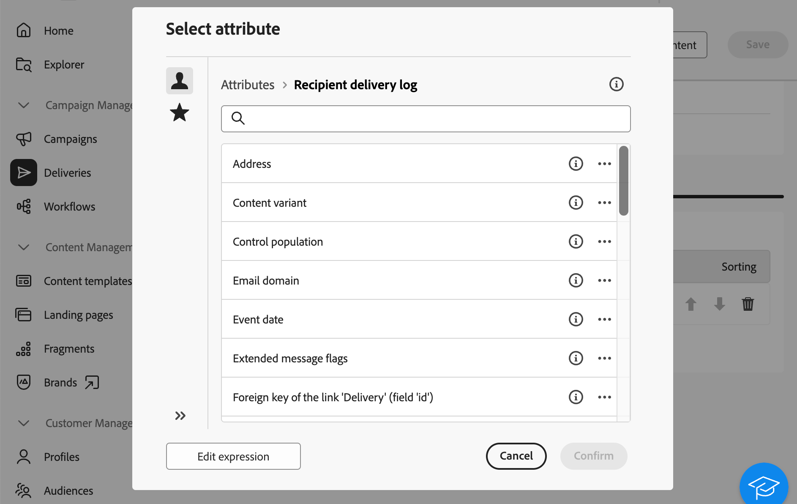
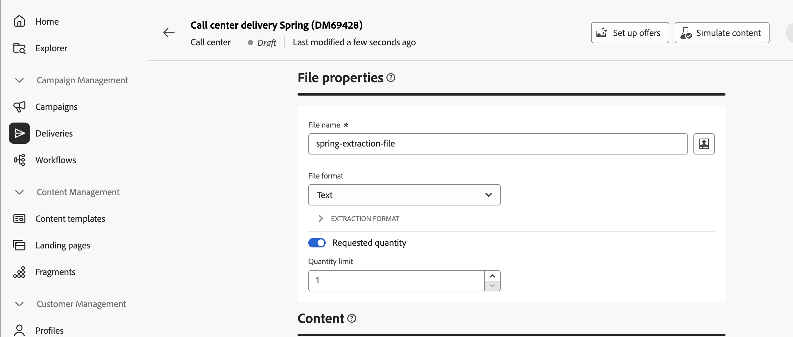

# Skapa och skicka en kundtjänstleverans {#create-call-center}

Du kan skapa en fristående kundtjänstleverans eller skapa en i samband med ett kampanjarbetsflöde. Stegen nedan beskriver proceduren för en fristående leverans (en bild). Om du arbetar i ett kampanjarbetsflöde beskrivs stegen för att skapa i [det här avsnittet](../workflows/activities/channels.md#create-a-delivery-in-a-campaign-workflow).

Följ de här huvudstegen för att skapa och skicka en ny fristående kundtjänstleverans:

1. Skapa leveransen, [läs mer](#create-delivery)
1. Välj målgrupp, [läs mer](#select-audience)
1. Redigera innehållet, [läs mer](#edit-content)
1. Förhandsgranska och skicka leveransen, [läs mer](#preview-send)

## Skapa leveransen{#create-delivery}

Följ de här stegen för att skapa leveransen och konfigurera dess egenskaper:

1. Välj menyn **[!UICONTROL Deliveries]** och klicka på knappen **[!UICONTROL Create delivery]**.

1. Välj **[!UICONTROL Call center]** som kanal och klicka på **[!UICONTROL Create delivery]** för att bekräfta.

   {zoomable="yes"}

   >[!NOTE]
   >
   >Om du vill välja en annan mall kan du gå till [sidan](../msg/delivery-template.md).

1. Under **[!UICONTROL Properties]** anger du **[!UICONTROL Label]** för leveransen. Ytterligare alternativ finns i det här [avsnittet](../email/create-email.md#create-email).

   {zoomable="yes"}

>[!NOTE]
>
>Du kan schemalägga leverans till ett visst datum. Mer information om detta hittar du i det här [avsnittet](../msg/gs-deliveries.md#gs-schedule).

## Välj målgruppen{#select-audience}

Nu måste ni definiera målgruppen som ska användas för extraheringsfilen.

1. Klicka på **[!UICONTROL Select audience]** i avsnittet **[!UICONTROL Audience]** på leveranssidan.

   {zoomable="yes"}

1. Välj en befintlig målgrupp eller skapa en egen.

   * [Lär dig hur du väljer en befintlig målgrupp](../audience/add-audience.md)
   * [Lär dig skapa en ny publik](../audience/one-time-audience.md)

   {zoomable="yes"}

>[!NOTE]
>
>Mottagare av samtalscenter måste innehålla minst sina namn och telefonnummer. Mottagare med ofullständig information utesluts från leveranser till callcenter.
>
>Mer information om hur du konfigurerar kontrollgrupper finns på [sidan](../audience/control-group.md)

## Redigera innehållet{#edit-content}

Nu ska vi utforma innehållet i extraheringsfilen som ska genereras av kundtjänstleveransen.

1. Klicka på knappen **[!UICONTROL Edit content]** på leveranssidan.

   {zoomable="yes"}

1. Ange fältet **[!UICONTROL File name]**. Mer information om hur du anpassar filnamnet finns på [sidan](../personalization/personalize.md).

1. Välj en **[!UICONTROL File format]**: **Text**, **Text med kolumner med fast bredd**, **CSV (Excel)** eller **XML**.

   {zoomable="yes"}

   >[!NOTE]
   >
   >Alternativ för extraheringsformat finns på den här [sidan](../direct-mail/content-direct-mail.md#properties).

1. Växla till alternativet **[!UICONTROL Requested quantity]** om du inte vill begränsa antalet mottagare för leveransen.

1. Klicka på knappen **[!UICONTROL Add Attribute]** i avsnittet **[!UICONTROL Content]** för att skapa en ny kolumn som ska visas i extraheringsfilen.

1. Välj det attribut som ska visas i kolumnen och bekräfta sedan. Mer information om hur du väljer attribut och lägger till dem i favoriter finns på [sidan](../get-started/attributes.md).

   

1. Upprepa dessa steg om du vill lägga till så många kolumner som behövs för extraheringsfilen.

   Du kan sedan redigera attributen, sortera extraheringsfilen eller ändra kolumnernas placering. Se denna [sida](../direct-mail/content-direct-mail.md#content) för mer information om detta.

   

## Förhandsgranska och skicka leveransen{#preview-send}

När leveransinnehållet är klart kan du förhandsgranska det med testprofiler och skicka korrektur. Du kan sedan skicka leveransen till callcenter för att generera extraheringsfilen.

De viktigaste stegen för att förhandsgranska och skicka extraheringsfilen är följande. Mer information finns på [sidan](../direct-mail/send-direct-mail.md).

1. Använd **[!UICONTROL Simulate content]** från sidan med leveransinnehåll.

   {zoomable="yes"}

1. Markera en eller flera testprofiler om du vill förhandsgranska det anpassade innehållet. Du kan också skicka korrektur. [Läs mer](../direct-mail/send-direct-mail.md#preview-dm)

   {zoomable="yes"}

1. Klicka på **[!UICONTROL Review & send]** på leveranssidan.

   {zoomable="yes"}

1. Klicka på **[!UICONTROL Prepare]** och övervaka förloppet och statistiken som tillhandahålls. Bekräfta sedan.

   {zoomable="yes"}

1. Klicka på **[!UICONTROL Send]** för att fortsätta med den sista sändningsprocessen och bekräfta sedan.

När leveransen har skickats genereras extraheringsfilen automatiskt och exporteras till den plats som anges i det **[!UICONTROL Routing]** externa kontot som valts i leveransmallens [avancerade inställningar](../advanced-settings/delivery-settings.md).

Spåra dina KPI-data (Key Performance Indicator) från din leveranssida och data från **[!UICONTROL Logs]**-menyn.

Börja mäta effekten av ert budskap med inbyggda rapporter. [Läs mer](../reporting/direct-mail.md)

