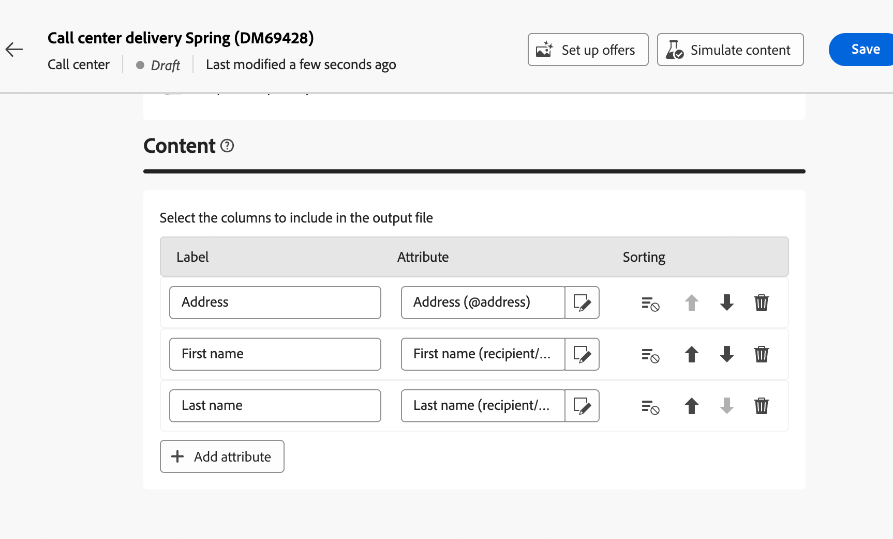

# Kom igång med anpassade kanaler {#gs-custom-channel}

Ni kan, direkt från Adobe Campaign Web UI, samordna och genomföra leveranser baserat på anpassade kanaler som är integrerade med tredje part. Konfigurationen av den anpassade kanalen utförs i klientkonsolen.

Två typer av anpassade kanaler stöds, externa och API. Med externa kanaler genererar Campaign anpassningsbara exportfiler med alla nödvändiga kontakt- och personaliseringsdata. Med API-kanaler skickas meddelanden till målprofilerna via den API som konfigurerats.

Du kan lägga till anpassade kanalleveranser i arbetsflöden eller bara använda dem som fristående leveranser.

Stegen nedan beskriver proceduren för en fristående leverans (en bild). De flesta steg liknar leveranser till callcenter. Mer information finns på [sidan](../call-center/create-call-center.md).

Så här skickar du en ny egen leverans:

1. Konfigurera den anpassade kanalen, [läs mer](#create-channel)
1. Skapa leveransen, [läs mer](#create-delivery)
1. Definiera målgruppen, [läs mer](#select-audience)
1. Redigera innehållet, [läs mer](#edit-content)
1. Förhandsgranska och skicka leveransen, [läs mer](#preview-send)

## Konfigurera den anpassade kanalen{#create-channel}

Först måste du konfigurera den anpassade kanalen. Här är huvudstegen som ska utföras i klientkonsolen. De här stegen är gemensamma för anpassade externa kanaler och API-kanaler:

1. Konfigurera schemat för att lägga till den nya kanalen i listan över tillgängliga kanaler. [Läs mer](https://experienceleague.adobe.com/docs/campaign/campaign-v8/send/other-channels/custom-channel.html?lang=sv-SE#configure-schema){target="_blank"}
1. Skapa ett nytt externt routningskonto. [Läs mer](https://experienceleague.adobe.com/docs/campaign/campaign-v8/send/other-channels/custom-channel.html?lang=sv-SE#create-ext-account){target="_blank"}
1. Skapa en ny leveransmall som är kopplad till den nya kanalen. [Läs mer](https://experienceleague.adobe.com/docs/campaign/campaign-v8/send/other-channels/custom-channel.html?lang=sv-SE#create-template){target="_blank"}

Anpassade API-kanaler kräver ytterligare konfiguration. [Läs mer](https://experienceleague.adobe.com/docs/campaign/campaign-v8/send/other-channels/custom-channel.html?lang=sv-SE#api-additional){target="_blank"}

## Skapa leveransen{#create-delivery}

Följ de här stegen för att skapa leveransen och konfigurera dess egenskaper:

1. Välj menyn **[!UICONTROL Deliveries]** och klicka på knappen **[!UICONTROL Create delivery]**.

1. Välj önskad anpassad kanal, markera den associerade mallen och klicka på **[!UICONTROL Create delivery]** för att bekräfta.

   {zoomable="yes"}

1. Under **[!UICONTROL Properties]** anger du **[!UICONTROL Label]** för leveransen.

   {zoomable="yes"}

Mer information om hur du skapar leveranser finns i kundtjänstens [dokumentation](../call-center/create-call-center.md#create-delivery).

## Definiera målgruppen{#select-audience}

Nu måste ni definiera målgruppen.

1. Klicka på **[!UICONTROL Audience]** i avsnittet **[!UICONTROL Select audience]** på kontrollpanelen för leverans.

1. Välj en befintlig målgrupp eller skapa en egen.

   {zoomable="yes"}

Mer information om målgruppsdefinition finns i kundtjänstens [dokumentation](../call-center/create-call-center.md#select-audience).

## Redigera innehållet{#edit-content}

Nu ska vi redigera innehållet i leveransen.

>[!BEGINTABS]

>[!TAB Anpassad extern kanal]

1. Klicka på knappen **[!UICONTROL Edit content]** på kontrollpanelen för leverans.

1. Ange en **[!UICONTROL File name]**, markera en **[!UICONTROL File format]** och lägg till så många kolumner som behövs för extraheringsfilen.

   

>[!TAB Anpassad API-kanal]

1. Klicka på knappen **[!UICONTROL Edit content]** på kontrollpanelen för leverans.

1. Fyll i fälten efter behov. Mer information om hur du konfigurerar den här skärmen finns på [sidan](https://experienceleague.adobe.com/docs/campaign/campaign-v8/send/other-channels/custom-channel.html?lang=sv-SE#api-additional-screen){target="_blank"}.

   

>[!ENDTABS]

Mer information om innehållsutgåvan finns i callcentrets [dokumentation](../call-center/create-call-center.md#edit-content).

## Förhandsgranska och skicka leveransen{#preview-send}

När leveransinnehållet är klart kan du förhandsgranska det med testprofiler. Du kan sedan skicka leveransen för att generera extraheringsfilen eller skicka meddelandet via API.

>[!BEGINTABS]

>[!TAB Anpassad extern kanal]

1. Klicka på knappen **[!UICONTROL Edit content]** på kontrollpanelen för leverans.

1. Klicka på knappen **[!UICONTROL Simulate content]** på sidan för leveransinnehåll och välj testprofiler.

   {zoomable="yes"}

>[!TAB Anpassad API-kanal]

1. Klicka på knappen **[!UICONTROL Edit content]** på kontrollpanelen för leverans.

1. Klicka på knappen **[!UICONTROL Simulate content]** på sidan för leveransinnehåll och välj testprofiler.

1. Klicka på **Öppna förhandsgranskning** till höger. Den här funktionen måste konfigureras med JSSP. Se den här [sidan](https://experienceleague.adobe.com/docs/campaign/campaign-v8/send/other-channels/custom-channel.html?lang=sv-SE#api-additional-preview){target="_blank"}.

   {zoomable="yes"}

>[!ENDTABS]

Klicka på **[!UICONTROL Review & send]** på kontrollpanelen för leverans och klicka på **[!UICONTROL Prepare]**. Bekräfta sedan. Klicka på **[!UICONTROL Send]** för att fortsätta med den sista sändningsprocessen och bekräfta sedan.

{zoomable="yes"}

Mer information om förhandsgranskning och sändning finns i callcentrets [dokumentation](../call-center/create-call-center.md#preview-send).
