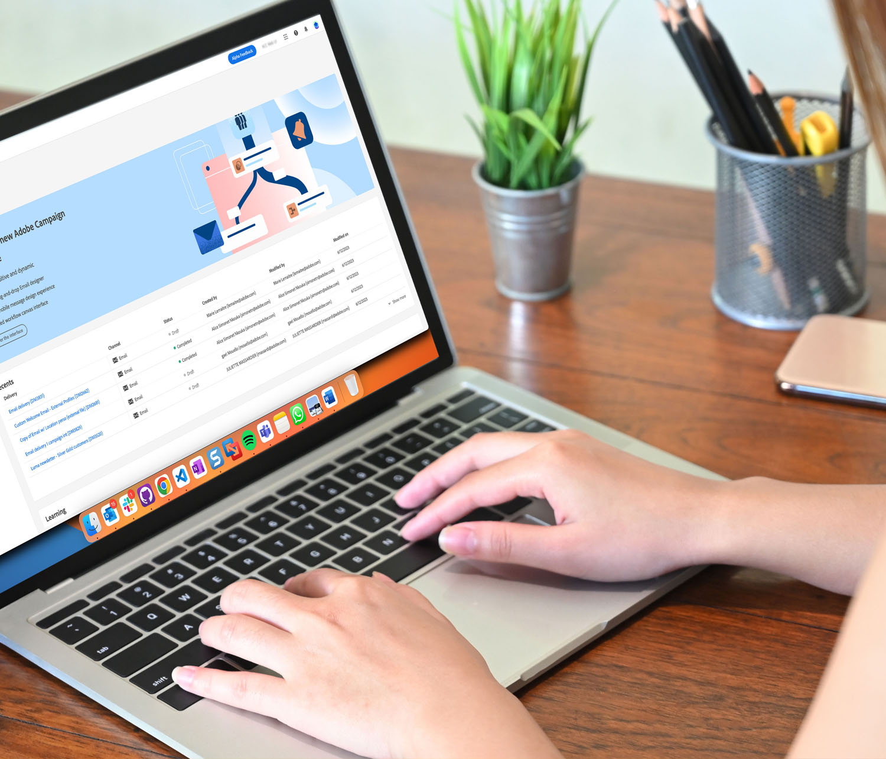
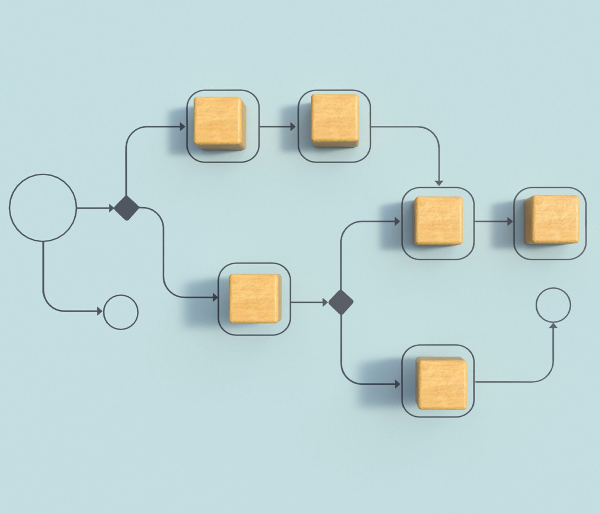

# Adobe Campaign webbgränssnittsdokumentation {#campaign-documentation}

>[!CONTEXTUALHELP]
>id="acw_homepage_learning_card1"
>title="Hjälp och dokumentation"
>abstract="Campaign har nu ett nytt webbanvändargränssnitt med förbättrad användarvänlighet, tillgänglighet och en ny design som avsevärt förbättrar användarupplevelsen. Det nya moderna användargränssnittet förenklar utformningen och leveransen av marknadsföringskampanjer och ger enhetlighet tillsammans med andra Adobe-lösningar."

>[!CONTEXTUALHELP]
>id="acw_homepage_welcome_title"
>title="Upplev nya Adobe Campaign användargränssnitt"
>abstract="Modern, intuitiv och dynamisk."

>[!CONTEXTUALHELP]
>id="acw_homepage_welcome_list1"
>title="Objekt 1"
>abstract="Ny designupplevelse för e-post, SMS och push-meddelanden"

>[!CONTEXTUALHELP]
>id="acw_homepage_welcome_list2"
>title="Objekt 2"
>abstract="Förenklat gränssnitt för arbetsyta"

>[!CONTEXTUALHELP]
>id="acw_homepage_welcome_list3"
>title="Objekt 3"
>abstract="Omdesignat användargränssnitt för målgrupper, prenumerationer, AEM Assets, landningssidor"

>[!CONTEXTUALHELP]
>id="acw_homepage_welcome_list4"
>title="Objekt 4"
>abstract="Nästa generations frågemodellerare och e-postdesigner"

Vi är stolta över att kunna presentera den nya versionen av Adobe Campaign webbgränssnitt. Vår senaste release är fullmatad med intuitiva funktioner som förenklar skapandet av personaliserade flerkanalskampanjer, ger enastående resultat och ger er en konkurrensfördel i alla kanaler. Det nya moderna användargränssnittet förenklar utformningen och leveransen av marknadsföringskampanjer och ger enhetlighet tillsammans med andra Adobe-lösningar, inklusive Adobe Experience Platform.

## Nyheter

Få en glimt av de senaste förbättringarna i Adobe Campaign Web - produkt och dokumentation! En omfattande lista över viktiga funktioner och funktioner för att släppa uppdateringar finns på [den här sidan](rn/whats-new.md).

>[!BEGINTABS]

>[!TAB 25 maj-utgåvan]

Maj-versionen är nu aktiv, inklusive den nya anpassade kanalen, varumärkesjusteringspoängen och förbättringen av typologireglerna.

>[!TAB AI-assistenten]

✨ Fördjupa dig i en praktisk upplevelse med vår [ AI Assistant](../v8/email/generative-gs.md) -förhandsgranskning av aktiva funktioner, som är utformad för att du först ska kunna utforska dess funktioner och till fullo förstå dess funktioner.

{target="_blank"}

>[!TAB Vanliga frågor och svar ]

Vanliga frågor om användargränssnittet i Campaign finns på en ny dedikerad sida.

>[!ENDTABS]

## Börja med grunderna

<table style="table-layout:fixed">
  <tr style="border: 0;">
    <td>
    
    
<strong>Upptäck det nya användargränssnittet</strong> Upptäck Adobe Campaign webbs nya gränssnitt och navigeringsupplevelse som är integrerad med Adobe Experience Platform.

    </td>
    <td>
    
    
<strong>Omdesignad arbetsyta för arbetsflöden</strong> Lär dig hur du skapar arbetsflöden för att samordna alla processer och uppgifter och förbättrar hastigheten och skalan för alla delar av marknadsföringskampanjer.
 
    </td>
    <td>
    
    
<strong>Träffa e-postmeddelandet om Designer</strong> Lär dig hur du börjar med en mall, eller använd Adobe Campaign nya e-postprogram för Designer för att skapa e-postmeddelanden utan att behöva skriva en enda kodrad.
    
</td>
    <td>
    
    
<strong>Gör ditt innehåll dynamiskt</strong> Lär dig hur du anpassar ditt innehåll baserat på den information du har samlat in om dina profiler för att göra ditt innehåll mer tilltalande och öka sannolikheten för att det läses.

    </td>
  </tr>
  <tr style="border: 0;">
    <td align="center"></td>
    <td align="center"></td>
    <td align="center"></td>
    <td align="center"></td>
    </tr>
</table>

## Utforska dokumentationen

<table style="table-layout:auto">
  <tr style="border: 0;">
    <td>
      
     
      <strong>Kom igång</strong> <a href="get-started/user-interface.md">Användargränssnitt</a> - <a href="get-started/connect-to-campaign.md">Anslut till kampanj</a> - <a href="get-started/permissions.md">Åtkomst och behörigheter</a>
    </td>
    <td>
      
     
      <strong>Kundens upplevelse</strong> <a href="workflows/gs-workflows.md" target="_blank">Automatisera med arbetsflöden</a> - <a href="campaigns/gs-campaigns.md" target="_blank">Kampanjsamordning</a> - <a href="personalization/gs-personalization.md">Dynamiskt innehåll</a> - <a href="reporting/gs-reports.md">Rapportering och analys</a>
    </td>
    <td>
      
     
      <strong>Skicka meddelanden</strong> <a href="msg/gs-deliveries.md">Skapa en leverans</a> - <a href="email/create-email.md">E-post</a> - <a href="push/gs-push.md">Push-meddelanden</a> - <a href="sms/gs-sms.md">SMS</a> - <a href="msg/delivery-template.md">Leveransmallar</a> - <a href="preview-test/preview-test.md">Förhandsgranska och testa</a> 
    </td>
    <td>
      
     
      <strong>Profiler och målgrupper</strong> <a href="audience/gs-audiences-recipients.md">Kom igång</a> - <a href="audience/create-audience.md">Skapa målgrupper</a> - <a href="audience/test-profiles.md">Testprofiler</a> - <a href="audience/manage-services.md">Prenumerationstjänster</a> - <a href="query/query-modeler-overview.md">Frågemodelleraren</a>
    </td>
  </tr>
</table>

## Ytterligare resurser

* [Adobe Campaign produktbeskrivning](https://helpx.adobe.com/se/legal/product-descriptions/adobe-campaign-managed-cloud-services.html){target="_blank"}
* [Adobe Campaign v8-dokumentation](https://experienceleague.adobe.com/docs/campaign-v8.html?lang=sv){target="_blank"}