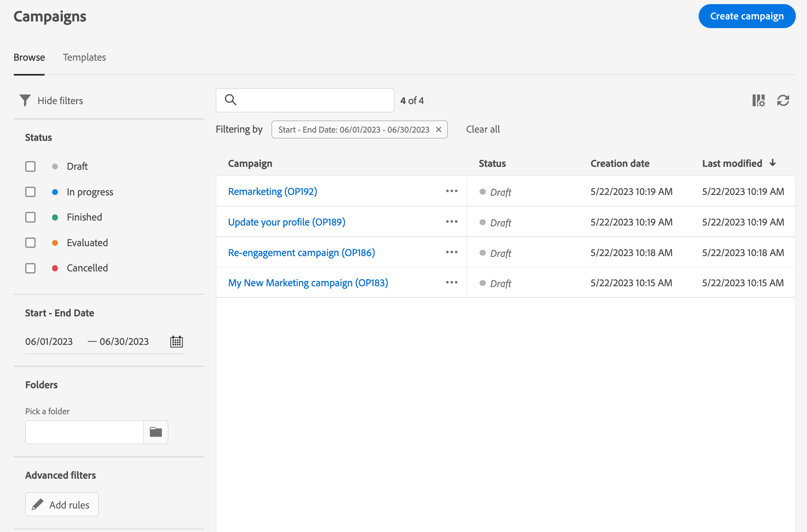

# Kom igång med kampanjer {#campaigns}

>[!CONTEXTUALHELP]
>id="acw_homepage_card5"
>title="Utforma och skicka flerkanalskampanjer"
>abstract="Adobe Campaign-funktioner hjälper er att hantera centraliserade kunddata, utforma kundkommunikation och kampanjer och skapa personaliserade upplevelser i olika kanaler: E-post, push och SMS."

Med Adobe Campaign kan ni enkelt samordna era riktade marknadsföringssatsningar med den inbyggda kampanjhanteringsfunktionen. Med möjligheten att definiera ett schema kan ni planera kampanjernas varaktighet och tidsplanering för att anpassa dem till strategiska mål och maximera målgruppernas engagemang.

Genom att lägga till flera arbetsflöden och leveranser som är specifika för kampanjen kan ni skapa personaliserade upplevelser i olika kanaler och säkerställa att varje kontaktyta passar den avsedda målgruppen.

Kampanjerna erbjuder dedikerade rapporteringsmått för att få omfattande insikter om resultatet för hela kampanjen, så att ni kan bedöma hur effektiv den är, identifiera trender och fatta datadrivna beslut för att optimera framtida insatser.

<!--
Use Adobe Campaign to create cross-channel campaigns. With its marketing campaign orchestration capabilities, you can manage and centralize customer data, design customer communications and campaigns, and create personalized experiences across different channels. In this version, email, push and SMS channels are available.

Design and execute high-volume email campaigns to deliver personalized messages, for all platforms and screen sizes. 
Measure the effectiveness of your deliveries with detailed reports including the counts of opens, clicks, forwards, and more. With Adobe Campaign segmentation capabilities, you can run queries against a high-volume database, and easily define dynamic marketing segments which perfectly target your campaigns.
-->

<!--
Get Started with campaigns
Adobe Campaign offers a set of solutions that help you personalize and deliver campaigns across all of your online and offline channels. You can create, configure, execute and analyze marketing campaigns. All marketing campaigns can be managed from a unified control center. Discover how to browse and create marketing campaigns in this section.

Campaigns include actions (deliveries) and processes (importing or extracting files), as well as resources (marketing documents, delivery outlines). They are used in marketing campaigns. Campaigns are part of a program, and programs are included in a campaign plan.
-->

## Få tillgång till och hantera era kampanjer{#access-campaigns}

Om du vill skapa en ny kampanj eller hantera befintliga kampanjer klickar du på **[!UICONTROL Campaigns]** -menyn.

Det finns två flikar:

* The **Bläddra** alla befintliga kampanjer visas på fliken. Du kan klicka på en kampanj för att öppna instrumentpanelen eller skapa en ny kampanj genom att klicka på **Skapa kampanj** -knappen. Se det här [section](create-campaigns.md#create-campaigns).

* The **Mallar** På -fliken visas alla tillgängliga kampanjmallar. Kampanjmallar är förkonfigurerade så att de kan återanvändas för att skapa nya kampanjer. De skapas från klientkonsolen. [Läs mer](https://experienceleague.adobe.com/docs/campaign/automation/campaign-orchestration/marketing-campaign-templates.html)

Varje kampanj i listan visar information om dess aktuella status, skapandedatum, senaste gången den ändrades osv.

Du kan anpassa de kolumner som visas genom att klicka på **Konfigurera kolumn för en anpassad layout** -ikonen i det övre högra hörnet av listan. På så sätt kan du lägga till ytterligare information i listan. Dessutom finns det ett sökfält och filter som gör det enklare att söka i listan. [Läs mer](../get-started/user-interface.md#list-screens)

Du kan till exempel filtrera efter kampanjschemat. Öppna filterpanelen och använd **Start - slutdatum** avsnitt:

## Kontrollpanelen för kampanjer{#campaign-dashboard}

I **Bläddra** klickar du på en kampanj för att visa dess instrumentpanel.

Status och schema för kampanjen visas högst upp på skärmen. Du kan använda **Konfigurera kampanjinställningar** om du vill ändra kampanjens egenskaper som definierades när kampanjen skapades. Det finns tre knappar som gör att du kan visa loggar, rapportera, duplicera eller ta bort kampanjen. Se det här [section](create-campaigns.md#create-campaigns)

Det finns två flikar:

* The **Arbetsflöden** På -fliken visas alla arbetsflöden som är kopplade till kampanjen. På den här fliken kan du även skapa ett nytt arbetsflöde i kampanjen. Se det här [section](create-campaigns.md#create-campaigns)
* The **Leveranser** På fliken visas alla leveranser som är kopplade till kampanjen. Du kan också skapa en ny leverans i kampanjen. Se det här [section](create-campaigns.md#create-campaigns)

