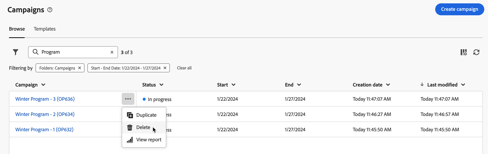

# Få tillgång till och hantera era kampanjer {#manage-campaigns}

>[!CONTEXTUALHELP]
>id="acw_campaign_schedule"
>title="Kampanjschema"
>abstract="Ange eller ändra kampanjschemat."

Klicka på menyn **[!UICONTROL Campaigns]** till vänster om du vill få åtkomst till och hantera dina kampanjer.

## Lista över kampanjer {#access-campaigns}

Det finns två flikar i kampanjlistan:

* Fliken **Bläddra** visar alla befintliga kampanjer. Du kan klicka på en kampanj för att öppna dess instrumentpanel eller skapa en ny kampanj genom att klicka på knappen **Skapa kampanj** . Se [avsnittet](create-campaigns.md#create-campaigns).

* Fliken **Mallar** visar alla tillgängliga kampanjmallar. Du kan visa en befintlig mall eller skapa en ny. [Läs mer](#manage-campaign-templates).

Som standard visar varje kampanj i listan information om dess aktuella status, start- och slutdatum, skapandedatum, senaste gången den ändrades osv.

Du kan anpassa de kolumner som visas genom att klicka på kolumnen **Konfigurera för en anpassad layout** som finns i listans övre högra hörn. Detta gör att du kan lägga till eller ta bort kolumner och ändra ordning på information i kampanjlistan.

Dessutom finns det ett sökfält och filter som gör det enklare att söka i listan. [Läs mer](../get-started/user-interface.md#list-screens).

Du kan till exempel filtrera efter kampanjschemat. Öppna filterpanelen och använd avsnittet **Start - slutdatum**:

## Kampanjinstrumentpanel {#campaign-dashboard}

>[!CONTEXTUALHELP]
>id="acw_campaign_delivery_list"
>title="Lista över leveranser i kampanjen"
>abstract="Fliken **Leveranser** visar alla leveranser som är kopplade till den aktuella kampanjen. Klicka på namnet på en leverans för att redigera den. Använd knappen Skapa leverans för att lägga till en ny leverans för kampanjen."

>[!CONTEXTUALHELP]
>id="acw_campaign_workflow_list"
>title="Arbetsflödeslista i en kampanj"
>abstract="Fliken **Arbetsflöde** visar alla arbetsflöden som är länkade till den aktuella kampanjen."

Klicka på ett kampanjnamn på fliken **Bläddra** i kampanjlistan för att visa information om kampanjen.

Status och schema för kampanjen visas högst upp på skärmen. Använd knappen **Inställningar** för att uppdatera kampanjens egenskaper, till exempel etikett, mapp och beskrivning. Du kan också ändra kampanjschemat från inställningsskärmen. Läs mer om kampanjschemat i [det här avsnittet](create-campaigns.md#campaign-schedule).

Använd knapparna **Logs** och **Reports** på kampanjkontrollpanelen för att övervaka kampanjen. Läs mer i det här [avsnittet](create-campaigns.md#create-campaigns).

På kontrollpanelen visas två huvudflikar för varje kampanj: Arbetsflöden och Leveranser.

* Fliken **Arbetsflöden** visar alla arbetsflöden som är associerade med kampanjen. På den här fliken kan du även skapa ett nytt arbetsflöde i kampanjen. Se [avsnittet](create-campaigns.md#create-campaigns).

* Fliken **Leveranser** visar alla leveranser som har skapats i den aktuella kampanjen. Du kan också skapa en ny leverans i kampanjen. Se [avsnittet](create-campaigns.md#create-campaigns).

>[!NOTE]
>
>Fliken **Leveranser** visar alla leveranser som är kopplade till kampanjen. Leveranser som har skapats i ett arbetsflöde kan dock inte tas bort därifrån. Om du vill ta bort en leverans som har skapats i ett arbetsflöde tar du bort leveransaktiviteten från arbetsflödet. [Läs mer](../msg/gs-messages.md#delivery-delete).

## Ta bort en kampanj {#campaign-delete}

Du kan ta bort en kampanj på två sätt:

* Klicka på ellipsknappen i listan med kampanjer och välj sedan **Ta bort**.

  

* Klicka på knappen **Mer** i själva kampanjen och välj sedan **Ta bort**.

  

## Duplicera en kampanj {#campaign-duplicate}

Du kan duplicera en kampanj på två sätt:

* Klicka på ellipsknappen i listan med kampanjer och välj sedan **Duplicera**.

* Klicka på knappen **Mer** i själva kampanjen och välj sedan **Duplicera**.

I båda fallen måste du bekräfta dupliceringen för att skapa den nya kampanjen. Kampanjens etikett är **Kopia av`<label of the initial campaign>`**. Bläddra till kampanjinställningarna för att uppdatera den här etiketten.

## Arbeta med kampanjmallar {#manage-campaign-templates}

Kampanjmallar innehåller förkonfigurerade inställningar som kan återanvändas för att skapa nya kampanjer. Det finns en uppsättning inbyggda mallar som hjälper dig att komma igång. Du kan skapa och konfigurera kampanjmallar och sedan skapa kampanjer utifrån dessa mallar.

En kampanjmall kan lagra följande information:

* Kampanjen **Inställningar**
* Kampanjen **Schedule**
* Arbetsflödesmallar
* Leveransmallar

Så här skapar du en kampanjmall:

1. Klicka på menyn **[!UICONTROL Campaigns]**, bläddra till fliken **Mallar** och klicka sedan på knappen **[!UICONTROL Create template]** .
1. Välj den **mall** som ska användas. På så sätt kan du basera den nya mallen på en mall som du tidigare har skapat.
1. Ange en etikett för mallen.
1. Ändra vid behov följande **ytterligare alternativ**: internt namn, mapp, tilldelad, beskrivning och typ.
1. Definiera **schemat** för din kampanj. Lär dig hur du ställer in kampanjschemat i [det här avsnittet](create-campaigns.md#campaign-schedule).
1. Klicka på **Skapa**.
1. Lägg till arbetsflöden och leveransmallar i kampanjen.