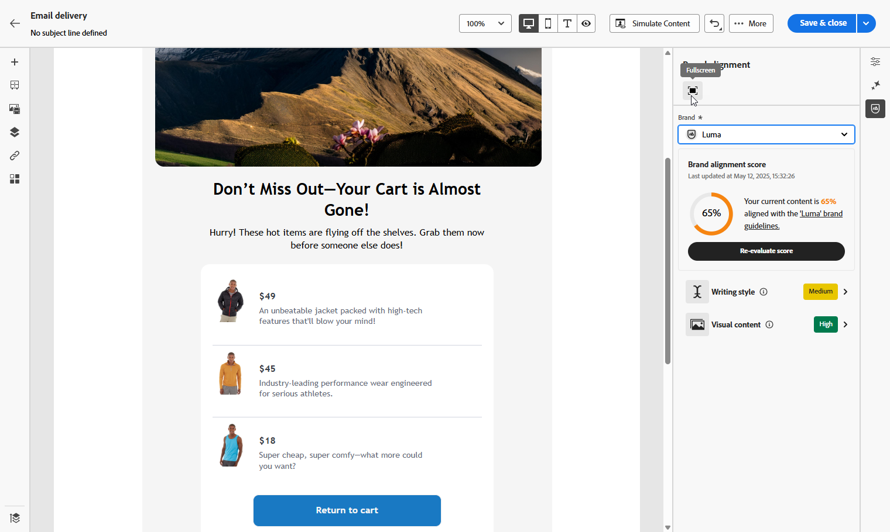

# Utvärdera ert innehåll {#brands-score}

>[!AVAILABILITY]
>
>Du måste godkänna [användaravtalet](https://www.adobe.com/legal/licenses-terms/adobe-dx-gen-ai-user-guidelines.html){target="_blank"} innan du kan använda AI-assistenten. Kontakta din Adobe-representant om du vill veta mer.

Funktionen för innehållsgranskning innehåller omfattande utvärderingsverktyg för att mäta hur väl era kampanjer överensstämmer med varumärkesriktlinjerna och upprätthåller innehållskvalitetsstandarder i all kommunikation:

* **Varumärkesjustering**: Granska och hantera innehåll som följer varumärkesriktlinjerna. Detta garanterar enhetlighet i fråga om ton, meddelanden och visuell identitet i alla e-postkampanjer.
* **Kvalitetskontroll**: Verifiera ditt innehåll innan det publiceras för att upprätthålla en hög standard och varumärkesintegritet.

## Validera ert innehåll med varumärkesanpassning {#validate-content}

När [ditt varumärke har konfigurerats och publicerats](brands.md) kan du bedöma varumärkesjusteringspoängen direkt i din e-postkampanj för att se till att innehållet följer varumärkesriktlinjerna:

1. Skapa din [e-postkampanj](../email/create-email.md).

1. Öppna menyn **[!UICONTROL Brand Alignment]** i e-postdesignern.

   Ditt innehåll utvärderas automatiskt mot ditt standardmärke. [Lär dig hur du tilldelar ett standardmärke](brands.md).

   

1. Om du vill utvärdera med ett annat varumärke väljer du det i listrutan **[!UICONTROL Brand]** och klickar på **[!UICONTROL Re-evaluate score]**.

   

1. Bläddra bland **varumärkesjusteringspoängen** (hög, Medium, låg) och granska detaljerad feedback.

1. Klicka på ikonen  om du vill se fler insikter i resultatet.

   

1. Välj en flaggad stödlinje om du vill visa specifik feedback och förslag.

   

1. Redigera ert innehåll baserat på rekommendationerna för att förbättra varumärkesanpassningen.

1. Utvärdera innehållet manuellt när du har gjort ändringar för att uppdatera justeringspoängen.

## Validera innehållskvaliteten {#validate-quality}

>[!NOTE]
>
>Utvärderingen av innehållskvaliteten är oberoende av varumärkesriktlinjerna. Även om ett varumärke väljs i listrutan tillämpas inte dess riktlinjer på kvalitetskontrollen. Varumärkesvalet är endast relevant för bedömning av varumärkesanpassning.

Förutom varumärkesanpassning kan ni utvärdera den allmänna innehållskvaliteten för att identifiera potentiella problem med läsbarhet, innehållets enhetlighet och effektivitet, oberoende av varumärkesriktlinjerna.

Så här utvärderar du innehållskvaliteten:

1. Skapa din [e-postleverans](../email/create-email.md).

1. Öppna menyn **[!UICONTROL Brand Alignment]** i e-post-Designer.

   

1. Klicka på **[!UICONTROL Evaluate score]** om du vill generera både varumärkesjustering och innehållskvalitetspoäng.

   

1. Gå till fliken **[!UICONTROL Overall quality]** om du vill granska dina innehållskvalitetsinsikter och rekommendationer.

   

1. Klicka på ikonen  om du vill se din kvalitetspoäng.

   

1. Markera ett flaggat objekt om du vill visa specifik feedback och förslag till åtgärder som kan förbättras. Poängen baseras på följande kategorier:

   * **[!UICONTROL CTA effectiveness]**: Utvärderar hur väl din call-to-action motiverar läsarna att vidta den önskade åtgärden.
   * **[!UICONTROL Subject Line]**: Utvärderar klarhet, relevans och kvalitet som får tittarna att tappa intresset för att uppmuntra e-postöppningar.
   * **[!UICONTROL Readability]**: Mäter hur enkelt och engagerande ditt innehåll är för läsarna att förstå.
   * **[!UICONTROL Spam Check]**: Identifierar vanliga skräppostutlösare som kan påverka leveransen.
   * **[!UICONTROL Content Cohesiveness]**: Ser till att ditt innehåll flyter smidigt och hålls kvar i ämnet.
   * **[!UICONTROL Proofreading]**: Kontrollerar stavning, grammatik och klarhetsproblem.

   

1. Redigera innehållet baserat på rekommendationerna för att förbättra läsbarheten, innehållets enhetlighet och övergripande kvalitet.

1. Klicka på **[!UICONTROL Re-evaluate score]** när du har gjort ändringar för att uppdatera din kvalitetspoäng.
