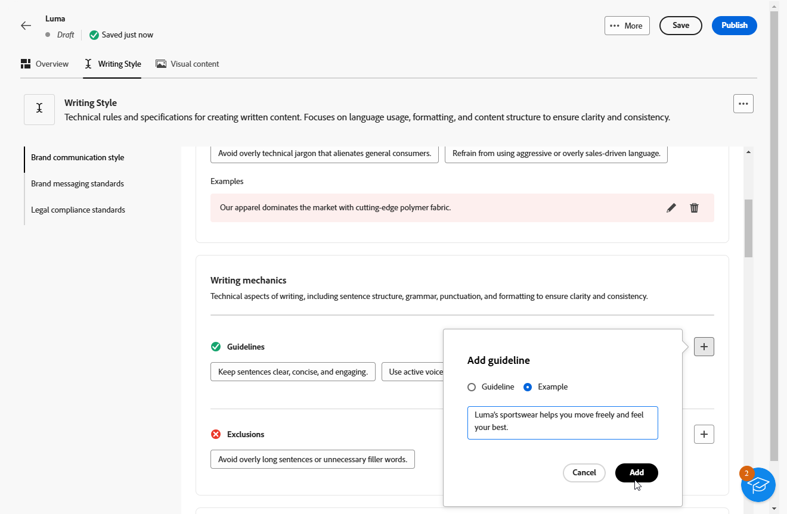
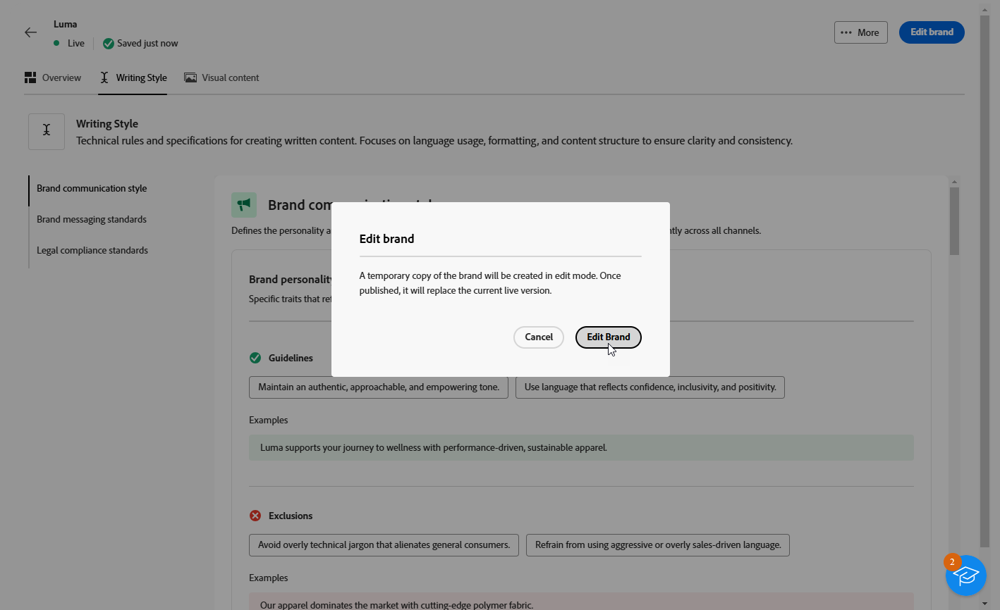

# Skapa och hantera varumärken {#brands}

>[!AVAILABILITY]
>
>Den här funktionen är en privat betaversion. Den kommer att finnas tillgänglig successivt för alla kunder i framtida versioner.

Varumärkesriktlinjerna är en omfattande uppsättning regler och standarder som definierar ett varumärkes visuella och verbala identitet. De fungerar som referens för att säkerställa en enhetlig varumärkesrepresentation i alla marknadsförings- och kommunikationskanaler.

I [!DNL Adobe Campaign Web] kan du nu ange och ordna din varumärkesinformation manuellt eller överföra varumärkesstöddokument för automatisk dataextrahering.

## Få tillgång till varumärken {#generative-access}

För att få åtkomst till menyn **[!UICONTROL Brands]** i [!DNL Adobe Campaign Web] måste användarna tilldelas produktprofilerna **[!UICONTROL Administrator (admin)]** och **[!UICONTROL Brand kit]** för att kunna skapa och hantera varumärken. För skrivskyddad åtkomst behöver användarna produktprofilen [!UICONTROL AI assistant].

[Läs mer](https://experienceleague.adobe.com/en/docs/campaign/campaign-v8/admin/permissions/manage-permissions)

+++  Lär dig hur du tilldelar varumärkesrelaterade behörigheter

1. Gå till din Campaign-produkt på startsidan för [Admin Console](https://adminconsole.adobe.com/enterprise).

   

1. Välj **[!DNL Product profile]** beroende på vilken behörighetsnivå du vill ge användaren.

   

1. Klicka på **[!DNL Add users]** för att tilldela den valda produktprofilen.

   

1. Ange användarens namn, användargrupp eller e-postadress.

1. Klicka på **Spara** om du vill använda ändringarna.

Alla användare som redan har tilldelats den här rollen får sina behörigheter automatiskt uppdaterade.

+++

## Skapa ert varumärke {#create-brand-kit}

Följ stegen nedan om du vill skapa och hantera riktlinjer för ditt varumärke.

Om du vill skapa och hantera din varumärkesriktlinje kan du antingen ange detaljerna själv eller överföra ditt varumärkesriktlinjer så att informationen extraheras automatiskt:

1. Välj **[!UICONTROL Brands]** på menyn **[!UICONTROL Content management]**.

1. Klicka på **[!UICONTROL Create brand]** på menyn **[!UICONTROL Brands]**.

   

1. Ange en **[!UICONTROL Name]** för ditt varumärke.

1. Dra och släpp eller markera filen för att ladda upp varumärkesriktlinjerna och extrahera automatiskt relevant varumärkesinformation. Klicka på **[!UICONTROL Create brand]**.

   Processen för informationsextrahering börjar nu. Observera att det kan ta flera minuter att slutföra.

   

1. Standarderna för att skapa innehåll och visuellt innehåll är nu automatiskt ifyllda. Bläddra bland de olika flikarna för att anpassa informationen efter behov.

1. Klicka på  på fliken **[!UICONTROL Writing Style]** om du vill lägga till en stödlinje eller ett undantag, inklusive exempel.

   

1. Klicka på  på fliken **[!UICONTROL Visual content]** om du vill lägga till ytterligare en stödlinje eller ett undantag.

1. Om du vill lägga till en bild som visar korrekt användning väljer du **[!UICONTROL Examples]** och klickar på **[!UICONTROL Select image]**. Du kan också lägga till en bild som visar felaktig användning som ett exkluderingsexempel.

   

1. När konfigurationen är klar klickar du på **[!UICONTROL Save]** och sedan på **[!UICONTROL Publish]** för att göra din varumärkesriktlinje tillgänglig i AI-assistenten.

1. Klicka på **[!UICONTROL Edit brand]** om du vill ändra det publicerade varumärket.

   >[!NOTE]
   >
   >Detta skapar en temporär kopia i redigeringsläge och ersätter den publicerade versionen.

   

1. Öppna den avancerade menyn på din **[!UICONTROL Brands]**-kontrollpanel genom att klicka på ikonen  för att:

   * Visa varumärke
   * Redigera
   * Duplicera
   * Publicera
   * Avpublicera
   * Ta bort

   

Riktlinjerna för ditt varumärke är nu tillgängliga från listrutan **[!UICONTROL Brand]** i AI-assistentmenyn, vilket gör att det kan generera innehåll och resurser som är anpassade till dina specifikationer. [Läs mer om AI-assistenten](gs-generative.md)

