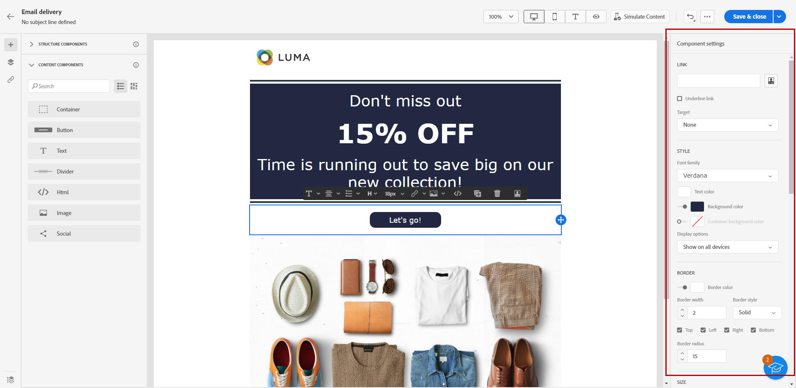
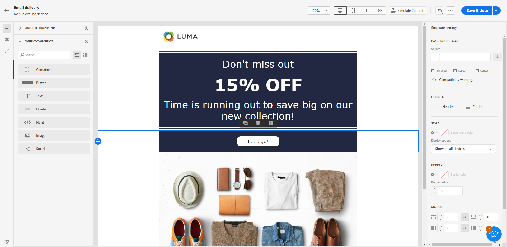
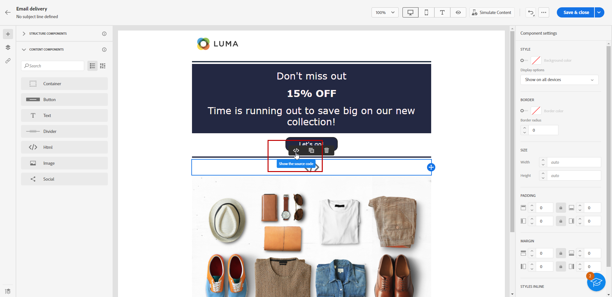

# Använda e-postdesignerns innehåll {#content-components}

>[!CONTEXTUALHELP]
>id="ac_content_components_email"
>title="Om innehåll"
>abstract="Innehållskomponenterna är tomma platshållare för innehåll som du kan använda för att skapa layouten för ett e-postmeddelande."

>[!CONTEXTUALHELP]
>id="ac_content_components_landing_page"
>title="Om innehåll"
>abstract="Innehållskomponenterna är tomma platshållare för innehåll som du kan använda för att skapa layouten för en landningssida."

>[!CONTEXTUALHELP]
>id="ac_content_components_fragment"
>title="Om innehåll"
>abstract="Innehållskomponenter är tomma platshållare för innehåll som du kan använda för att skapa layouten för ett fragment."

>[!CONTEXTUALHELP]
>id="ac_content_components_template"
>title="Om innehåll"
>abstract="Innehållskomponenter är tomma platshållare för innehåll som du kan använda för att skapa layouten för en mall."

När du skapar ditt e-postinnehåll **[!UICONTROL Content]** Med -komponenter kan du anpassa e-postmeddelandet ytterligare med råa, tomma komponenter som du kan använda en gång i ett e-postmeddelande.

Du kan lägga till så många **[!UICONTROL Contents]** som du behöver i en **[!UICONTROL Structure]**, som definierar layouten för ditt e-postmeddelande.

## Lägg till innehållskomponenter {#add-content-components}

Följ stegen nedan för att lägga till innehållskomponenter i e-postmeddelanden och anpassa dem efter dina behov.

1. Använd en [befintligt innehåll](existing-content.md) eller dra och släppa en **[!UICONTROL Structure]** till ditt tomma innehåll för att definiera layouten för ditt e-postmeddelande. [Lär dig mer](create-email-content.md)

1. Dra och släpp **[!UICONTROL Content]** efter eget val inom relevanta strukturer.

   

   >[!NOTE]
   >
   >Du kan lägga till flera komponenter i en enda struktur och i varje kolumn i en struktur.

1. Justera alternativen för varje komponent med hjälp av kontextuella **[!UICONTROL Settings]** -fliken. Du kan t.ex. välja att bara visa den på datorn eller mobila enheter, eller både och. Du kan också hantera länkalternativ på den här fliken. [Läs mer om att hantera länkar](message-tracking.md)

1. Justera formatattributen för varje komponent med **[!UICONTROL Style]** -fliken. Du kan till exempel ändra textstil, utfyllnad eller marginal för varje komponent. [Läs mer om justering och utfyllnad](alignment-and-padding.md)

   

1. På den avancerade menyn i **[!UICONTROL Content]** till höger kan du enkelt ta bort eller duplicera valfri innehållskomponent efter behov.

## Behållare {#container}

Du kan lägga till en enkel behållare i vilken du lägger till en annan innehållskomponent. På så sätt kan du använda en särskild formatering för behållaren, som skiljer sig från den komponent som används inuti.

Lägg till exempel till en **[!UICONTROL Container]** och sedan lägga till en [Knapp](#button) -komponenten i den behållaren. Du kan använda en specifik bakgrund för behållaren och en annan för knappen.

## Knapp {#buttons}

Använd **[!UICONTROL Button]** om du vill infoga en eller flera knappar i e-postmeddelandet och dirigera om din e-postpublik till en annan sida.

1. Från **[!UICONTROL Contents]** lista, dra och släppa **[!UICONTROL Button]** till en **[!UICONTROL Structure]** -komponenten.

   

1. Klicka på den nya knappen för att anpassa texten och få tillgång till **[!UICONTROL Settings]** och **[!UICONTROL Styles]** -tabbar.

   

1. Från **[!UICONTROL Settings]** -tabbar, i **[!UICONTROL URL]** lägger du till den URL som du vill omdirigera till när du klickar på knappen.

1. Välj hur innehållet ska visas med **[!UICONTROL Target]** listruta:

   * **[!UICONTROL None]**: öppnar länken i samma ram som den klickades på (standard).
   * **[!UICONTROL Blank]**: öppnar länken i ett nytt fönster eller på en ny flik.
   * **[!UICONTROL Self]**: öppnar länken i samma ram som den klickades på.
   * **[!UICONTROL Parent]**: öppnar länken i den överordnade ramen.
   * **[!UICONTROL Top]**: öppnar länken i hela fönstret.

   

1. Du kan anpassa knappen ytterligare genom att ändra formatattribut som **[!UICONTROL Border]**, **[!UICONTROL Size]**, **[!UICONTROL Margin]**, osv. från **[!UICONTROL Styles]** -fliken.

## Text {#text}

Använd **[!UICONTROL Text]** om du vill infoga text i e-postmeddelandet och justera formatet (kantlinje, storlek, utfyllnad osv.) med **[!UICONTROL Settings]** och **[!UICONTROL Styles]** -tabbar.

1. Från **[!UICONTROL Contents]** meny, dra och släppa **[!UICONTROL Text]** till en **[!UICONTROL Structure]** -komponenten.

   

1. Klicka på den nya komponenten som du har lagt till för att anpassa texten och få tillgång till **[!UICONTROL Settings]** och **[!UICONTROL Styles]** -tabbar.

1. Ändra texten med följande alternativ i det sammanhangsberoende verktygsfältet:

   

   * **[!UICONTROL Change text style]**: fet, kursiv, understrykning eller genomstrykning i texten.
   * **Ändra justering**: välj mellan vänsterjustering, högerjustering, centrering eller marginaljustering för texten.
   * **[!UICONTROL Create list]**: lägg till punkt- eller nummerlista i texten.
   * **[!UICONTROL Set heading]**: lägg till upp till sex rubriknivåer i texten.
   * **Teckenstorlek**: välj teckensnittsstorleken för texten i pixlar.
   * **[!UICONTROL Edit image]**: lägg till en bild eller en resurs i textkomponenten.
   * **[!UICONTROL Show the source code]**: visar källkoden för texten. Den kan inte ändras.
   * **[!UICONTROL Duplicate]**: lägg till en kopia av textkomponenten.
   * **[!UICONTROL Delete]**: ta bort den markerade textkomponenten från e-postmeddelandet.
   * **[!UICONTROL Add personalization]**: lägg till anpassningsfält för att anpassa innehållet utifrån dina profildata.
   * **[!UICONTROL Enable conditional content]**: lägg till villkorligt innehåll för att anpassa komponentens innehåll till målprofilerna.

1. Justera övriga formatattribut, t.ex. textfärg, teckensnittsfamilj, kantlinje, utfyllnad, marginal. från **[!UICONTROL Styles]** -fliken.

   

## Delare {#divider}

Använd **[!UICONTROL Divider]** om du vill infoga en delningslinje för att ordna layouten och innehållet i ditt e-postmeddelande.

Du kan justera formatattribut som linjefärg, format och höjd på menyn **[!UICONTROL Styles]** -fliken.

## HTML {#HTML}

Använd **[!UICONTROL HTML]** om du vill kopiera och klistra in de olika delarna av din befintliga HTML. På så sätt kan du skapa kostnadsfria modulära HTML-komponenter för att återanvända en del externt innehåll.

1. Från **[!UICONTROL Components]**, dra och släpp **[!UICONTROL HTML]** till en **[!UICONTROL Structure]** -komponenten.

   

1. Klicka på den nya komponenten och välj sedan **[!UICONTROL Show the source code]** från kontextverktygsfältet för att lägga till HTML.

   

>[!NOTE]
>
>Adobe rekommenderar att du gör ett externt innehåll kompatibelt med e-postdesignern [skapa ett meddelande från grunden](create-email-content.md) och kopiera innehållet från ditt befintliga e-postmeddelande till komponenter.

## Bild {#image}

Använd **[!UICONTROL Image]** om du vill infoga en bildfil från datorn i e-postmeddelandet.

1. Från **[!UICONTROL Content]** meny, dra och släppa **[!UICONTROL Image]** i en **[!UICONTROL Structure]** -komponenten.

   

1. Klicka **[!UICONTROL Browse]** om du vill välja en bildfil bland dina resurser. Du kan också välja att **[!UICONTROL Import your media]**.

   Mer information om hur du överför och lägger till resurser i Assets Essentials finns i [Adobe Experience Manager Assets Essentials-dokumentation](https://experienceleague.adobe.com/docs/experience-manager-assets-essentials/help/add-delete.html).

   

1. Navigera i mapparna för att hitta den resurs du behöver, eller använd sökfältet för att hitta den effektivt.

   När du har hittat den resurs du söker efter klickar du på **[!UICONTROL Select]**.

   

1. Klicka på den nya komponenten och ange bildegenskaperna med **[!UICONTROL Settings]** tab:

   * **[!UICONTROL Image title]** I kan du definiera en titel för bilden.
   * **[!UICONTROL Alt text]** I kan du definiera den bildtext som är länkad till bilden. Detta motsvarar alt HTML-attributet.

   

1. Ni kan lägga till en länk för att dirigera om er målgrupp till ett annat innehåll. [Läs mer](message-tracking.md)

1. Justera övriga formatattribut som marginal, kant osv. med **[!UICONTROL Styles]** -fliken.

## Social {#social}

Använd **[!UICONTROL Social]** för att infoga länkar till sidor för sociala medier i ditt e-postinnehåll.

1. Från **[!UICONTROL Components]** meny, dra och släpp **[!UICONTROL Social]** till en **[!UICONTROL Structure]** -komponenten.

1. Klicka på den nya komponenten.

1. I **[!UICONTROL Social]** fält för **[!UICONTROL Settings]** väljer du vilka sociala medier du vill lägga till eller ta bort.

   

1. Välj storlek på ikonerna i dialogrutan **[!UICONTROL Size of images]** fält.

1. Klicka på ikonerna för sociala medier för att konfigurera **[!UICONTROL URL]** som er målgrupp omdirigeras till.

   

1. Du kan också ändra ikonerna för vart och ett av dina sociala medier om det behövs i **[!UICONTROL Source]** fält.

1. Justera övriga formatattribut, t.ex. format, marginal, kant. från **[!UICONTROL Styles]** -fliken.
