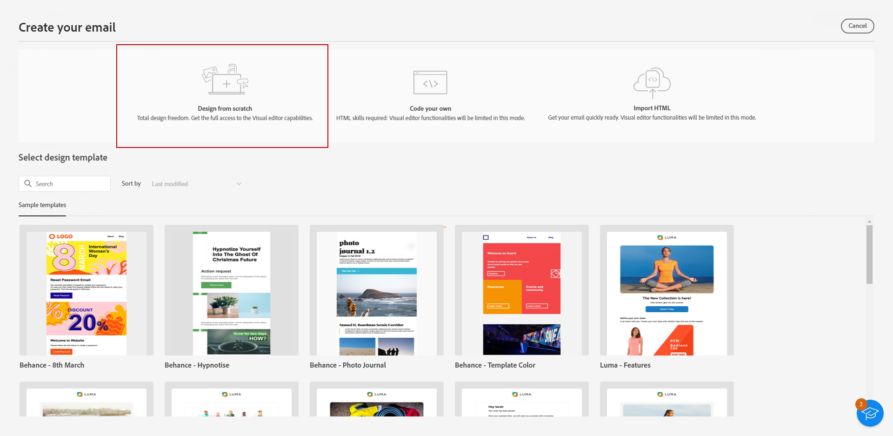

# Starta ditt e-postinnehåll från grunden {#create-email-content}

>[!CONTEXTUALHELP]
>id="ac_structure_components_email"
>title="Om strukturkomponenter"
>abstract="Strukturkomponenter definierar layouten för e-postmeddelandet."

>[!CONTEXTUALHELP]
>id="ac_structure_components_landing_page"
>title="Om strukturkomponenter"
>abstract="Strukturkomponenter definierar landningssidans layout."

>[!CONTEXTUALHELP]
>id="ac_structure_components_fragment"
>title="Om strukturkomponenter"
>abstract="Strukturkomponenter definierar fragmentets layout."

>[!CONTEXTUALHELP]
>id="ac_structure_components_template"
>title="Om strukturkomponenter"
>abstract="Strukturkomponenter definierar mallens layout."

>[!CONTEXTUALHELP]
>id="ac_edition_columns_email"
>title="Definiera e-postkolumner"
>abstract="Med e-postdesignern kan du enkelt definiera layouten för e-postmeddelandet genom att definiera kolumnstrukturen."

>[!CONTEXTUALHELP]
>id="ac_edition_columns_landing_page"
>title="Definiera landningssidans kolumner"
>abstract="Med e-postdesignern kan du enkelt definiera layouten för landningssidan genom att definiera kolumnstrukturen."

>[!CONTEXTUALHELP]
>id="ac_edition_columns_fragment"
>title="Definiera fragmentkolumner"
>abstract="Med e-postdesignern kan du enkelt definiera fragmentets layout genom att definiera kolumnstrukturen."

>[!CONTEXTUALHELP]
>id="ac_edition_columns_template"
>title="Definiera mallkolumner"
>abstract="Med e-postdesignern kan du enkelt definiera mallens layout genom att definiera kolumnstrukturen."

Med e-postdesignern kan du enkelt definiera e-postens struktur. Genom att lägga till och flytta strukturella element med enkla dra-och-släpp-åtgärder kan du utforma e-postmeddelandets brödtext på bara några sekunder.

Följ stegen nedan när du vill börja skapa e-postinnehåll:

1. På e-postdesignerns hemsida väljer du **[!UICONTROL Design from scratch]** alternativ.

   

1. Börja designa e-postinnehåll genom att dra och släppa **[!UICONTROL Structure components]** på arbetsytan för att definiera layouten för e-postmeddelandet.

   >[!NOTE]
   >
   >Det går inte att stapla kolumner i alla e-postprogram. Om det inte finns stöd för det här alternativet staplas inte kolumner.

   <!--Once placed in the email, you cannot move nor remove your components unless there is already a content component or a fragment placed inside. This is not true in AJO - TBC?-->

   

1. Lägg till så många **[!UICONTROL Structure components]** vid behov och redigera inställningarna i den dedikerade rutan till höger.

   Välj **[!UICONTROL n:n column]** -komponent för att definiera hur många kolumner du vill ha (mellan 3 och 10). Du kan också definiera bredden på varje kolumn genom att flytta pilarna längst ned i varje kolumn.

   >[!NOTE]
   >
   >Varje kolumnstorlek får inte vara mindre än 10 % av strukturkomponentens totala bredd. Du kan inte ta bort en kolumn som inte är tom.

1. Expandera **[!UICONTROL Content components]** och lägg till så många element du behöver i en eller flera strukturkomponenter. [Läs mer om innehållskomponenter](content-components.md)

1. Varje komponent kan anpassas ytterligare med **[!UICONTROL Component settings]** till höger. Du kan till exempel ändra textstil, utfyllnad eller marginal för varje komponent. [Läs mer om justering och utfyllnad](alignment-and-padding.md)

   

1. Infoga anpassningsfält för att anpassa ditt e-postinnehåll från profildata. [Läs mer om innehållspersonalisering](../personalization/personalize.md)

1. Klicka på **[!UICONTROL Links]** från den vänstra panelen för att visa alla URL:er för ditt innehåll som måste spåras. Du kan ändra deras **[!UICONTROL Tracking Type]** eller **[!UICONTROL Label]** och lägga till **[!UICONTROL Categories]** vid behov. [Läs mer om länkar och meddelandespårning](message-tracking.md)

   

1. Om det behövs kan du anpassa e-postmeddelandet ytterligare genom att klicka på **[!UICONTROL Switch to code editor]** på den avancerade menyn. På så sätt kan du redigera e-postkällkoden, till exempel för att lägga till spårningstaggar eller anpassade HTML-taggar. [Läs mer om kodredigeraren](code-content.md)

   >[!CAUTION]
   >
   >Du kan inte återgå till den visuella designern för det här e-postmeddelandet när du har växlat till kodredigeraren.

1. När innehållet är klart klickar du på **[!UICONTROL Simulate content]** för att kontrollera din e-poståtergivning. Du kan välja skrivbordsvy eller mobilvy. [Läs mer om hur du förhandsgranskar ditt e-postmeddelande](../preview-test/preview-test.md)

   

1. När e-postmeddelandet är klart klickar du på **[!UICONTROL Save]**.

