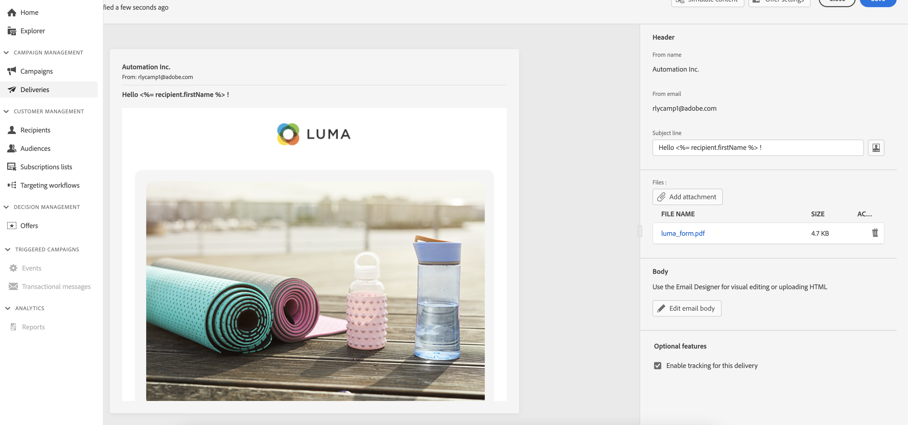

# Konfigurera e-postinnehållet {#configure-content}

>[!NOTE]
>
>Dokumentationen håller på att byggas och uppdateras ofta. Den slutliga versionen av detta innehåll är klar i januari 2023.

Knappen Redigera innehåll: visa användningsfall med ärenderad, bifogad fil, lägg till erbjudande, spärra/knip aktiverat (+ anteckning om simulerad innehållsknapp med länk för att förhandsgranska korrekturavsnitt)

## E-posthuvud

>[!CONTEXTUALHELP]
>id="acw_deliveries_email_header"
>title="E-posthuvud"
>abstract="TBC"

## E-postbilaga

>[!CONTEXTUALHELP]
>id="acw_deliveries_email_attachment"
>title="E-postbilaga"
>abstract="TBC"

## E-postspårning

>[!CONTEXTUALHELP]
>id="acw_deliveries_email_options"
>title="Spårningsalternativ"
>abstract="TBC"

<!--
Offers same as campaign (no design, only selection)
Diff from AJO:  attachement
-->