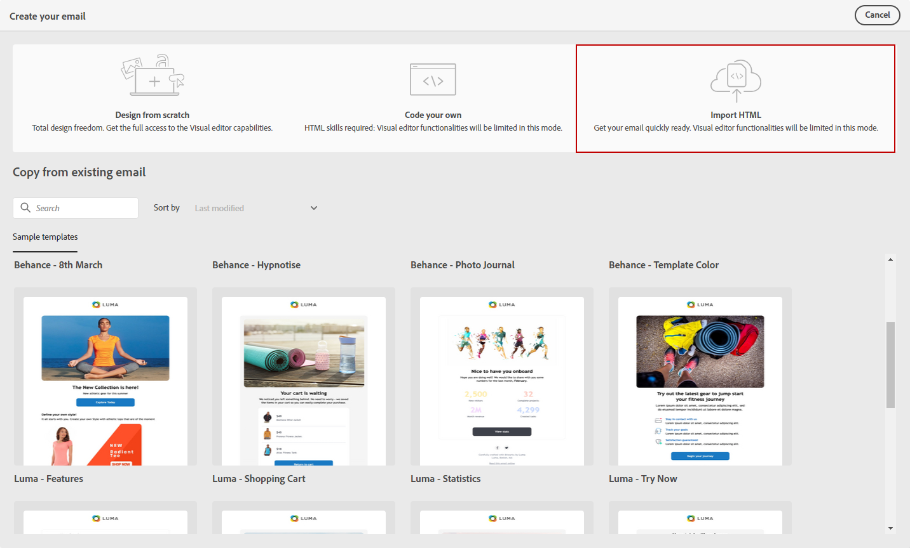

# Importera e-postinnehåll {#existing-content}

>[!CONTEXTUALHELP]
>id="acw_deliveries_email_import_content"
>title="Använd befintligt e-postinnehåll"
>abstract="Med e-postdesignern kan du importera befintligt HTML-innehåll. Innehållet kan vara en HTML-fil med en infogad formatmall eller en ZIP-mapp med HTML-filen, formatmallen (.css) och bilder."

Med e-postdesignern kan du importera befintligt HTML-innehåll. Innehållet kan vara:

* An **HTML-fil** med en infogad formatmall,
* A **ZIP-mapp** med HTML-filen, formatmallen (.css) och bilderna.

  >[!NOTE]
  >
  >ZIP-filstrukturen har inga begränsningar. Referenserna måste dock vara relativa och passa i trädstrukturen i ZIP-mappen.

Om du vill importera en fil som innehåller HTML-innehåll följer du stegen nedan:

1. På [E-postdesigner](get-started-email-designer.md) startsida, välja **[!UICONTROL Import HTML]**.

   

1. Dra och släpp HTML- eller ZIP-filen med HTML och klicka på **[!UICONTROL Import]**.

1. När HTML-innehållet har överförts kan du använda e-postdesignerns funktioner för att redigera och förhandsgranska e-postmeddelandet. [Läs mer](create-email-content.md)

   