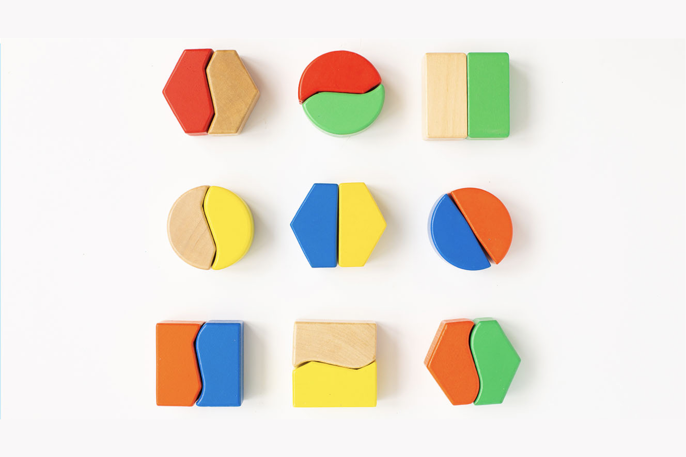

# Kom igång med innehållsfragment {#gs-fragments}

>[!CONTEXTUALHELP]
>id="acw_homepage_welcome_rn4"
>title="Innehållsfragment"
>abstract="Nu kan du skapa och använda innehållsfragment. Ett innehållsfragment är en återanvändbar komponent som kan refereras i ett eller flera meddelanden. När du ändrar ett fragment uppdateras allt innehåll som använder det."
>additional-url="https://experienceleague.adobe.com/docs/campaign-web/v8/release-notes/release-notes.html" text="Se versionsinformation"

>[!CONTEXTUALHELP]
>id="acw_fragments_menu"
>title="Definiera egna innehållsfragment"
>abstract="Ett innehållsfragment är en återanvändbar komponent som kan refereras i ett eller flera meddelanden mellan kampanjer. Den här funktionen används för att skapa flera anpassade innehållsblock som kan användas av marknadsföringsanvändare för att snabbt sammanställa innehåll i en förbättrad designprocess. Det finns två typer av innehållsfragment: visuella fragment som är tillgängliga i e-postdesignern och uttrycksfragment i uttrycksredigeraren."

>[!CONTEXTUALHELP]
>id="acw_personalization_editor_fragments"
>title="Lägg till uttrycksfragment"
>abstract="Uttrycksfragment är fördefinierade innehållsblock som innehåller en viss återgivning som du kan infoga i leveranserna. Du kan till exempel lägga till en logotyp, ett hälsningsmeddelande eller en länk till meddelandets spegelsida. Du kan också skapa egna uttrycksfragment som passar dina behov."

## Vad är innehållsfragment? {#what}

Ett innehållsfragment är en återanvändbar komponent som kan refereras i ett eller flera meddelanden. När du ändrar ett fragment uppdateras allt innehåll som använder det. Med den här funktionen kan man skapa flera anpassade innehållsblock som kan användas av marknadsföringsanvändare för att snabbt sammanställa meddelandeinnehåll i en förbättrad designprocess.

Det finns två typer av fragment:

* **Uttrycksfragment** är fördefinierade uttryck som är tillgängliga från en dedikerad post i uttrycksredigeraren. Campaign innehåller en uppsättning fördefinierade innehållsblock som innehåller en specifik återgivning som du kan infoga i dina leveranser. Du kan till exempel lägga till en logotyp, ett hälsningsmeddelande eller en länk till meddelandets spegelsida. Du kan också skapa egna uttrycksfragment som passar dina behov.

* **Visuella fragment** är fördefinierade visuella block som du kan återanvända i flera [e-postleveranser](../email/get-started-email-designer.md) eller i [innehållsmallar](../email/use-email-templates.md).

  >[!AVAILABILITY]
  >
  >Den här funktionen är begränsad tillgänglighet (LA). Den är begränsad till kunder som migrerar **från Adobe Campaign Standard till Adobe Campaign v8** och kan inte distribueras i någon annan miljö.

## Låt oss dyka djupare

Nu när du har en förståelse för vilka innehållsfragment som är och vad du kan göra med dem i Adobe Campaign är det dags att fördjupa sig i dessa dokumentationsavsnitt för att börja arbeta med funktionen.

<table style="table-layout:fixed"><tr style="border: 0;">
<td>

<a href="create-fragment.md"><strong>Skapa egna innehållsfragment</strong></a>

</td>
<td>

<a href="use-visual-fragments.md"><strong>Lägg till visuella fragment i e-postmeddelanden</strong>

</td>
<td>

<a href="use-expression-fragments.md"><strong>Använd uttrycksfragment i uttrycksredigeraren</strong></a>

</td>
</tr></table>
