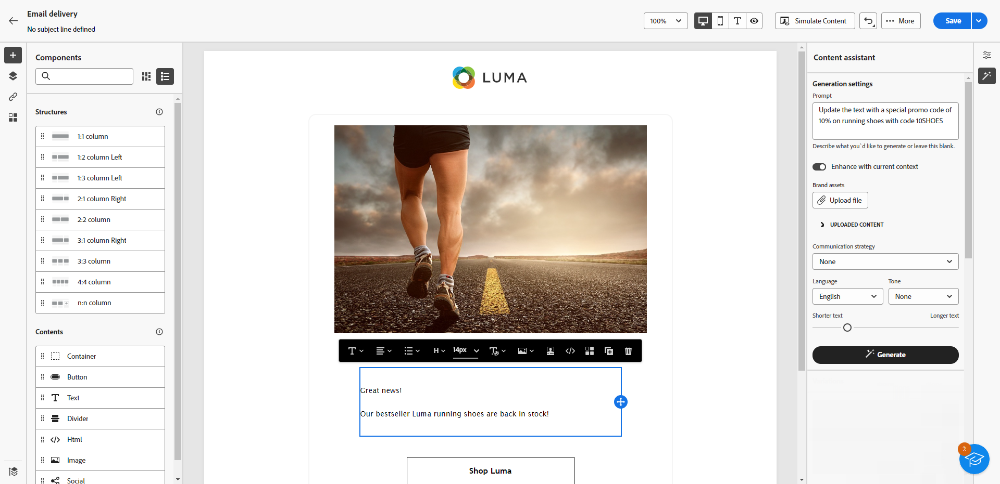

# Skapa text med Content Assist {#generative-content}

När du har skapat och personaliserat dina e-postmeddelanden kan du använda Content Assistant som drivs av generativ AI för att ta ditt innehåll till nästa nivå.

Content Assistant kan hjälpa er att optimera effekten av era leveranser genom att föreslå olika typer av innehåll som troligtvis får genklang hos er målgrupp.

>[!AVAILABILITY]
>
>Den här funktionen kommer att vara tillgänglig i början av oktober.

1. När du har skapat och konfigurerat e-postleveransen klickar du på **[!UICONTROL Edit content]**.

   Mer information om hur du konfigurerar din e-postleverans finns i [den här sidan](../content/create-email-content.md).

1. Fyll i **[!UICONTROL Basic details]** för leverans. När du är klar klickar du **[!UICONTROL Edit email content]**.

1. Anpassa e-postmeddelandet efter behov.

1. Välj **[!UICONTROL Text component]** du vill uppdatera och få tillgång till menyn för generering av upplevelser.

   

1. Finjustera innehållet genom att beskriva vad du vill generera.

   Aktivera **[!UICONTROL Enhance with current context]** för innehållsassistenten att anpassa nytt innehåll baserat på leverans, leveransnamn och vald målgrupp.

   

1. Välj **[!UICONTROL Upload file]** om du vill lägga till en varumärkesresurs som innehåller innehåll som kan ge innehållsassistenten ytterligare kontext.

   Du kan också klicka **[!UICONTROL Uploaded content]** för att hitta tidigare uppdaterade filer. Observera att det överförda innehållet endast är tillgängligt för återanvändning av den aktuella användaren.

1. Välj **[!UICONTROL Communication strategy]** som bäst passar dina behov. Detta påverkar den genererade textens ton och format.

1. Välj **[!UICONTROL Language]** och **[!UICONTROL Tone]** som du vill att den genererade texten ska ha. På så sätt säkerställs att texten passar er målgrupp och ert syfte.

   

1. Använd skjutreglaget för att ange längden på den genererade texten.

1. När frågan är klar klickar du på **[!UICONTROL Generate]**.

1. Bläddra bland de genererade **[!UICONTROL Variations]** och klicka **[!UICONTROL Apply]** när du hittat rätt innehåll.

   

1. Infoga anpassningsfält för att anpassa ditt e-postinnehåll baserat på profildata. [Läs mer om innehållspersonalisering](../personalization/personalize.md)

   

1. När du har definierat meddelandeinnehållet klickar du på **[!UICONTROL Simulate content]** för att styra återgivningen och kontrollera personaliseringsinställningarna med testprofiler. [Läs mer](../preview-test/preview-content.md)

   

1. När ni har definierat ert innehåll, er målgrupp och ert schema är ni redo att förbereda er för att leverera e-post. [Läs mer](../monitor/prepare-send.md)

