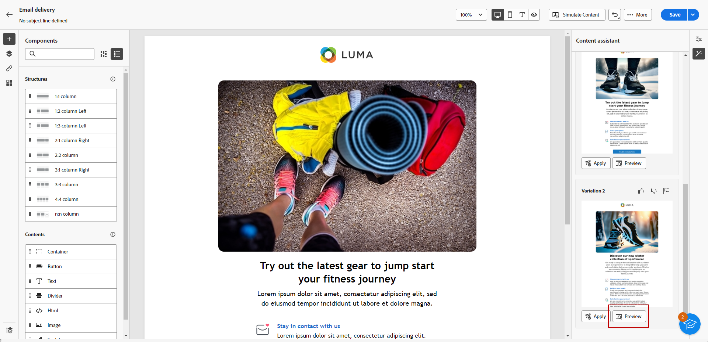

# Generera ett e-postmeddelande med innehållsassistenten {#generative-email}

Content Assistant förbättrar kommunikationens effekt genom att automatiskt generera komplett e-postinnehåll, vilket sparar tid och ger en konsekvent kvalitet.

Med hjälp av generativ AI kan ni enkelt skapa övertygande e-postmeddelanden som får genklang hos er målgrupp och gör kommunikationen effektivare och effektivare.

1. När du har skapat och konfigurerat e-postleveransen klickar du på **[!UICONTROL Create content]**.

   Mer information om hur du konfigurerar din e-postleverans finns i [den här sidan](../content/create-email-content.md).

1. Fyll i **[!UICONTROL Basic details]** för leverans. När du är klar klickar du **[!UICONTROL Edit email body]**.

1. Välj den designmall som du vill att Content Assistant ska basera det genererade e-postmeddelandet på.

   Du kan också importera en HTML-fil.

1. Välj **[!UICONTROL Experience generation]**.

   

1. Finjustera innehållet genom att beskriva vad du vill generera.

   Här är några exempel:

   * För ett nyhetsbrev: Generera ett månatligt nyhetsbrev med researtiklar, högdagrar och exklusiva prenumeranterbjudanden.
   * För feedback och enkäter: Skapa ett e-postmeddelande med en inbjudan till kunder att lämna feedback om sina senaste programvaruupplevelser och delta i en enkät om produktförbättringar.
   * För årsdag- och födelsedagsedelsemejl: Generera ett födelsedagsedelsemeddelande, fira kundens speciella dag och ge dem en födelsedagsrabatt.

   

1. Välj **[!UICONTROL Upload file]** om du vill lägga till en varumärkesresurs som innehåller innehåll som kan ge innehållsassistenten ytterligare kontext.

   Du kan också klicka **[!UICONTROL Uploaded content]** för att hitta tidigare uppdaterade filer. Observera att det överförda innehållet endast är tillgängligt för återanvändning av den aktuella användaren.

1. Välj **[!UICONTROL Communication strategy]** som bäst passar dina behov. Det här påverkar tonen och stilen på det genererade e-postmeddelandet.

1. Välj **[!UICONTROL Language]** och **[!UICONTROL Tone]** som du vill att den genererade texten ska ha. På så sätt säkerställs att texten passar er målgrupp och ert syfte.

   

1. Anpassa **[!UICONTROL Content type]** resursinställningar så att de matchar de önskade resursegenskaperna.

1. När frågan är klar klickar du på **[!UICONTROL Generate]**.

1. Sök i **[!UICONTROL Variation suggestions]** för att hitta den e-postadress du vill ha. Klicka **[!UICONTROL Preview]** om du vill visa en fullskärmsversion av den valda varianten.

   

1. Klicka **[!UICONTROL Select]** när du hittat rätt innehåll.

   

1. Infoga anpassningsfält för att anpassa ditt e-postinnehåll baserat på profildata eller anpassa innehållet ytterligare vid behov. [Läs mer om innehållspersonalisering](../personalization/personalize.md)

1. När du har definierat ditt e-postinnehåll klickar du på **[!UICONTROL Simulate content]** för att styra återgivningen och kontrollera personaliseringsinställningarna med testprofiler.  [Läs mer](../preview-test/preview-content.md)

   

1. När ni har definierat ert innehåll, er målgrupp och ert schema är ni redo att förbereda er för att leverera e-post. [Läs mer](../monitor/prepare-send.md)

