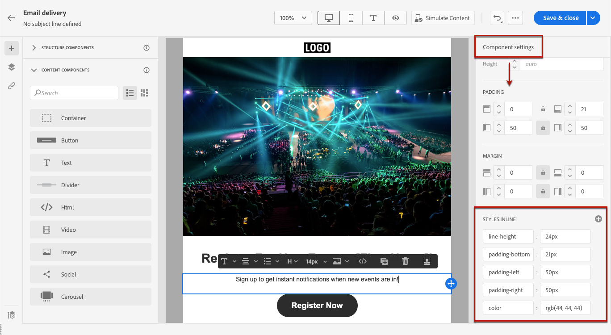

# Lägg till textbundna formatattribut {#adding-inline-styling-attributes}

När du markerar ett element i e-postdesignergränssnittet och visar dess inställningar i den högra rutan, kan du anpassa infogade attribut och deras värde för det specifika elementet.

1. Markera en komponent direkt i innehållet eller med **[!UICONTROL Navigation tree]** i den vänstra rutan.

1. Från **[!UICONTROL Component settings]** till höger, sök efter **[!UICONTROL Styles Inline]** -avsnitt.

   

1. Ändra värdena för de befintliga attributen.

1. Du kan lägga till nya egenskaper med **+** -knappen. Du kan lägga till alla attribut och värden som är CSS-kompatibla.

   

Formateringen används på det markerade elementet.

>[!NOTE]
>
>Om de underordnade elementen inte har några definierade formatattribut ärvs det överordnade elementets formatering.

