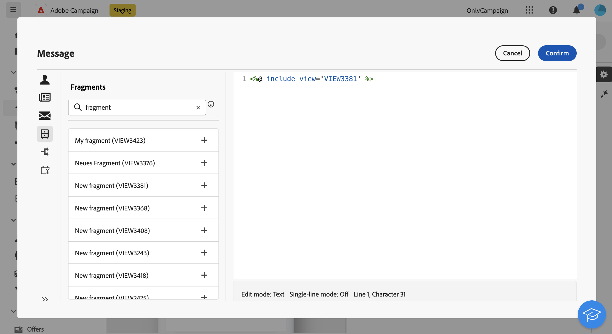

# Lägga till uttrycksfragment i uttrycksredigeraren {#expression}

>[!CONTEXTUALHELP]
>id="acw_fragments_list"
>title="Fragment"
>abstract="Alla uttrycksfragment som skapats i den aktuella sandlådan visas i den här listan. Om du vill använda ett fragment klickar du på plusknappen (+) för att lägga till fragment-ID:t i redigeraren."

<!-- pas vu dans l'UI-->

Uttrycksfragment kan användas i alla fält som kan redigeras med uttrycksredigeraren. Följ stegen nedan om du vill lägga till uttrycksfragment i ditt innehåll.

1. Öppna [uttrycksredigeraren](../personalization/gs-personalization.md) och välj menyn **[!UICONTROL Fragments]** i den vänstra rutan.

   I listan visas alla uttrycksfragment som har skapats i den aktuella sandlådan.

1. Klicka på ikonen `+` bredvid ett uttrycksfragment för att lägga till det i ditt innehåll.

   

1. Fragment-ID läggs till i redigeraren. Om du öppnar motsvarande uttrycksfragment och redigerar det från gränssnittet synkroniseras ändringarna automatiskt. De sprids till alla **[!UICONTROL Draft]**-leveranser som innehåller detta fragment-ID.