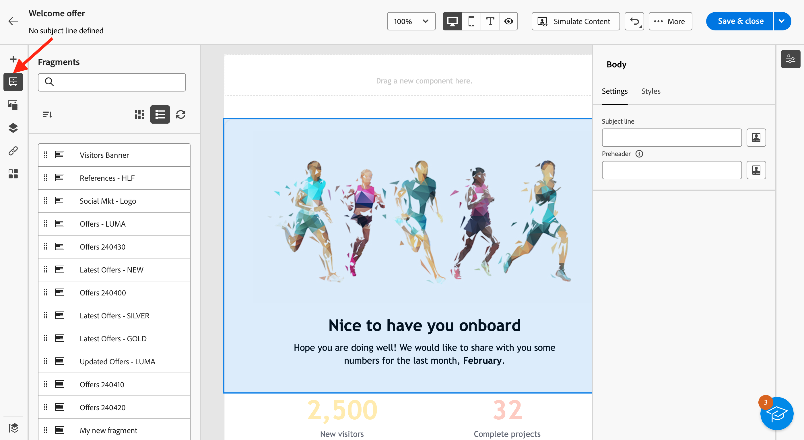

# Lägg till visuella fragment i e-postmeddelanden {#use-visual-fragments}

>[!AVAILABILITY]
>
>Den här funktionen kräver en uppdatering av Campaign v8.6.4. Läs mer i [Versionsinformation för Campaign v8-klientkonsolen](https://experienceleague.adobe.com/en/docs/campaign/campaign-v8/releases/release-notes).

I webbgränssnittet för Campaign är **visuella fragment** fördefinierade visuella block som du kan återanvända i flera [e-postleveranser](../email/get-started-email-designer.md) eller i [innehållsmallar](../content/use-email-templates.md). Lär dig hur du skapar och hanterar innehållsfragment i [det här avsnittet](fragments.md).

## Använda ett visuellt fragment {#use-fragment}

>[!CONTEXTUALHELP]
>id="acw_fragments_details"
>title="Fragmentalternativ"
>abstract="Den här rutan innehåller alternativ som är relaterade till det valda fragmentet. Du kan välja vilka enheter du vill att fragmentet ska visas på och öppna innehållet i det här fragmentet. Använd fliken **[!UICONTROL Styles]** för att anpassa fragmentet ytterligare. Du kan också bryta arvet med det ursprungliga visuella fragmentet."

<!-- pas vu dans l'UI-->

Så här infogar du ett visuellt fragment i e-postinnehåll:

1. Öppna e-post- eller mallinnehåll med hjälp av [e-post-Designer](../email/get-started-email-designer.md).

1. Välj ikonen **[!UICONTROL Fragments]** i den vänstra listen.

   

1. Listan över alla visuella fragment som skapats i den aktuella sandlådan visas. Du kan:

   * Sök efter ett visst fragment genom att skriva dess etikett.
   * Sortera fragment i stigande eller fallande ordning.
   * Ändra hur fragmenten visas (kort eller listvy).

   >[!NOTE]
   >
   >Fragment sorteras efter skapandedatum. Nyligen tillagda fragment visas först i listan.

   Om visuella fragment ändras eller läggs till när du redigerar ditt innehåll, klickar du på ikonen **Uppdatera** för att uppdatera listan med de senaste ändringarna.

1. Dra och släpp ett visuellt fragment från listan till området där du vill infoga det. Precis som andra komponenter kan du flytta runt fragmentet i innehållet.

1. Markera fragmentet för att visa dess alternativ i den högra rutan.

   

   På fliken **[!UICONTROL Settings]** kan du:

   * Välj de enheter som du vill att fragmentet ska visas på.
   * Klicka på knappen **Redigera innehåll** för att öppna innehållet i det här fragmentet. [Läs mer](../content/fragments.md#edit-fragments)

     Du kan anpassa fragmentet ytterligare med fliken **[!UICONTROL Styles]**.

1. Om det behövs bryter du arvet med det ursprungliga visuella fragmentet. [Läs mer](#break-inheritance)

   Du kan också ta bort fragmentet från innehållet eller duplicera det. Utför dessa åtgärder direkt från den snabbmeny som visas ovanpå fragmentet.

1. Lägg till så många visuella fragment som behövs och **[!UICONTROL Save]** dina ändringar.

### Visual fragment in read-only mode {#fragment-readonly}

Åtkomsträttigheter kan gälla för visuella fragment.

Om behörighetsutgåva inte beviljas för ett visst visuellt fragment visas innehållsmallen i **skrivskyddat läge**. I det här fallet ersätts knappen **[!UICONTROL Edit content]** med knappen **[!UICONTROL View content]** så att du kan visa fragmentet utan att göra några ändringar.

{zoomable="yes"}

Som framgår nedan är alla funktionsikoner inaktiverade, vilket begränsar interaktionen till att endast visas.

{zoomable="yes"}

## Bryt arv {#break-inheritance}

När du redigerar ett visuellt fragment synkroniseras ändringarna och sprids automatiskt till alla e-postleveranser och innehållsmallar som innehåller det fragmentet.

Som standard synkroniseras fragment när de läggs till i ett e-postmeddelande eller i en innehållsmall.

Du kan emellertid bryta arvet från det ursprungliga fragmentet. I det här fallet kopieras innehållet i fragmentet till den aktuella designen och ändringarna synkroniseras inte längre.

Så här bryter du arv:

1. Markera det visuella fragmentet.

1. Klicka på upplåsningsikonen i det sammanhangsberoende verktygsfältet.

   

1. Fragmentet blir ett fristående element som inte längre är länkat till det ursprungliga fragmentet. Redigera det som vilken annan innehållskomponent som helst i innehållet. [Läs mer](../email/content-components.md)